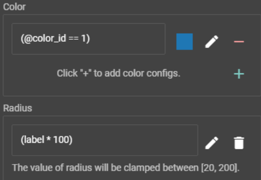
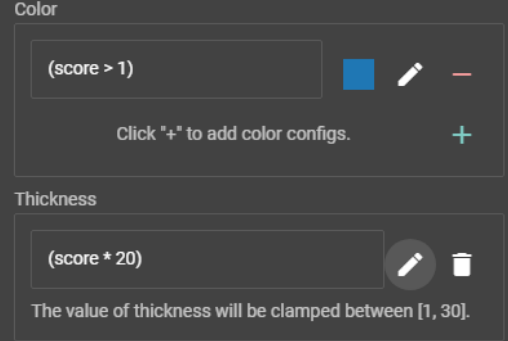
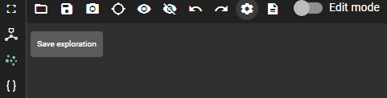
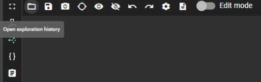
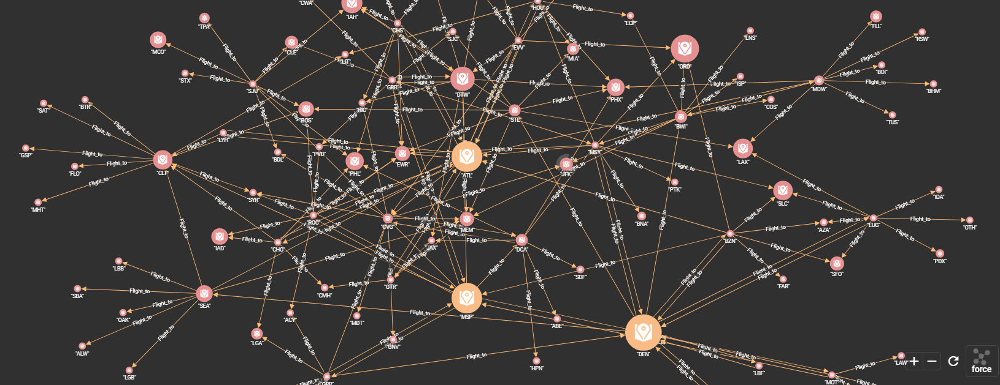
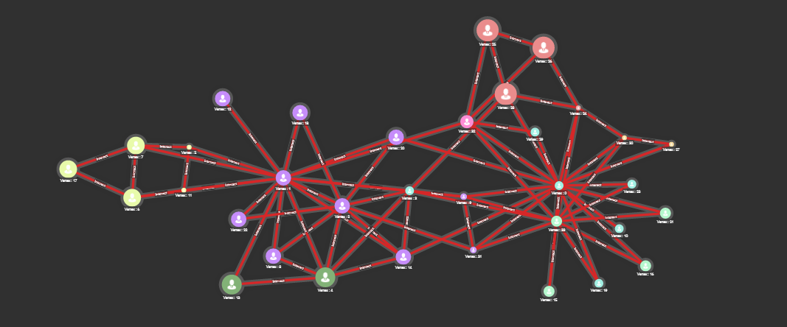
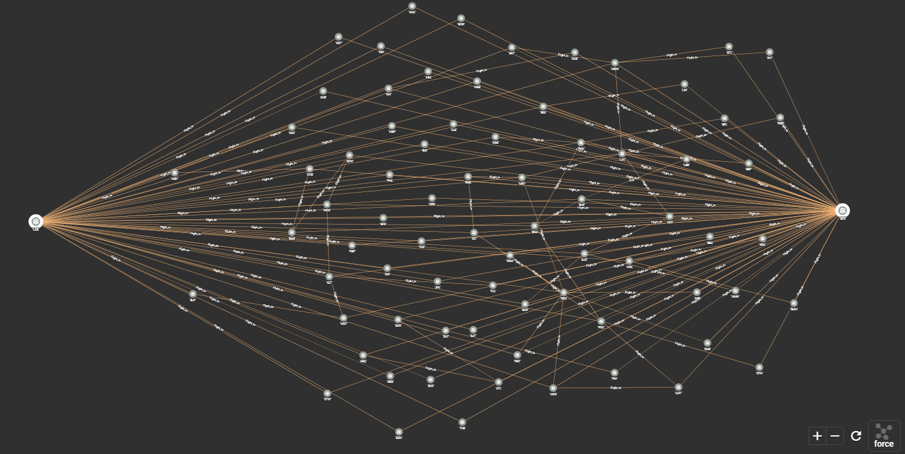
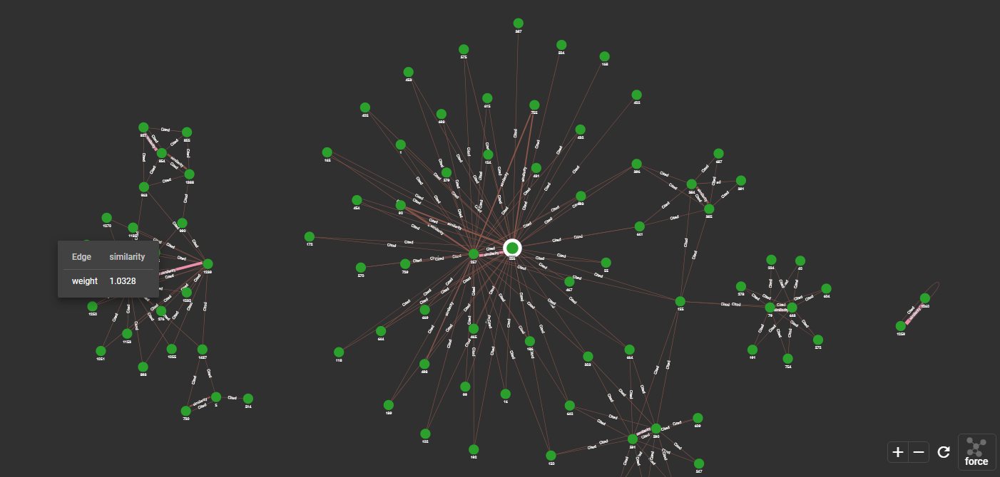

# TigerGraph In-Database Graph Data Science Algorithm Visualizations
For TigerGraph version 3.2 or higher
03/09/2021

## Introduction

The [GSQL Graph Algorithm Library](https://github.com/tigergraph/gsql-graph-algorithms) is a collection of high-performance GSQL queries, according to the description of the library:
> Each of the queries implements a standard graph algorithm. Each algorithm is ready to be installed and used, either as a stand-alone query or as a building block of a larger
analytics application.GSQL running on the TigerGraph platform is particularly
well-suited for graph algorithms:
>* Turing-complete with full support for imperative and procedural programming,
 ideal for algorithmic computation.
>* Parallel and Distributed Processing, enabling computations on larger graphs.
>* User-Extensible.
  Because the algorithms are written in standard GSQL and compiled by the user,
  they are easy to modify and customize.
>* Open-Source. Users can study the GSQL implementations to learn by
  example, and they can develop and submit additions to the library.

Currently most of the queries built at **GSQL Graph Algorithm Library** output the results in the form of a JSON file. There is a lack of visualization functionality when applying those queries in the TigerGraph GraphStudio. 

The purpose of this project is to: (1) provide visualizations for some of the most frequently used queries current in the **GSQL Graph Algorithm Library**; (2) showcase those visualizations based on several real-world graph data. Visualizations have been developed for ~20 algorithms based on 8 real world datasets.

## Contents
- Algorithms
  - Centrality
    - [Article rank](https://github.com/tigergraph/ecosys/blob/TIDGDSA-59/demos/algorithm_visualization/algorithms/Centrality/tg_article_rank_vis.gsql)
    - [Betweenness](https://github.com/tigergraph/ecosys/blob/TIDGDSA-59/demos/algorithm_visualization/algorithms/Centrality/tg_betweenness_cent_vis.gsql)
    - [Closeness](https://github.com/tigergraph/ecosys/blob/TIDGDSA-59/demos/algorithm_visualization/algorithms/Centrality/tg_closeness_cent_vis.gsql)
    - [Degree](https://github.com/tigergraph/ecosys/blob/TIDGDSA-59/demos/algorithm_visualization/algorithms/Centrality/tg_degree_cent_vis.gsql)
    - [Eigenvector](https://github.com/tigergraph/ecosys/blob/TIDGDSA-59/demos/algorithm_visualization/algorithms/Centrality/tg_eigenvector_cent_vis.gsql)
    - [Harmonic](https://github.com/tigergraph/ecosys/blob/TIDGDSA-59/demos/algorithm_visualization/algorithms/Centrality/tg_harmonic_cent_vis.gsql)
    - [Influence_maximization](https://github.com/tigergraph/ecosys/blob/TIDGDSA-59/demos/algorithm_visualization/algorithms/Centrality/tg_influence_maximization_CELF_vis.gsql)
    - [Pagerank](https://github.com/tigergraph/ecosys/blob/TIDGDSA-59/demos/algorithm_visualization/algorithms/Centrality/tg_pagerank_vis.gsql)
  - Community
      - [SCC](https://github.com/tigergraph/ecosys/tree/TIDGDSA-59/demos/algorithm_visualization/algorithms/Community/tg_scc_vis.gsql)
      - [WCC](https://github.com/tigergraph/ecosys/tree/TIDGDSA-59/demos/algorithm_visualization/algorithms/Community/tg_wcc_vis.gsql)
      - [K-core](https://github.com/tigergraph/ecosys/tree/TIDGDSA-59/demos/algorithm_visualization/algorithms/Community/tg_kcore_vis.gsql)
      - [Lable Propagation](https://github.com/tigergraph/ecosys/tree/TIDGDSA-59/demos/algorithm_visualization/algorithms/Community/tg_label_prop_vis.gsql)
      - [LCC](https://github.com/tigergraph/ecosys/tree/TIDGDSA-59/demos/algorithm_visualization/algorithms/Community/tg_lcc_vis.gsql)
      - [Louvain](https://github.com/tigergraph/ecosys/tree/TIDGDSA-59/demos/algorithm_visualization/algorithms/Community/tg_louvain_vis.gsql)
      - [Triangle Counting](https://github.com/tigergraph/ecosys/tree/TIDGDSA-59/demos/algorithm_visualization/algorithms/Community/tg_tri_count_vis.gsql)
  - Path
    - [Cycle Detection](https://github.com/tigergraph/ecosys/blob/TIDGDSA-59/demos/algorithm_visualization/algorithms/Path/tg_cycle_detection_vis.gsql)
    - [Max_flow](https://github.com/tigergraph/ecosys/blob/TIDGDSA-59/demos/algorithm_visualization/algorithms/Path/tg_maxflow_vis.gsql)
    - [Min spanning tree](https://github.com/tigergraph/ecosys/blob/TIDGDSA-59/demos/algorithm_visualization/algorithms/Path/tg_mst_vis.gsql)
    - [Shortest Path](https://github.com/tigergraph/ecosys/blob/TIDGDSA-59/demos/algorithm_visualization/algorithms/Path/tg_shortest_ss_any_wt_vis.gsql)
  - Similarity
    - [Cosine](https://github.com/tigergraph/ecosys/blob/TIDGDSA-59/demos/algorithm_visualization/algorithms/Similarity/tg_cosine_nbor_ap_batch_vis.gsql)
    - [Jaccard](https://github.com/tigergraph/ecosys/blob/TIDGDSA-59/demos/algorithm_visualization/algorithms/Similarity/tg_jaccard_nbor_ap_batch_vis.gsql)

- Graphs
  - [fw_baydry](https://github.com/tigergraph/ecosys/tree/TIDGDSA-59/demos/algorithm_visualization/graphs/fw_baydry)
  - [karate](https://github.com/tigergraph/ecosys/tree/TIDGDSA-59/demos/algorithm_visualization/graphs/karate)
  - [netscience](https://github.com/tigergraph/ecosys/tree/TIDGDSA-59/demos/algorithm_visualization/graphs/netscience)
  - [USairport](https://github.com/tigergraph/ecosys/tree/TIDGDSA-59/demos/algorithm_visualization/graphs/USairports)
  - [polblogs](https://github.com/tigergraph/ecosys/tree/TIDGDSA-59/demos/algorithm_visualization/graphs/polblogs)
  - [web_edu](https://github.com/tigergraph/ecosys/tree/TIDGDSA-59/demos/algorithm_visualization/graphs/web_edu)
  - [wiki_vote](https://github.com/tigergraph/ecosys/tree/TIDGDSA-59/demos/algorithm_visualization/graphs/wiki_vote)

## How to use?

Follow the following steps to use graph algrithms with visualizations:
1. If you wanted to use graphs on this repository, check out the section [Loading graphs](#loading-graphs) to see instructions. If there is already graph loaded in your GraphStudio, go to step 2.
2. For complete aesthetic display, you need to follow the instructions in the section [Visualization aesthetic configurations](#visualization-aesthetic-configurations) to set up schema as well as exploration configurations for the graph you are working on.
3. Then you could copy the graph algorithm queries in this repository to your graph and perform graph analysis with visual outputs. Some [examples](#examples) are provided for illustration.

### Loading graphs

To install a graph data, follow the following steps from the terminal:
1. Go to the corresponding graph directory , e.g. 'cd $rootdir/ecosys/demos/algorithm_visualization/graphs/netscience'
2. Create the graph schema: e.g. 'bash create_graph.sh'
3. Load data into the schema: e.g. 'bash load_graph.sh'

### Visualization aesthetic configurations

This section describes schema as well as exploration configurations for the graph you need to run graph algorithms on. Some attributes for nodes and edges need to be set up as inputs for specific queries. The aesthetic configuration is also necessary for complete visualization. 

- General setup:
  - In the graph schema, make sure that: (1) there is an attribute ‘label(FLOAT)’ for nodes of interest; (2) there is an attribute score(FLOAT)’ for edges of interest; (3) for similarity algorithms, add the edge ‘similarity’ to the schema with an attribute weight(FLOAT) between nodes of interest.
  - Before running new queries, make sure the [reset query](https://github.com/tigergraph/ecosys/blob/TIDGDSA-59/demos/algorithm_visualization/algorithms/reset.gsql) is run. Note that some queries might needed to be run twice for the path color to appear, due to server delay.
  - In the 'visualize graph results' panel after running a query, you could set up aesthetic configurations for a better visualization display.
    - By default, set up node config as follows:
      - For the color of the node of interest, set up an equation between the real accumulator '@color_id' and the real number '1'.
      - For the scale of the node of interest, set it up as multiplication of the attribute 'label' and the real number '100'.

      

    - By default, set up edge config as follows:
      - For the color of the edge of interest, set up an inequality of the attribute 'score' larger than the real number '1'.
      - For the thickness of the edge of interest, set it up as multiplication of the attribute 'score' and the real number '20'.

      

    - You could customize your own aesthetic configuration by playing with those settings.

- Configuration saving:

  After aesthetic configurations are set up. You could save the configuration for future use by saving it as an exploration by clicking the 'save exploration' bottom:
  
  

- Configuration loading:

  To load your saved explorations as aesthetic configurations, click the 'open exploration history' bottom and load your desired one:

  
  

  To read more about saving's and loading's of explorations, check out this [guide](https://docs.tigergraph.com/gui/current/graphstudio/explore-graph/graph-exploration-panel#_save_and_open_graph_exploration_result).
## Examples

A GraphStudio solution that contains the schema of 5 graphs can be found [here](https://github.com/tigergraph/ecosys/blob/TIDGDSA-59/demos/algorithm_visualization/graph_alg_vis_TGsolution.tar.gz). To load the solution, simply download the solution with '.tar.gz' postfix and import it into your GraphStudio by clicking 'Import An Existing Solution'. Directions for importing a solution can be found [here](https://docs.tigergraph.com/gui/current/graphstudio/export-and-import-solution).

Example usecases of visualized graph algorithms are loaded as queries in this solution. Here are several of those:

- Pagerank centralities of United States airports.

  [Pageranks](https://github.com/tigergraph/ecosys/tree/TIDGDSA-59/demos/algorithm_visualization/algorithms/Centrality/pagerank/global/unweighted) are calculated for each airport based on the USairport graph, where existence of directed edges indicates whether there is a flight from one airport to another airport.
  
  Query: 
  ```
  tg_pagerank_vis (STRING v_type="Airport", STRING e_type="Flight_to", FLOAT max_change=0.001, INT max_iter=25, FLOAT damping=0.85, INT top_k = 3, BOOL print_accum = TRUE, STRING result_attr = "label", STRING file_path = "", BOOL display_edges = TRUE, INT display_edges_num = 8)
  ```

  Display:

  Vertices of top 3 largest pageranks are displayed in yellow, with their one-hop neighbors displayed in pink. Airports with larger pageranks are displayed with larger radius. 

  

- Louvain community detection on social network.

  [Louvain](https://github.com/tigergraph/ecosys/tree/TIDGDSA-59/demos/algorithm_visualization/algorithms/Community/louvain) community detection algorithm is applied to the Zachary’s karate club network, where weighted undirected edges record number of common activities the club members took part of.
  
  Query: 
  ```
  tg_louvain_vis(STRING v_type = "Member", STRING e_type = "Interact", STRING wt_attr = "weight", INT max_iter = 40, STRING result_attr = "label", STRING file_path = "", BOOL print_info = TRUE, INT comm_display_size=200)
  ```

  Display:

  Club members in selected detected communities and their one-hop neighbores are displayed. Members detected in same community are displayed in same color and radius.

  

- Max-flow paths between two United States airports.

  [Max flow](https://github.com/tigergraph/ecosys/tree/TIDGDSA-59/demos/algorithm_visualization/algorithms/Path/maxflow) algorithm is applied to the USairport graph, where the 'Seats' attrubute of directed edges records total number of seats on flights from one airport to another airport during the data was collected.
  
  Query: 
  ```
  tg_maxflow_vis(VERTEX source="SFO", VERTEX sink="LAS", STRING v_type="Airport", STRING e_type="Flight_to", STRING reverse_e_type="Flight_from", STRING cap_attr="Seats", STRING cap_type="INT", FLOAT min_flow_threshhold = 0.001, BOOL print_accum = TRUE, BOOL display_edges = TRUE, BOOL spit_to_file = FALSE, STRING file_path = "")
  ```

  Display:

  Flight paths from the airport "SFO" to the airport "LAS" with the maximal possible seat capacity are displayed, which is the sub-graph which holds the maxflow capacity.

  

- Cosine similarity between blog posts.

  [Cosine similarity](https://github.com/tigergraph/ecosys/tree/TIDGDSA-59/demos/algorithm_visualization/algorithms/Path/maxflow) algorithm is applied to the polblogs graph, where directed edges records citations from one political blog to another political blog.
  
  Query: 
  ```
  tg_cosine_vis(STRING vertex_type="Blog", STRING edge_type="Cited", STRING edge_attribute="weight", INT top_k=3, BOOL print_accum = true, STRING file_path, STRING similarity_edge="similarity", INT num_of_batches = 1, INT v_display_size=10)
  ```

  Display:

  Most similar pairs of blogs and their one-hop neighbors are displayed, with their Cosine similarities highlighted with thick pink lines.

  
## References

Here are sources of the graph data, please make sure that you are citing the sources if you are using those data.

- fw_baydry [[1]](https://cran.r-project.org/web/packages/igraphdata/igraphdata.pdf) 
- karate [[1]](https://cran.r-project.org/web/packages/igraphdata/igraphdata.pdf)
- USairport [[1]](https://cran.r-project.org/web/packages/igraphdata/igraphdata.pdf)
- netscience [[2]](https://networkrepository.com/ca-netscience.php) [[3]](https://arxiv.org/pdf/physics/0605087.pdf)
- polblogs [[4]](https://networkrepository.com/polblogs.php) [[5]](https://dl.acm.org/doi/abs/10.1145/1134271.1134277)
- web_edu [[6]](https://networkrepository.com/web-edu.php) [[7]](https://profs.info.uaic.ro/~ancai/CN/bibliografie/FastParallelPageRank-paper%20lin%20syst.pdf)
- wiki_vote [[8]](https://snap.stanford.edu/data/wiki-Vote.html)
