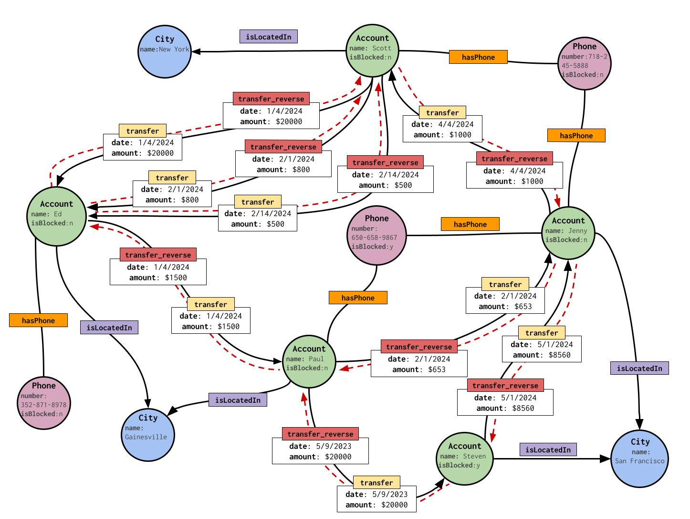

# Introduction <a name="top"></a>

This GSQL tutorial provides a hands-on introduction to GSQL Version 3 (V3) for new users. The GSQL&reg; software program is the TigerGraph comprehensive environment for designing graph schemas, loading and managing data to build a graph, and querying the graph to perform data analysis

GSQL V3 syntax reflects the evolution towards GQL, the ISO standard graph query language standard released in 2024. V3 emphasizes ASCII art in its syntax, as well as support for most OpenCyper pattern match syntax and functions.

A more exhaustive description of functionality and behavior of GSQL is available from the [GSQL Language Reference](https://docs.tigergraph.com/gsql-ref/latest/intro/).


# Table of Contents

- [Sample Graph](#sample-graph-for-tutorial)
- [Set Up Environment](#set-up-environment)
- [Set Up Schema (model)](#set-up-schema)
- [Load Data](#load-data)
- [Query Examples](#query-examples)
  - [Node Pattern](#node-pattern)
  - [Edge Pattern](#edge-pattern)
  - [Path Pattern](#path-pattern)
  - [Pattern Summary](#pattern-summary)
- [Advanced Topics](#advanced-topics)
  - [Accumulators](#accumulators)
    - [Accumulator Operators](#accumulator-operators)
    - [Global vs Vertex Attached Accumulator](#global-vs-vertex-attached-accumulator)
    - [ACCUM vs POST-ACCUM](#accum-vs-post-accum)
    - [Edge Attached Accumulator](#edge-attached-accumulator)
  - [Vertex Set Variables And Accumulators As Composition Tools](#vertex-set-variables-and-accumulators-as-composition-tools)
    - [Using Vertex Set Variables](#using-vertex-set-variables)
    - [Using Accumulators](#using-accumulators)
  - [Flow Control](#flow-control)
    - [IF Statement](#if-statement)
    - [WHILE Statement](#while-statement)
    - [FOREACH Statement](#foreach-statement)
    - [CONTINUE and BREAK Statement](#continue-and-break-statement)
    - [CASE WHEN Statement](#case-when-statement)
  - [Vertex Set Operators](#vertex-set-operators)
    - [Union](#union)
    - [Intersect](#intersect)
    - [Minus](#minus)
  - [Query Tuning](#query-tuning)
  - [Explore Catalog](#explore-catalog)
 - [Support](#support) 

# Sample Graph For Tutorial
This graph is a simplifed version of a real-world financial transaction graph. There are 5 _Account_ vertices, with 8 _transfer_ edges between Accounts. An account may be associated with a _City_ and a _Phone_.




# Set Up Environment 

If you have your own machine (including Windows and Mac laptops), the easiest way to run TigerGraph is to install it as a Docker image.
Follow the [Docker setup instructions](https://github.com/tigergraph/ecosys/blob/master/demos/guru_scripts/docker/README.md) to  set up the environment on your machine.

[Go back to top](#top)

# Set Up Schema 
A graph schema describes the vertex types, edge types, and properties found in your graph. TigerGraph is a schema-first database, meaning that the schema is declared before loading data. This not only optimizes data storage and query performance, but it also provides built-in checks to make sure your data conformed to the expected schema.

Copy [ddl.gsql](./script/ddl.gsql) to your container. 
Next, run the following in your container's bash command line. 
```
gsql ddl.gsql
```
As seen below, the declarative DDL creates vertex and edge types. Vertex type requires a `PRIMARY KEY`. Edge types requires `FROM` and `TO` vertex types as the key.
Multiple edges of the same type can share endpoints. In such case, a `DISCRIMINATOR` attribute is needed to differentiate edges sharing the same pair of endpoints. If an edge type has the `REVERSE_EDGE` option, then that type is paired with a companion type so that every edge has a twin edge, sharing the same properties, except it runs in the opposite direction.

```python
//install gds functions
import package gds
install function gds.**

//create vertex types
CREATE VERTEX Account ( name STRING PRIMARY KEY, isBlocked BOOL)
CREATE VERTEX City ( name STRING PRIMARY KEY)
CREATE VERTEX Phone (number STRING PRIMARY KEY, isBlocked BOOL)

//create edge types
CREATE DIRECTED EDGE transfer (FROM Account, TO Account, DISCRIMINATOR(date DATETIME), amount UINT) WITH REVERSE_EDGE="transfer_reverse"
CREATE UNDIRECTED EDGE hasPhone (FROM Account, TO Phone)
CREATE DIRECTED EDGE isLocatedIn (FROM Account, TO City)

//create graph; * means include all graph element types in the graph.
CREATE GRAPH financialGraph (*)
```

[Go back to top](#top)

# Load Data 

Now that you have a graph schema, you can load data using one of the following methods. 

- Load sample data from our publicly accessible s3 bucket:
  
  Copy [load.gsql](./script/load.gsql) to your container. 
  Next, run the following in your container's bash command line. 
  ```
     gsql load.gsql
  ```
  or in GSQL Shell editor, copy the content of [load.gsql](./script/load.gsql), and paste it into the GSQL shell editor to run.
  
- Load from local file in your container
  - Copy the following data files to your container.
    - [account.csv](https://raw.githubusercontent.com/tigergraph/ecosys/master/demos/guru_scripts/docker/tutorial/4.x/data/account.csv)
    - [phone.csv](https://raw.githubusercontent.com/tigergraph/ecosys/master/demos/guru_scripts/docker/tutorial/4.x/data/phone.csv)
    - [city.csv](https://raw.githubusercontent.com/tigergraph/ecosys/master/demos/guru_scripts/docker/tutorial/4.x/data/city.csv)
    - [hasPhone.csv](https://raw.githubusercontent.com/tigergraph/ecosys/master/demos/guru_scripts/docker/tutorial/4.x/data/hasPhone.csv)
    - [locate.csv](https://raw.githubusercontent.com/tigergraph/ecosys/master/demos/guru_scripts/docker/tutorial/4.x/data/locate.csv)
    - [transfer.csv](https://raw.githubusercontent.com/tigergraph/ecosys/master/demos/guru_scripts/docker/tutorial/4.x/data/transfer.csv)

  - Copy [load2.gsql](./script/load2.gsql) to your container. Modify the script with your local file path. Next, run the following in your container's bash command line. 
    ```
       gsql load2.gsql
    ``` 
    or in GSQL Shell editor, copy the content of [load2.gsql](./script/load2.gsql), and paste in GSQL shell editor to run.

    The declarative loading script is self-explanatory. You define the filename alias for each data source, and use the the LOAD statement to map the data source to the target schema elements-- vertex types, edge types, and vector attributes.
    ```python
    USE GRAPH financialGraph

    DROP JOB load_local_file

    //load from local file
    CREATE LOADING JOB load_local_file  {
      // define the location of the source files; each file path is assigned a filename variable.  
      DEFINE FILENAME account="/home/tigergraph/data/account.csv";
      DEFINE FILENAME phone="/home/tigergraph/data/phone.csv";
      DEFINE FILENAME city="/home/tigergraph/data/city.csv";
      DEFINE FILENAME hasPhone="/home/tigergraph/data/hasPhone.csv";
      DEFINE FILENAME locatedIn="/home/tigergraph/data/locate.csv";
      DEFINE FILENAME transferdata="/home/tigergraph/data/transfer.csv";
      //define the mapping from the source file to the target graph element type. The mapping is specified by VALUES clause. 
      LOAD account TO VERTEX Account VALUES ($"name", gsql_to_bool(gsql_trim($"isBlocked"))) USING header="true", separator=",";
      LOAD phone TO VERTEX Phone VALUES ($"number", gsql_to_bool(gsql_trim($"isBlocked"))) USING header="true", separator=",";
      LOAD city TO VERTEX City VALUES ($"name") USING header="true", separator=",";
      LOAD hasPhone TO Edge hasPhone VALUES ($"accnt", gsql_trim($"phone")) USING header="true", separator=",";
      LOAD locatedIn TO Edge isLocatedIn VALUES ($"accnt", gsql_trim($"city")) USING header="true", separator=",";
      LOAD transferdata TO Edge transfer VALUES ($"src", $"tgt", $"date", $"amount") USING header="true", separator=",";
    }

    run loading job load_local_file
    ```
    
[Go back to top](#top)

# Query Examples 

In GSQL, each query block (SELECT-FROM-WHERE) can be used to generate a vertex set or a table. 

- SELECT A Vertex Set Style: if a query block generates a vertex set, we can store the vertex set in a variable, and use the vertex set variable to drive subsequent query blocks composition via pattern matching or set operation.
- SELECT INTO A Table Style: if a query block generates a table, we can output the table.

Regardless which style you are choosing, the FROM clause will always specify a pattern. The pattern follows ISO GQL standard syntax, which is a well-designed ASCII art syntax-- `()` represents nodes, and `-[]->` represents edges. 

We show both styles for each pattern class. 

## Node Pattern
### SELECT A Vertex Set Style 
Copy [q1a.gsql](./script/q1a.gsql) to your container. 

```python
#enter the graph
USE GRAPH financialGraph

//create a query
CREATE OR REPLACE QUERY q1a () SYNTAX v3 {

  // select from a node pattern-- symbolized by (),
  //":Account" is the label of the vertex type Account, "a" is a binding variable to the matched node. 
  // v is a vertex set variable, holding the selected vertex set
  v = SELECT a
      FROM (a:Account);

  // output vertex set variable v in JSON format
  PRINT v;

  //we can use vertex set variable in the subsequent query block's node pattern.
  //v is placed in the node pattern vertex label position. The result is re-assigned to v. 
  v = SELECT a
      FROM (a:v)
      WHERE a.name == "Scott";

  // output vertex set variable v in JSON format
  PRINT v;

}

# Two methods to run the query. The compiled method gives the best performance. 

# Method 1: Run immediately with our interpret engine
interpret query q1a()

# Method 2: Compile and install the query as a stored procedure
install query q1a

# run the compiled query
run query q1a()
```
### SELECT INTO A Table Style
If you're familiar with SQL, treat the matched node as a table -- table(a) or table(a.attr1, a.attr2...). You can group by and aggregate on its columns, just like in SQL. Use `SELECT expr1, expr2..` as usual, with the extension `SELECT a` as selecting the graph element a.

Copy [q1b.gsql](./script/q1b.gsql) to your container. 

```python
#enter the graph
USE GRAPH financialGraph

CREATE OR REPLACE QUERY q1b () SYNTAX v3 {
  //think the FROM clause as a table (a.attr1, a.attr2,...)
  // you can group by a or its attributes, and do aggregation.
  // ":Account" is the label of the vertex type, and "a" is the
  // vertex type alias, and () symbolize a vertex pattern in ASCII art.
  SELECT a.isBlocked, count(*) INTO T
  FROM (a:Account)
  GROUP BY a.isBlocked;

  PRINT T;
}

# Method 1: Run immediately with our interpret engine
interpret query q1b()

# Method 2: Compile and install the query as a stored procedure
install query q1b

# run the compiled query
run query q1b()
```

[Go back to top](#top)

## Edge Pattern 
### SELECT A Vertex Set Style 
Copy [q2a.gsql](./script/q2a.gsql) to your container. 

```python

USE GRAPH financialGraph

# create a query
CREATE OR REPLACE QUERY q2a (string acctName) SYNTAX v3 {

  //Declare a local sum accumulator to add values. Each vertex has its own accumulator of the declared type
  //The vertex instance is selected based on the FROM clause pattern.
  SumAccum<int> @totalTransfer = 0;

  // match an edge pattern-- symbolized by ()-[]->(), where () is node, -[]-> is a directed edge
  // "v" is a vertex set variable holding the selected vertex set.
  // {name: acctName} is a JSON style filter. It's equivalent to "a.name == acctName"
  // ":transfer" is the label of the edge type "transfer". "e" is the alias of the matched edge.
  v = SELECT b
      FROM (a:Account {name: acctName})-[e:transfer]->(b:Account)
      //for each matched edge, accumulate e.amount into the local accumulator of b.
      ACCUM  b.@totalTransfer += e.amount;

  //output each v and their static attribute and runtime accumulators' state
  PRINT v;

}


# Two methods to run the query. The compiled method gives the best performance. 

# Method 1: Run immediately with our interpret engine
interpret query q2a("Scott")

# Method 2: Compile and install the query as a stored procedure
install query q2a

# run the compiled query
run query q2a("Scott")
```

### SELECT INTO A Table Style
If you're familiar with SQL, treat the matched edge as a table -- table(a, e, b) or table(a.attr1, a.attr2..., e.attr1, e.attr2...,b.attr1, b.attr2...). You can group by and aggregate on its columns, just like in SQL. Use `SELECT expr1, expr2..` as usual, with the extension "SELECT a", "SELECT e", "SELECT b" as selecting the graph element.

Copy [q2b.gsql](./script/q2b.gsql) to your container. 

```python
USE GRAPH financialGraph

CREATE OR REPLACE QUERY q2b () SYNTAX v3 {

  //think the FROM clause is a matched table with columns (a, e, b)
  //you can use SQL syntax to group by the source and target account, and sum the total transfer amount
  SELECT a, b, sum(e.amount)  INTO T
  FROM (a:Account)-[e:transfer]->(b:Account)
  GROUP BY a, b;

  //output the table in JSON format
  PRINT T;

}

# Two methods to run the query. The compiled method gives the best performance.

# Method 1: Run immediately with our interpret engine
interpret query q2b()

# Method 2: Compile and install the query as a stored procedure
install query q2b

# run the compiled query
run query q2b()
```

[Go back to top](#top)

## Path Pattern 

### SELECT A Vertex Set Style: Fixed Length vs. Variable Length Path Pattern
Copy [q3a.gsql](./script/q3a.gsql) to your container. 

```python
USE GRAPH financialGraph

// create a query
CREATE OR REPLACE QUERY q3a (datetime low, datetime high, string acctName) SYNTAX v3 {

  // a path pattern in ascii art ()-[]->()-[]->(), where alternating node() and edge -[]->.
  // You can also use WHERE clause inside a vertex () or edge-[]->. 
  R = SELECT b
      FROM (a:Account WHERE a.name== accntName)-[e:transfer]->()-[e2:transfer]->(b:Account)
      WHERE e.date >= low AND e.date <= high and e.amount >500 and e2.amount>500;

      PRINT R;

  // below we use variable length path.
  // *1.. means 1 to more steps of the edge type "transfer"
  // select the reachable end point and bind it to vertex alias "b"
  R = SELECT b
      FROM (a:Account WHERE a.name == accntName)-[:transfer*1..]->(b:Account);

      PRINT R;

}

# Two methods to run the query. The compiled method gives the best performance.

# Method 1: Run immediately with our interpret engine
interpret query q3a("2024-01-01", "2024-12-31", "Scott")

# Method 2: Compile and install the query as a stored procedure
install query q3a

# run the compiled query
run query q3a("2024-01-01", "2024-12-31", "Scott")
```

### SELECT INTO A Table Style: Group By On A Path Table

If you're familiar with SQL, treat the matched path as a table -- table(a, e, b, e2, c) or unfold their attributes into table(a.attr1, a.attr2..., e.attr1, e.attr2...,b.attr1, b.attr2...). You can group by and aggregate on its columns, just like in SQL. Use `SELECT expr1, expr2..` as usual, with the extension "SELECT a", "SELECT e", "SELECT b" etc. as selecting the graph element.

Copy [q3b.gsql](./script/q3b.gsql) to your container. 

```python
USE GRAPH financialGraph

// create a query
CREATE OR REPLACE QUERY q3b (datetime low, datetime high, string acctName) SYNTAX v3 {

   // a path pattern in ascii art () -[]->()-[]->()
   // think the FROM clause is a matched table with columns (a, e, b, e2, c)
   // you can use SQL syntax to group by on the matched table
   // Below query find 2-hop reachable account c from a, and group by the path a, b, c
   // find out how much each hop's total transfer amount.
   SELECT a, b, c, sum(DISTINCT e.amount) AS hop_1_sum,  sum(DISTINCT e2.amount) AS hop_2_sum INTO T1
   FROM (a:Account)-[e:transfer]->(b)-[e2:transfer]->(c:Account)
   WHERE e.date >= low AND e.date <= high
   GROUP BY a, b, c;

   PRINT T1;

   /* below we use variable length path.
      *1.. means 1 to more steps of the edge type "transfer"
      select the reachable end point and bind it to vertex alias "b"
     note: 
      1. the path has "shortest path" semantics. If you have a path that is longer than the shortest,
      we only count the shortest. E.g., scott to scott shortest path length is 4. Any path greater than 4 will
      not be matched.
     2. we can not put an alias to bind the edge in the the variable length part -[:transfer*1..]->, but 
     we can bind the end points (a) and (b) in the variable length path, and group by on them.
   */
   SELECT a, b, count(*) AS path_cnt INTO T2
   FROM (a:Account {name: acctName})-[:transfer*1..]->(b:Account)
   GROUP BY a, b;

   PRINT T2;

}

# Two methods to run the query. The compiled method gives the best performance.

# Method 1: Run immediately with our interpret engine
interpret query q3b("2024-01-01", "2024-12-31", "Scott")

# Method 2: Compile and install the query as a stored procedure
install query q3b

run query q3b("2024-01-01", "2024-12-31", "Scott")
```

[Go back to top](#top)

## Pattern Summary

## Table of Edge Patterns (following ISO GQL Standard Syntax)
| Orientation | Example |  Edge Pattern | 
|------------|---------------|----------------------------|
| Pointing left  | <-[e:transfer]-   | <-[alias:type1\|type2\|..]- | 
| Pointing right  | -[e:transfer]->   | -[alias:type1\|type2\|..]-> | 
| undirected  | \~[e:hasPhone]\~   |  \~[alias:type1\|type2\|..]\~ | 
| Left or undirected  | <\~[e:transfer\|hasPhone]\~  | <\~[alias:type1\|type2\|..]\~ |
| Right or undirected  | \~[e:transfer\|hasPhone]\~>   | \~[alias:type1\|type2\|..]\~> | 
| Left or right  | <-[e:transfer]->   | <-[alias:type1\|type2\|..]-> | Y |
| Left, undirected, or right  | -[e:transfer\|hasPhone]-   | -[alias:type1\|type2\|..]- | 

## Variable Length Pattern Quantifier
We support two ways to specify repetitions of a pattern. 

### GQL Style:
| Quantifier | Example |  Description |
|------------|---------|--------------|
| {m,n}    | -[:transfer]->{1,2}   | beween m and n repetitions |
| {m,}    | -[:transfer]->{1,}   | m or more repetitions |
| *    | -[:transfer]->*   | equivalent to {0,} |
| +    | -[:transfer]->+   | equivalent to {1,} |


### GSQL Style: 
| Quantifier | Example |  Description |
|------------|---------|--------------|
| *m..n    | -[:transfer*1..2]->   | beween m and n repetitions |
| *m..    | -[:transfer*1..]->   | m or more repetitions |
| *m    | -[:transfer*m]->   | equivalent to m..m |

[Go back to top](#top)

# Advanced Topics
## Accumulators
GSQL is a Turing-complete graph database query language. One of its key advantages over other graph query languages is its support for accumulators, which can be either global or vertex local. 
Accumulators are containers that store a data value, accept inputs, and aggregate these inputs into the stored data value using a binary operation `+=`.
An accumulator is used as a state variable in GSQL. Its state is mutable throughout the life cycle of a query.

### Accumulator Operators
An accumulator in GSQL supports two operators: assignment (=) and accumulation (+=).

- `=` operator: The assignment operator can be used to reset the state of an accumulator or its current value.

- `+=` operator: The accumulation operator can be used to add new values to the accumulator’s state. Depending on the type of accumulator, different accumulation semantics are applied.

```python
USE GRAPH financialGraph

// "distributed" key word means this query can be run both on a single node or a cluster of nodes 
CREATE OR REPLACE DISTRIBUTED QUERY a1 (/* parameters */) SYNTAX v3 {

    SumAccum<INT> @@sum_accum = 0;
    MinAccum<INT> @@min_accum = 0;
    MaxAccum<INT> @@max_accum = 0;
    AvgAccum @@avg_accum;
    OrAccum @@or_accum = FALSE;
    AndAccum @@and_accum = TRUE;
    ListAccum<INT> @@list_accum;

    // @@sum_accum will be 3 when printed
    @@sum_accum +=1;
    @@sum_accum +=2;
    PRINT @@sum_accum;

    // @@min_accum will be 1 when printed
    @@min_accum +=1;
    @@min_accum +=2;
    PRINT @@min_accum;

    // @@max_accum will be 2 when printed
    @@max_accum +=1;
    @@max_accum +=2;
    PRINT @@max_accum;

    @@avg_accum +=1;
    @@avg_accum +=2;
    PRINT @@avg_accum;

    // @@or_accum will be TRUE when printed
    @@or_accum += TRUE;
    @@or_accum += FALSE;
    PRINT @@or_accum;

    // @@and_accum will be FALSE when printed
    @@and_accum += TRUE;
    @@and_accum += FALSE;
    PRINT @@and_accum;

    // @@list_accum will be [1,2,3,4] when printed
    @@list_accum += 1;
    @@list_accum += 2;
    @@list_accum += [3,4];
    PRINT @@list_accum;

}

//install the query
install query  a1

//run the query
run query a1()
```  
In the above example, six different accumulator variables (those with prefix @@) are declared, each with a unique type. Below we explain their semantics and usage.

- `SumAccum<INT>` allows user to keep adding INT values

- `MinAccum<INT>` keeps the smallest INT number it has seen. As the @@min_accum statements show, we accumulated 1 and 2 to the MinAccum accumulator, and end up with the value 0, as neither of 1 nor 2 is smaller than the initial state value 0.

- `MaxAccum<INT>` is the opposite of MinAccum. It returns the MAX INT value it has seen. The max_accum statements accumulate 1 and 2 into it, and end up with the value 2.

-  `AvgAccum` keeps the average value it has seen. It returns the AVG INT value it has seen. The avg_accum statements accumulate 1 and 2 into it, and end up with the value 1.5.

- `OrAccum` keeps OR-ing the internal boolean state variable with new boolean variables that accumulate to it. The initial default value is assigned FALSE. We accumulate TRUE and FALSE into it, and end up with the TRUE value.

- `AndAccum` is symmetric to OrAccum. Instead of using OR, it uses the AND accumulation semantics. We accumulate TRUE and FALSE into it, and end up with the FALSE value.

- `ListAccum<INT>` keeps appending new integer(s) into its internal list variable. We append 1, 2, and [3,4] to the accumulator, and end up with [1,2,3,4].

[Go back to top](#top)
### Global vs Vertex Attached Accumulator
At this point, we have seen that accumulators are special typed variables in GSQL. We are ready to explain their global and local scopes.

Global accumulators belong to the entire query. They can be updated anywhere within the query, whether inside or outside a query block. Local accumulators belong to each vertex. The term "local" indicates that they are local to the vertex element. These accumulators can only be updated when their owning vertex is accessible within a SELECT-FROM-WHERE-ACCUM query block. To differentiate them, we use specific prefixes in their identifiers when declaring them.

- `@@` is used for declaring global accumulator variables. It is always used stand-alone. E.g @@cnt +=1

- `@` is used for declaring local accumulator variables. It must be used with a vertex alias specified in the FROM clause in a query block. E.g. v.@cnt += 1 where v is a vertex alias specified in a FROM clause of a SELECT-FROM-WHERE query block.

```python
USE GRAPH financialGraph

CREATE OR REPLACE QUERY a2 (/* parameters */) SYNTAX V3 {

    SumAccum<INT> @cnt = 0; //local accumulator
    SumAccum<INT>  @@hasPhoneCnt = 0; //global accumulator

   // ~[]~ is an undirected edge.
   S = SELECT a
       FROM (a:Account) ~ [e:hasPhone] ~ (p:Phone)
       WHERE a.isBlocked == FALSE
       ACCUM  a.@cnt +=1,
              p.@cnt +=1,
              @@hasPhoneCnt +=1;

   PRINT S;
   PRINT @@hasPhoneCnt;

}

interpret query a2()

```

In the above example:

- `@cnt` is a local accumulator. Once declared, each vertex alias x specified in a FROM clause can access it in the form x.@cnt. The local accumulator state is mutable by any query block.

- `@@hasPhoneCnt` is a global accumulator.

The ACCUM clause will execute its statements for each pattern matched in the FROM clause and evaluated as TRUE by the WHERE clause.

**Detailed Explanation:**
- The `FROM` clause identifies the edge patterns that match Account -[hasPhone]- Phone.

- The `WHERE` clause filters the edge patterns based on the Account.isBlocked attribute.

- The `ACCUM` clause will execute once for each matched pattern instance that passes the WHERE clause.

For each matching pattern that satisfies the WHERE clause, the following will occur:

- `a.@cnt += 1`
- `p.@cnt += 1`
- `@@hasPhoneCnt += 1`

The accumulator will accumulate based on the accumulator type.

[Go back to top](#top)

### ACCUM vs POST-ACCUM

#### ACCUM
Running example. 
```python
USE GRAPH financialGraph

CREATE OR REPLACE QUERY a2 (/* parameters */) SYNTAX V3 {

    SumAccum<INT> @cnt = 0; //local accumulator
    SumAccum<INT>  @@hasPhoneCnt = 0; //global accumulator

   // ~[]~ is an undirected edge.
   S = SELECT a
       FROM (a:Account) ~ [e:hasPhone] ~ (p:Phone)
       WHERE a.isBlocked == FALSE
       ACCUM  a.@cnt +=1,
              p.@cnt +=1,
              @@hasPhoneCnt +=1;

   PRINT S;
   PRINT @@hasPhoneCnt;

}

interpret query a2()
```
- `FROM-WHERE` Produces a Binding Table
  
We can think of the FROM and WHERE clauses specify a binding table, where the FROM clause specifies the pattern, and the WHERE clause does a post-filter of the matched pattern instances-- the result is a table, each row in the table is a pattern instance with the binding variables specified in the FROM clause as columns. In the above query a2 example, the FROM clause produces a result table (a, e, p) where “a” is the Account variable, “e” is the “hasPhone” variable, and “p” is the Phone variable.

- `ACCUM` Process each row independently in the Binding Table

The `ACCUM` clause executes its statements once for each row in the `FROM-WHERE` binding table. The execution is done in a map-reduce fashion.

**Map-Reduce Interpretation:** The ACCUM clause uses snapshot semantics, executing in two phases:

- **Map Phase:** Each row in the binding table is processed in parallel, applying each statement in the `ACCUM` clause, starting with the same accumulator snapshot as inputs. The snapshot of accumulator values is taken before the start of the ACCUM clause.

- **Reduce Phase:** At the end of the `ACCUM` clause, these Map Phase effect are aggregated into their respective accumulators, creating a new snapshot of accumulator values.

The new snapshot of accumulate states is available for access after the ACCUM clause.


#### POST-ACCUM

The optional `POST-ACCUM` clause enables accumulation and other computations across the set of vertices produced by the `FROM-WHERE` binding table. `POST-ACCUM` can be used without `ACCUM`. If it is preceded by an `ACCUM` clause, then its statement can access the new snapshot value of accumulators computed by the `ACCUM` clause.

Running example. 

```python
USE GRAPH financialGraph

CREATE OR REPLACE QUERY a3 () SYNTAX V3 {

    SumAccum<INT> @cnt = 0; //local accumulator
    SumAccum<INT>  @@testCnt1 = 0; //global accumulator
    SumAccum<INT>  @@testCnt2 = 0; //global accumulator

   S = SELECT a
       FROM (a:Account) ~ [e:hasPhone] ~ (p:Phone)
       WHERE a.isBlocked == TRUE
       //a.@cnt snapshot value is 0
       ACCUM  a.@cnt +=1, //add 1 to a.@cnt
              @@testCnt1+= a.@cnt //access a.@cnt snapshot value 0
       POST-ACCUM (a) //loop vertex “a” set.
          @@testCnt2 += a.@cnt; //access a.@cnt new snapshot value 1


   PRINT @@testCnt1;
   PRINT @@testCnt2;
   PRINT S;

}

INTERPRET QUERY a3()
```

- `POST-ACCUM` Loops A Vertex Set Selected From the Binding Table
  
The `POST-ACCUM` clause is designed to do some computation based on a selected vertex set from the binding table. It executes its statements(s) once for each distinct value of a referenced vertex column from the binding table. You can have multiple `POST-ACCUM` clauses. But each `POST-ACCUM` clause can only refer to one vertex alias defined in the `FROM` clause. In query a3, `POST-ACCUM (a)` means we project the vertex “a” column from the binding table, remove the duplicates, and loop through the resulting vertex set.

Another characteristic of the `POST-ACCUM` clause is that its statements can access the aggregated accumulator value computed in the `ACCUM` clause.

In query a3, the `POST-ACCUM` statement will loop over the vertex set “a”, and its statement `@@testCnt2+=a.@cnt` will read the updated snapshot value of `@a.cnt`, which is 1.

```python
USE GRAPH financialGraph

CREATE OR REPLACE DISTRIBUTED QUERY a4 () SYNTAX V3 {

     SumAccum<int> @@edgeCnt = 0;
     MaxAccum<int> @maxAmount = 0;
     MinAccum<int> @minAmount = 100000;

     MaxAccum<int> @@maxSenderAmount = 0;
     MinAccum<int> @@minReceiverAmount = 100000;
     SumAccum<int> @@bCnt = 0;
     SumAccum<int> @@aCnt = 0;

    S = SELECT b
        FROM (a:Account) - [e:transfer] -> (b:Account)
        WHERE NOT a.isBlocked
        ACCUM  a.@maxAmount += e.amount, //sender max amount
               b.@minAmount += e.amount, //receiver min amount
                @@edgeCnt +=1
        POST-ACCUM (a) @@maxSenderAmount += a.@maxAmount
        POST-ACCUM (b) @@minReceiverAmount += b.@minAmount
        POST-ACCUM (a) @@aCnt +=1
        POST-ACCUM (b) @@bCnt +=1 ;

  PRINT @@maxSenderAmount,  @@minReceiverAmount;
  PRINT @@edgeCnt, @@aCnt, @@bCnt;

}

INSTALL QUERY a4


RUN QUERY a4()
```

When you reference a vertex alias in a `POST-ACCUM` statement, you bind that vertex alias to the `POST-ACCUM` clause implicitly. You can also explicitly bind a vertex alias with a `POST-ACCUM` clause by putting the vertex alias in parentheses immediately after the keyword `POST-ACCUM`. Each `POST-ACCUM` clause must be bound with one and only one vertex alias.

In query a4(), we have multiple `POST-ACCUM` clauses, each will be looping one selected vertex set.

- `POST-ACCUM (a) @@maxSenderAmount += a.@maxAmount`: In this statement, we loop through the vertex set "a", accessing the aggregate result value `a.@maxAmount` from the `ACCUM` clause. We can write the same statement by removing “(a)”: `POST-ACCUM @@maxSenderAmount += a.@maxAmount`. The compiler will infer the `POST-ACCUM` is looping “a”.

- `POST-ACCUM (b) @@minReceiverAmount += b.@minAmount`: In this statement, we loop through the vertex set “b”, accessing the aggregate result value `b.@minAmount`

- `POST-ACCUM (a) @@aCnt +=1`: In this statement, we loop through the vertex set “a”, for each distinct “a”, we increment `@@aCnt`.

- `POST-ACCUM (b) @@bCnt +=1`: in this statement, we loop through the vertex set “b”, for each distinct “b”, we increment `@@bCnt`.

Note that you can only access one vertex alias in a `POST-ACCUM`. Below example is not allowed, as it has two vertex alias (a, b) in `a.@maxAmount` and `b.@maxAmount`, respectively. 

```python
### Example of Incorrect Code ❌
POST-ACCUM @@maxSenderAmount += a.@maxAmount + b.@maxAmount;
```
[Go back to top](#top)

### Edge Attached Accumulator

Similar to attaching accumulator a vertex, you can attach primitive accumulators to an edge instance. 

Example. 

```python
USE GRAPH financialGraph

CREATE OR REPLACE QUERY q4a (string acctName) SYNTAX v3 {

  OrAccum EDGE @visited;

  v = SELECT b
      FROM (a:Account {name: acctName})-[e:transfer]->(b:Account)
      ACCUM  e.@visited += TRUE;

  v = SELECT b
      FROM (a:Account)-[e:transfer]->(b:Account)
      WHERE NOT e.@visited;

  //output each v and their static attribute and runtime accumulators' state
  PRINT v;

}

//it is only supported for single node, or single node mode in distributed enviroment
install query -single q4a
run query q4a("Jenny")
```
[Go back to top](#top)
## Vertex Set Variables And Accumulators As Composition Tools

**Query Composition** means that one query block's computation result can be used as input to another query block. 

User can use two methods to achieve query composition. 

### Using Vertex Set Variables

GSQL query consists of a sequence of query blocks. Each query block will produce a vertex set variable. In top-down syntax order, subsequent query block's `FROM` clause pattern can refer to prior query block's vertex set variable. Thus, achieving query block composition.  

High level, within the query body brackets, you can define a sequence of connected or unconnected query blocks to make up the query body. Below is the skeleton of a query body.

```python
CREATE OR REPLACE DISTRIBUTED QUERY q3(/* parameters */) SYNTAX V3 {
    // Query body

    V1= Query_Block_1;


    V2= Query_Block_2;


    V3= Query_Block_3;

        .
        .
        .

    V_n = Query_Block_n;

    PRINT V_i;
}
```

A typical GSQL query follows a top-down sequence of query blocks. Each query block generates a vertex set, which can be used by subsequent query blocks to drive pattern matching. For example, 
the query a5 below achieve query composition via tgtAccnts vertex set variable, where the first SELECT query block compute this variable, and the second SELECT query block uses the variable in its `FROM` clause. 

```python
USE GRAPH financialGraph

CREATE OR REPLACE DISTRIBUTED QUERY a5() SYNTAX V3 {

 SumAccum<int> @cnt = 0;

 //for each blocked account, find its 1-hop-neighbor who has not been blocked.
 tgtAccnts = SELECT y
             FROM (x:Account)- [e:transfer] -> (y:Account)
             WHERE x.isBlocked == TRUE AND y.isBlocked == FALSE
             ACCUM y.@cnt +=1;

 // tgtAccnts vertex set drive the query block below. It's placed in the vertex label position.
 tgtPhones = SELECT z
             FROM (x:tgtAccnts) ~ [e:hasPhone] ~ (z:Phone)
             WHERE z.isBlocked
             ACCUM z.@cnt +=1;

  PRINT tgtPhones;
}

INSTALL QUERY a5

RUN QUERY a5()
```
[Go back to top](#top)

### Using Accumulators
 
Recall that vertex-attached accumulator can be accessed in a query block. Across query blocks, if the same vertex is accessed, it's vertex-attached accumulator (a.k.a local accumulator) can be treated as the runtime attribute of the vertex,
each query block will access the latest value of each vertex's local accumulator, thus achieving composition. 

Global variable maintains a global state, it can be accessed within query block, or at the same level as a query block. 
For example, in a6 query below, the first query block accumulate 1 into each `y`'s `@cnt` accumulator, and increment the global accumulator `@@cnt`. In the second query block's `WHERE` clause, we use the `@cnt` and `@@cnt` accumulator, thus achieving composition. 

```python
USE GRAPH financialGraph

CREATE OR REPLACE DISTRIBUTED QUERY a6() SYNTAX V3 {

 SumAccum<int> @cnt = 0;
 SumAccum<int> @@cnt = 0;

 //for each blocked account, find its 1-hop-neighbor who has not been blocked.
 tgtAccnts = SELECT y
             FROM (x:Account)- [e:transfer] -> (y:Account)
             WHERE x.isBlocked == TRUE AND y.isBlocked == FALSE
             ACCUM y.@cnt +=1, @@cnt +=1;

 // tgtAccnts vertex set drive the query block below
 tgtPhones = SELECT z
             FROM (x:tgtAccnts)- [e:hasPhone] - (z:Phone)
             WHERE z.isBlocked AND x.@cnt >1 AND @@cnt>0
             ACCUM z.@cnt +=1;

  PRINT tgtPhones;
}


INSTALL QUERY a6


RUN QUERY a6()
```

[Go back to top](#top)

## Flow Control

### IF Statement
The `IF` statement provides conditional branching: execute a block of statements only if a given condition is true. The `IF` statement allows for zero or more `ELSE-IF` clauses, followed by an optional `ELSE` clause. It is always closed by the `END` keyword.

The `IF` statement can appear within a query block `ACCUM` or `POST-ACCUM` clause, or at top-statement level-- the same level as the `SELECT` query block.

**Syntax** 
```python
IF condition1 THEN statement(s)
 ELSE IF condition2 THEN statement(s)
  ...
 ELSE statement(s)
END
```
**Example**
```python
USE GRAPH financialGraph
CREATE OR REPLACE QUERY IfElseTest () SYNTAX V3 {

  SumAccum<INT> @@isBlocked;
  SumAccum<INT> @@unBlocked;
  SumAccum<INT> @@others;

  S1 = SELECT a
       FROM (a:Account)
       ACCUM
             IF a.isBlocked THEN @@isBlocked += 1
              ELSE IF NOT a.isBlocked THEN @@unBlocked += 1
              ELSE  @@others += 1
             END;

  PRINT @@isBlocked, @@unBlocked, @@others;

  STRING drink = "Juice";
  SumAccum<INT> @@calories = 0;

 //if-else. Top-statement level. Each statement
 //needs to end by a semicolon, including the “END”.

  IF drink == "Juice" THEN @@calories += 50;
   ELSE IF drink == "Soda"  THEN @@calories += 120;
   ELSE @@calories = 0;   // Optional else-clause
 END;
  // Since drink = "Juice", 50 will be added to calories

  PRINT @@calories;
}

INSTALL QUERY IfElseTest

RUN QUERY IfElseTest()
```
[Go back to top](#top)

### WHILE Statement
The `WHILE` statement provides unbounded iteration over a block of statements. `WHILE` statements can be used at query block level or top-statement level.

The `WHILE` statement iterates over its body until the condition evaluates to false or until the iteration limit is met. A condition is any expression that evaluates to a boolean. The condition is evaluated before each iteration. `CONTINUE` statements can be used to change the control flow within the while block. `BREAK` statements can be used to exit the while loop.

A `WHILE` statement may have an optional `LIMIT` clause. The `LIMIT` clauses have a constant positive integer value or integer variable to constrain the maximum number of loop iterations.

The `WHILE` statement can appear within a query block `ACCUM` or `POST-ACCUM` clause, or at top-statement level-- the same level as the `SELECT` query block.

**Syntax** 
```python
WHILE condition (LIMIT maxIter)? DO
    statement(s)
END
```
**Example**
```python
USE GRAPH financialGraph
CREATE OR REPLACE QUERY WhileTest (VERTEX<Account> seed) SYNTAX V3 {
  //mark if a node has been seen
  OrAccum @visited;
  //empty vertex set var
  reachable_vertices = {};
  //declare a visited_vertices var, annotated its type
  //as ANY type so that it can take any vertex
  visited_vertices (ANY) = {seed};

  // Loop terminates when all neighbors are visited
  WHILE visited_vertices.size() !=0 DO
       //s is all neighbors of visited_vertices
       //which have not been visited
     visited_vertices = SELECT s
                        FROM (visited_vertices)-[:transfer]->(s)
                        WHERE s.@visited == FALSE
                        POST-ACCUM
                                s.@visited = TRUE;

    reachable_vertices = reachable_vertices UNION visited_vertices;
  END;

  PRINT reachable_vertices;

  //reset vertex set variables
  reachable_vertices = {};
  visited_vertices (ANY) = {seed};


     //clear the visited flag
  S1 = SELECT s
       FROM  (s:Account)
       ACCUM s.@visited = FALSE;

    // Loop terminates when condition met or reach 2 iterations
  WHILE visited_vertices.size() !=0 LIMIT 2 DO
     visited_vertices = SELECT s
                        FROM (visited_vertices)-[:transfer]-> (s)
                        WHERE s.@visited == FALSE
                        POST-ACCUM
                              s.@visited = TRUE;

     reachable_vertices = reachable_vertices UNION visited_vertices;
  END;

  PRINT reachable_vertices;
}


INSTALL QUERY WhileTest

RUN QUERY WhileTest("Scott")
```
[Go back to top](#top)

### FOREACH Statement
The `FOREACH` statement provides bounded iteration over a block of statements.

The `FOREACH` statement can appear within a query block `ACCUM` or `POST-ACCUM` clause, or at top-statement level-- the same level as the `SELECT` query block.

**Syntax** 
```python
FOREACH loop_var IN rangeExpr DO
   statements
END

//loop_var and rangExpr can be the following forms
name IN setBagExpr
(key, value) pair IN setBagExpr // because it’s a Map
name IN RANGE [ expr, expr ]
name IN RANGE [ expr, expr ].STEP ( expr )
```
**Example**
```python
USE GRAPH financialGraph
CREATE OR REPLACE QUERY ForeachTest ( ) SYNTAX V3 {

  ListAccum<UINT>  @@listVar = [1, 2, 3];
  SetAccum<UINT>   @@setVar = (1, 2, 3);
  BagAccum<UINT>   @@bagVar =  (1, 2, 3);

  SetAccum<UINT> @@set1;
  SetAccum<UINT> @@set2;
  SetAccum<UINT> @@set3;

  #FOREACH item in collection accumlators variables
  S = SELECT tgt
      FROM (s:Account) -[e:Transfer]-> (tgt)
      ACCUM
        @@listVar += e.amount,
        @@setVar += e.amount,
        @@bagVar += e.amount;

  PRINT @@listVar, @@setVar, @@bagVar;

  //loop element in a list
  FOREACH i IN @@listVar DO
      @@set1 += i;
  END;

  //loop element in a set
  FOREACH i IN @@setVar DO
     @@set2 += i;
  END;

  //loop element in a bag
  FOREACH i IN @@bagVar DO
      @@set3 += i;
  END;

  PRINT @@set1, @@set2, @@set3;

  //show step of loop var
  ListAccum<INT> @@st;
  FOREACH k IN RANGE[-1,4].STEP(2) DO
      @@st += k;
  END;

  PRINT @@st;

  ListAccum<INT> @@t;

  //nested loop:
  // outer loop iterates 0, 1, 2.
  // inner loop iterates 0 to i
  FOREACH i IN RANGE[0, 2] DO
    @@t += i;
    S = SELECT s
        FROM (s:Account)
        WHERE s.name =="Scott"
        ACCUM
          FOREACH j IN RANGE[0, i] DO
            @@t += j
          END;
  END;
  PRINT @@t;

  MapAccum<STRING,STRING> @@mapVar, @@mapVarResult;
  S = SELECT s
      FROM (s:Account)
      WHERE s.name =="Scott" OR s.name == "Jennie"
      ACCUM @@mapVar += (s.name -> s.isBlocked);

   //loop (k,v) pairs of a map
   FOREACH (keyI, valueJ) IN @@mapVar DO
    @@mapVarResult += (keyI -> valueJ);
   END;

  PRINT  @@mapVar, @@mapVarResult;

}

INSTALL QUERY ForeachTest

RUN QUERY ForeachTest()
```
[Go back to top](#top)

### CONTINUE and BREAK Statement
The `CONTINUE` and `BREAK` statements can only be used within a block of a `WHILE` or `FOREACH` statement. The `CONTINUE` statement branches control flow to the end of the loop, skipping any remaining statements in the current iteration, and proceeding to the next iteration. That is, everything in the loop block after the `CONTINUE` statement will be skipped, and then the loop will continue as normal. The `BREAK` statement branches control flow out of the loop, i.e., it will exit the loop and stop iteration.

**Example** 
```python
USE GRAPH financialGraph
CREATE OR REPLACE QUERY ContinueAndBreakTest ( ) {

   //output: 1, 3
   INT i = 0;
   WHILE (i < 3) DO
      i = i + 1;
      IF (i == 2) THEN
         CONTINUE; //go directly to WHILE condition
      END;
      PRINT i;
    END;

    //output: 1
    i = 0;
    WHILE (i < 3) DO
      i = i + 1;
      IF (i == 2) THEN
        Break; //jump out of the WHILE loop
      END;
      PRINT i;
    END;

}

INSTALL QUERY ContinueAndBreakTest

RUN QUERY ContinueAndBreakTest()
```
[Go back to top](#top)


### CASE WHEN Statement

One `CASE` statement contains one or more `WHEN-THEN` clauses, each `WHEN` presenting one expression. The `CASE` statement may also have one `ELSE` clause whose statements are executed if none of the preceding conditions are true.

The `CASE` statement can be used in two different syntaxes: One equivalent to an `IF-ELSE` statement, and the other equivalent to a switch statement.

The `IF-ELSE` version evaluates the boolean condition within each `WHEN` clause and executes the first block of statements whose condition is true. The optional concluding `ELSE` clause is executed only if all `WHEN` clause conditions are false.

The switch version evaluates the expression following the keyword `WHEN` and compares its value to the expression immediately following the keyword `CASE`. These expressions do not need to be boolean; the `CASE` statement compares pairs of expressions to see if their values are equal. The first `WHEN-THEN` clause to have an expression value equal to the `CASE` expression value is executed; the remaining clauses are skipped. The optional `ELSE` clause is executed only if no `WHEN` clause expression has a value matching the `CASE` value.

The `CASE` statement can appear within a query block `ACCUM` or `POST-ACCUM` clause, or at a top-statement level — the same level as the `SELECT` query block

**Syntax** 
```python
//if-else semantics
CASE
  WHEN condition1 THEN statement(s)
  WHEN condition2 THEN statement(s)
  ...
  ELSE statement(s)
END

//or switch semantics
CASE expr
  WHEN constant1 THEN statement(s)
  WHEN constant2 THEN statement(s)
  ...
  ELSE statement(s)
END
```
**Example**
```python
USE GRAPH financialGraph
CREATE OR REPLACE QUERY CaseWhenTest () SYNTAX V3{

  SumAccum<INT> @@isBlocked;
  SumAccum<INT> @@unBlocked;
  SumAccum<INT> @@others;

  SumAccum<INT> @@isBlocked2;
  SumAccum<INT> @@unBlocked2;
  SumAccum<INT> @@others2;


  //case-when in a query block
  S1 = SELECT a
       FROM (a:Account)
       ACCUM
          //if-else semantic: within query block, statement
          //does not need a semicolon to end.
          CASE
            WHEN a.isBlocked THEN @@isBlocked += 1
            WHEN NOT a.isBlocked THEN @@unBlocked += 1
            ELSE  @@others += 1
          END;


  PRINT @@isBlocked, @@unBlocked, @@others;

  S2 = SELECT a
       FROM (a:Account)
       ACCUM
          //switch semantic: within query block, statement
          //does not need a semicolon to end.
          CASE a.isBlocked
            WHEN TRUE THEN @@isBlocked2 += 1
            WHEN FALSE THEN @@unBlocked2 += 1
            ELSE  @@others2 += 1
          END;

  PRINT @@isBlocked2, @@unBlocked2, @@others2;

  STRING drink = "Juice";
  SumAccum<INT> @@calories = 0;

 //if-else version. Top-statement level. Each statement
 //needs to end by a semicolon, including the “END”.
  CASE
    WHEN drink == "Juice" THEN @@calories += 50;
    WHEN drink == "Soda"  THEN @@calories += 120;
    ELSE @@calories = 0;       // Optional else-clause
  END;
  // Since drink = "Juice", 50 will be added to calories

  //switch version. Top-statement level. Each statement
  //needs to end by a semicolon, including the “END”.
  CASE drink
    WHEN "Juice" THEN @@calories += 50;
    WHEN "Soda"  THEN @@calories += 120;
    ELSE  @@calories = 0;    // Optional else-clause
  END;

  PRINT @@calories;
}

INSTALL QUERY CaseWhenTest

RUN QUERY CaseWhenTest()
```

[Go back to top](#top)

## Vertex Set Operators

### Union
The `UNION` operator in GSQL is used to combine two or more sets into a single result set. It removes duplicate elements from the input sets. The set could be vertex set or some type set.

**Example**
```python
USE GRAPH financialGraph
CREATE OR REPLACE QUERY unionTest () SYNTAX V3 {
  S1 = SELECT s
       FROM (s:Phone)
       WHERE s.number == "111" OR s.number == "222";

  //show what's in S1
  PRINT S1[S1.number];

  S2 = SELECT s
       FROM (s:Phone)
       WHERE s.number == "222";

  //show what's in S2
  PRINT S2[S2.number];

  S3 = S1 UNION S2;

  //show what's in S3
  PRINT S3[S3.number];

  S4 = SELECT c
       FROM (c:City);

  S5 = S3 UNION S4;

  //show what's in S5
  PRINT S5[S5.number];

}
```
[Go back to top](#top)

### Intersect
The `INTERSECT` operator in GSQL is used to return the common vertices between two vertex sets. It only returns the vertices that are present in both vertex sets.

**Example**
```python
USE GRAPH financialGraph
CREATE OR REPLACE QUERY intersectTest () SYNTAX V3{
  S1 = SELECT s
       FROM (s:Phone)
       WHERE s.number == "111" OR s.number == "222";

  //show what's in S1
  PRINT S1[S1.number];

  S2 = SELECT s
       FROM (s:Phone)
       WHERE s.number == "222";

  //show what's in S2
  PRINT S2[S2.number];

  S3 = S1 INTERSECT S2;

  //show what's in S3
  PRINT S3[S3.number];

}
```
[Go back to top](#top)

### Minus
The `MINUS` operator in GSQL is used to return the difference between two vertex sets. It essentially subtracts one vertex set from the other, returning only the vertices that are present in the first vertex set but not in the second.

**Example**
```python
USE GRAPH financialGraph

CREATE OR REPLACE QUERY minusTest () SYNTAX V3 {
  S1 = SELECT s
       FROM (s:Phone)
       WHERE s.number == "111" OR s.number == "222";

  //show what's in S1
  PRINT S1[S1.number];

  S2 = SELECT s
       FROM (s:Phone)
       WHERE s.number == "222";

  //show what's in S2
  PRINT S2[S2.number];

  S3 = S1 MINUS S2;

  //show what's in S3
  PRINT S3[S3.number];

}
```
[Go back to top](#top)

## Query Tuning
### Batch Processing to Avoid OOM
Sometimes, you start with a set of vertices, referred to as the Seed set. Each vertex in the Seed set will traverse the graph, performing the same operation. If this process consumes too much memory, a divide-and-conquer approach can help prevent out-of-memory errors.

In the example below, we partition the Seed set into 1000 batches. To select vertices for each batch, we use the condition mod 1000 == batch_number. This groups vertices based on their remainder when divided by 1000.

```python
CREATE OR REPLACE QUERY BatchCount (INT batch_num) SYNTAX v3 {
        SumAccum<INT> @@count;
        batch1 = SELECT s
                 FROM (s:Account)
                 WHERE getvid(s) % 1000 == batch_num; //only select all vertices that mod 1000 == batch_num

        // 1000 is how many batch you will have. You can adjust the batch number to balance performance and memory usage
        tmp = SELECT a1
        FROM (a1:batch1)-[:transfer]->(b1:Account)-[:transfer]->(a2:Account)-[:Transfer]->(b2:batch1)
        WHERE a1.name != a2.name AND b1.name != b2.name
        ACCUM @@count +=1;
 
        PRINT @@count;
}
```
You can use a Shell script to invoke the above query with each batch id. 

```bash
#!/bin/bash

# Loop from 0 to 999
for i in {0...999}
do
  # Execute the curl command with the current batch_number
  curl -X GET -H "GSQL-TIMEOUT: 500000" "http://127.0.0.1:9000/query/general/BatchCount?batch_number=$i"
done
```
[Go back to top](#top)

## Explore Catalog

### Global Scope vs. Graph Scope
A database uses Data Definition Language (DDL) to create and modify schema objects. Schema objects include vertex types, edge types, graph types, etc. These schema objects reside in the metadata store, known as the Catalog.
Each schema object is visible within a scope. In a graph database, there are two scopes:

- ***Global Scope***: This is the default scope for schema objects. By default, all objects created using the "CREATE" DDL statement belong to the global scope.
- ***Graph Scope***: Each graph has its own scope. A schema change job can be used to add schema objects (vertex or edge types) to a specific graph’s scope.


[Go back to top](#top)
# Support 
If you like the tutorial and want to explore more, join the GSQL developer community at 

https://community.tigergraph.com/

Or, study our product document at

https://docs.tigergraph.com/gsql-ref/current/intro/

[Go back to top](#top)


