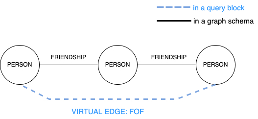
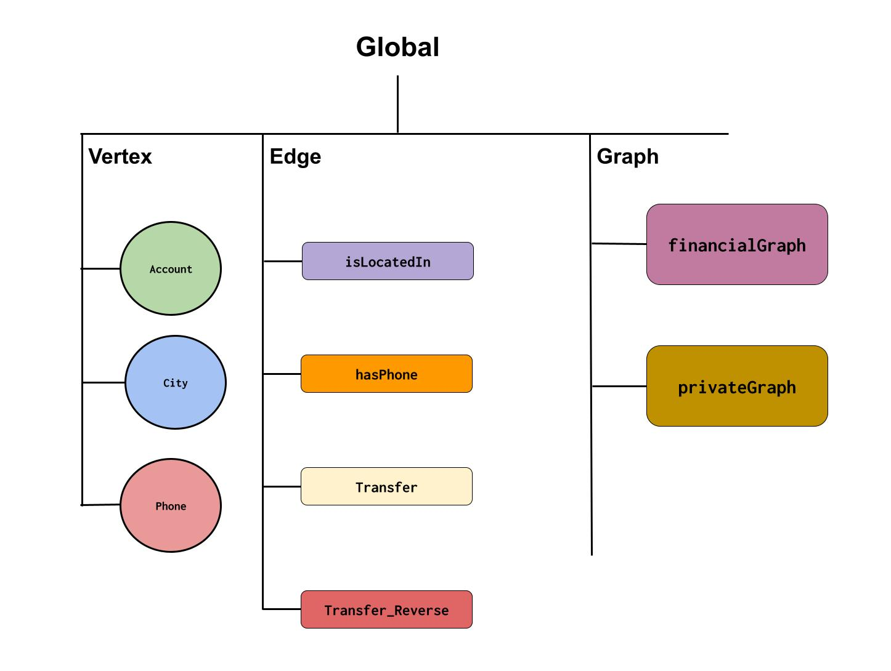

# Introduction <a name="top"></a>

This GSQL tutorial introduces new users to TigerGraph’s graph query language. GSQL enables schema design, data loading, and querying, with Turing-completeness for Agentic AI applications like task dependency management and hybrid data retrieval.

GSQL V3 syntax aligns with the 2024 ISO GQL standard, incorporating ASCII art and OpenCypher pattern matching.

To follow this tutorial, install the TigerGraph Docker image (8 CPUs and 20 GB RAM recommended, or 4 CPUs and 16 GB RAM minimum) or set up a Linux instance with Bash access. Download our free [Community Edition](https://dl.tigergraph.com/) to get started.

---
# Table of Contents

- [Sample Graph](#sample-graph-for-tutorial)
- [Set Up Environment](#set-up-environment)
- [Set Up Schema (model)](#set-up-schema)
- [Load Data](#load-data)
- [1-Block Query Examples](#1-block-query-examples)
  - [SELECT BLOCK](#select-block)
  - [SELECT BLOCK WITH VARIABLES](#select-block-with-variables)	
- [Stored Procedure Query Examples](#stored-procedure-query-examples)
  - [Two Flavors of SELECT](#two-flavors-of-select)
  - [Node Pattern](#node-pattern)
  - [Edge Pattern](#edge-pattern)
  - [Path Pattern](#path-pattern)
  - [Pattern Summary](#pattern-summary)
- [Advanced Topics](#advanced-topics)
  - [Accumulators](#accumulators)
    - [Accumulator Operators](#accumulator-operators)
    - [Global vs Vertex Attached Accumulator](#global-vs-vertex-attached-accumulator)
    - [ACCUM vs POST-ACCUM](#accum-vs-post-accum)
    - [Edge Attached Accumulator](#edge-attached-accumulator)
  - [Vertex Set Variables And Accumulators As Composition Tools](#vertex-set-variables-and-accumulators-as-composition-tools)
    - [Using Vertex Set Variables](#using-vertex-set-variables)
    - [Using Accumulators](#using-accumulators)
  - [Flow Control](#flow-control)
    - [IF Statement](#if-statement)
    - [WHILE Statement](#while-statement)
    - [FOREACH Statement](#foreach-statement)
    - [CONTINUE and BREAK Statement](#continue-and-break-statement)
    - [CASE WHEN Statement](#case-when-statement)
  - [DML](#dml)
    - [Update Attribute](#update-attribute)
    - [Insert Edge](#insert-edge)
    - [Delete Element](#delete-element)
 - [Vertex Set Operators](#vertex-set-operators)
    - [Union](#union)
    - [Intersect](#intersect)
    - [Minus](#minus)
  - [Vector Search](#vector-search)
  - [OpenCypher Query](#opencypher-query)
  - [Virtual Edge](#virtual-edge)
  - [REST API For GSQL](#rest-api-for-gsql)
  - [Query Tuning](#query-tuning)
  - [Explore Catalog](#explore-catalog)
 - [Experimental Features](#experimental-features)
   - [Table](#table)
   - [Init Table Statement](#init-table-statement)
   - [Order Table Statement](#order-table-statement)
   - [Filter Table Statement](#filter-table-statement)
   - [Project Table Statement](#project-table-statement)
   - [Join Statement](#join-statement)
   - [Union Statement](#union-statement)
   - [Union All Statement](#union-all-statement)
   - [Unwind Statement](#unwind-statement)    
 - [Support](#support)
 - [Contact](#contact)

---
# Sample Graph For Tutorial
This graph is a simplifed version of a real-world financial transaction graph. There are 5 _Account_ vertices, with 8 _transfer_ edges between Accounts. An account may be associated with a _City_ and a _Phone_.


---
# Set Up Environment 

If you have your own machine (including Windows and Mac laptops), the easiest way to run TigerGraph is to install it as a Docker image. Download [Community Edition Docker Image](https://dl.tigergraph.com/). Follow the [Docker setup instructions](https://github.com/tigergraph/ecosys/blob/master/demos/guru_scripts/docker/README.md) to  set up the environment on your machine. 

**Note**: TigerGraph does not currently support the ARM architecture and relies on Rosetta to emulate x86 instructions. For production environments, we recommend using an x86-based system.
For optimal performance, configure your Docker environment with **8 CPUs and 20+ GB** of memory. If your laptop has limited resources, the minimum recommended configuration is **4 CPUs and 16 GB** of memory.

After installing TigerGraph, the `gadmin` command-line tool is automatically included, enabling you to easily start or stop services directly from your bash terminal.
```python
   docker load -i ./tigergraph-4.2.0-alpha-community-docker-image.tar.gz # the xxx.gz file name are what you have downloaded. Change the gz file name depending on what you have downloaded
   docker images #find image id
   docker run -d -p 14240:14240 --name mySandbox imageId #start a container, name it “mySandbox” using the image id you see from previous command
   docker exec -it mySandbox /bin/bash #start a shell on this container. 
   gadmin start all  #start all tigergraph component services
   gadmin status #should see all services are up.
```

For the impatient, load the sample data from the tutorial/gsql folder and run your first query. 
```python
   cd tutorial/gsql/   
   gsql 00_schema.gsql  #setup sample schema in catalog
   gsql 01_load.gsql    #load sample data 
   gsql    #launch gsql shell
   GSQL> use graph financialGraph  #enter sample graph
   GSQL> ls #see the catalog content
   GSQL> select a from (a:Account)  #query Account vertex
   GSQL> select s, e, t from (s:Account)-[e:transfer]->(t:Account) limit 2 #query edge
   GSQL> select count(*) from (s:Account)  #query Account node count
   GSQL> select s, t, sum(e.amount) as transfer_amt  from (s:Account)-[e:transfer]->(t:Account)  # query s->t transfer ammount
   GSQL> exit #quit the gsql shell   
```

You can also access the GraphStudio visual IDE directly through your browser:
```python
   http://localhost:14240/
```
A login page will automatically open. Use the default credentials: user is `tigergraph`, password is `tigergraph`. 
Once logged in, click the GraphStudio icon. Assuming you've set up the tutorial schema and loaded the data, navigate by selecting `Global View`, then choose `financialGraph` from the pop up menu. Click Explore Graph to start interacting with your data visually.

To further explore the features of GraphStudio, you can view these concise introductory [videos](https://www.youtube.com/watch?v=29PCZEhyx8M&list=PLq4l3NnrSRp7RfZqrtsievDjpSV8lHhe-), and [product manual].(https://docs.tigergraph.com/gui/4.2/intro/) 

The following command is good for operation.

```python
#To stop the server, you can use
 gadmin stop all
#Check `gadmin status` to verify if the gsql service is running, then use the following command to reset (clear) the database.
 gsql 'drop all'
```

**Note that**, our fully managed service -- [TigerGraph Savanna](https://savanna.tgcloud.io/) is entirely GUI-based and does not provide access to a bash shell. To execute the GSQL examples in this tutorial, simply copy the query into the Savanna GSQL editor and click Run.

Additionally, all GSQL examples referenced in this tutorial can be found in your TigerGraph tutorials/gsql folder.

---
[Go back to top](#top)

# Set Up Schema 
A graph schema describes the vertex types, edge types, and properties found in your graph. TigerGraph is a schema-first database, meaning that the schema is declared before loading data. This not only optimizes data storage and query performance, but it also provides built-in checks to make sure your data conformed to the expected schema.

Copy [00_schema.gsql](./gsql/00_schema.gsql) to your container. 
Next, run the following in your container's bash command line. 
```
gsql 00_schema.gsql
```
As seen below, the declarative DDL creates vertex and edge types. Vertex type requires a `PRIMARY KEY`. Edge types requires `FROM` and `TO` vertex types as the key.
Multiple edges of the same type can share endpoints. In such case, a `DISCRIMINATOR` attribute is needed to differentiate edges sharing the same pair of endpoints. If an edge type has the `REVERSE_EDGE` option, then that type is paired with a companion type so that every edge has a twin edge, sharing the same properties, except it runs in the opposite direction.

```python
//install gds functions
import package gds
install function gds.**

//create vertex types
CREATE VERTEX Account ( name STRING PRIMARY KEY, isBlocked BOOL)
CREATE VERTEX City ( name STRING PRIMARY KEY)
CREATE VERTEX Phone (number STRING PRIMARY KEY, isBlocked BOOL)

//create edge types
CREATE DIRECTED EDGE transfer (FROM Account, TO Account, DISCRIMINATOR(date DATETIME), amount UINT) WITH REVERSE_EDGE="transfer_reverse"
CREATE UNDIRECTED EDGE hasPhone (FROM Account, TO Phone)
CREATE DIRECTED EDGE isLocatedIn (FROM Account, TO City)

//create graph; * means include all graph element types in the graph.
CREATE GRAPH financialGraph (*)
```

[Go back to top](#top)

---
# Load Data 

Now that you have a graph schema, you can load data using one of the following methods. 

- Load sample data from our publicly accessible s3 bucket:
  
  Copy [01_load.gsql](./gsql/01_load.gsql) to your container. 
  Next, run the following in your container's bash command line. 
  ```
     gsql 01_load.gsql
  ```
  or in GSQL editor of TigerGraph Savanna, copy the content of [01_load.gsql](./gsql/01_load.gsql), and paste it into the GSQL editor to run.
  
- Load from local file in your container
  - Copy the following data files to your container.
    - [account.csv](https://raw.githubusercontent.com/tigergraph/ecosys/master/tutorials/data/account.csv)
    - [phone.csv](https://raw.githubusercontent.com/tigergraph/ecosys/master/tutorials/data/phone.csv)
    - [city.csv](https://raw.githubusercontent.com/tigergraph/ecosys/master/tutorials/data/city.csv)
    - [hasPhone.csv](https://raw.githubusercontent.com/tigergraph/ecosys/master/tutorials/data/hasPhone.csv)
    - [locate.csv](https://raw.githubusercontent.com/tigergraph/ecosys/master/tutorials/data/locate.csv)
    - [transfer.csv](https://raw.githubusercontent.com/tigergraph/ecosys/master/tutorials/data/transfer.csv)

  - Copy [25_load2.gsql](./gsql/25_load2.gsql) to your container. Modify the script with your local file path. Next, run the following in your container's bash command line. 
    ```
       gsql 25_load2.gsql
    ``` 
    or in GSQL Shell editor, copy the content of [25_load2.gsql](./gsql/25_load2.gsql), and paste in GSQL shell editor to run.

    The declarative loading script is self-explanatory. You define the filename alias for each data source, and use the LOAD statement to map the data source to the target schema elements-- vertex types, edge types, and vector attributes.
    ```python
    USE GRAPH financialGraph

    DROP JOB load_local_file

    //load from local file
    CREATE LOADING JOB load_local_file  {
      // define the location of the source files; each file path is assigned a filename variable.  
      DEFINE FILENAME account="/home/tigergraph/data/account.csv";
      DEFINE FILENAME phone="/home/tigergraph/data/phone.csv";
      DEFINE FILENAME city="/home/tigergraph/data/city.csv";
      DEFINE FILENAME hasPhone="/home/tigergraph/data/hasPhone.csv";
      DEFINE FILENAME locatedIn="/home/tigergraph/data/locate.csv";
      DEFINE FILENAME transferdata="/home/tigergraph/data/transfer.csv";
      //define the mapping from the source file to the target graph element type. The mapping is specified by VALUES clause. 
      LOAD account TO VERTEX Account VALUES ($"name", gsql_to_bool(gsql_trim($"isBlocked"))) USING header="true", separator=",";
      LOAD phone TO VERTEX Phone VALUES ($"number", gsql_to_bool(gsql_trim($"isBlocked"))) USING header="true", separator=",";
      LOAD city TO VERTEX City VALUES ($"name") USING header="true", separator=",";
      LOAD hasPhone TO Edge hasPhone VALUES ($"accnt", gsql_trim($"phone")) USING header="true", separator=",";
      LOAD locatedIn TO Edge isLocatedIn VALUES ($"accnt", gsql_trim($"city")) USING header="true", separator=",";
      LOAD transferdata TO Edge transfer VALUES ($"src", $"tgt", $"date", $"amount") USING header="true", separator=",";
    }

    run loading job load_local_file
    ```

- Load from Iceberg table, or alternative Spark data sources, through [Tigergraph Spark Connector](https://docs.tigergraph.com/tigergraph-server/current/data-loading/load-from-spark-dataframe)
  - Please follow the Jupyter Notebook PySpark demo: [26_load_iceberg.ipynb](./gsql/26_load_iceberg.ipynb)
    
[Go back to top](#top)

---
# 1-Block Query Examples 

**NOTE** This 1-Block feature is available since 4.2.0 version. Prior version does not support this feature. 

## SELECT BLOCK
1-Block SELECT is a feature that offers an exploratory (interactive style) approach to querying data in a style similar to SQL or Cypher. This syntax enables users to write a single, concise select-from-where-accum statement on one line to retrieve data based on specified conditions. It also supports operations such as filtering, aggregation, sorting, and pagination, making it an excellent tool for ad hoc data inspection.

### Basic Syntax
The basic syntax structure of `1-Block SELECT` is as follows:

```python
SELECT <output_variable> FROM <pattern> WHERE <condition> <additional_clauses>
```
Similar to SQL, graph queries use SELECT-FROM-WHERE clauses. The key difference is that graph queries generalize the FROM clause to allow patterns. A matched pattern is a table, each row in the table is a pattern instance with the binding variables (alias) specified in the FROM clause as columns.  A pattern can represent a vertex, an edge, or a path. These patterns are expressed using ASCII art:

- `()` represents a node. You can put alias (a variable bound to the node) in the front, and `:VertexName` in the suffix. E.g., `(a:Account)`. 
- `-[]->` represents an edge. You can put alias (a variable bound to the edge) in the front, and `:EdgeName` in the suffix. <br> E.g., `-[e:transfer]->`. 
- `()-[]->()-[]->()...` A path is formed by alternating nodes and edges. <br>  E.g., `(a:Account)-[e:transfer]->(b:Account)-[e2:transfer]->(c:Account)`.

This pattern-based approach enables more "declarative flavor", and more flexible and expressive querying of graph data. 

You can directly type *one liner* of the above syntax in GSQL shell to explore your data. The query will not be stored in Catalog as a procedure. 
Or, you can break the one line to multiple lines and enclose them with `BEGIN` and `END` as illustrated below.  

```python
GSQL> BEGIN
GSQL>  SELECT <output_variable>
GSQL>  FROM <pattern>
GSQL>  WHERE <condition> <additional_clauses>
GSQL> END
```

### Examples

#### SELECT with filters

##### Using WHERE clause

```python
GSQL > use graph financialGraph
GSQL > SELECT s FROM (s:Account) LIMIT 10
GSQL > SELECT s FROM (s:Account {name: "Scott"})
GSQL > SELECT s FROM (s:Account WHERE s.isBlocked)
GSQL > SELECT s FROM (s:Account) WHERE s.name IN ("Scott", "Steven")
GSQL > SELECT s, e, t FROM (s:Account) -[e:transfer]-> (t:Account) WHERE s <> t
```

##### Using HAVING

```python
GSQL > use graph financialGraph
GSQL > SELECT s FROM (s:Account) -[e:transfer]-> (t:Account) having s.isBlocked
GSQL > SELECT s FROM (s:Account) -[e:transfer]-> (t:Account) having s.isBlocked AND s.name = "Steven"
```
#### Aggregation SELECT

```python
GSQL > use graph financialGraph
GSQL > SELECT COUNT(s) FROM (s:_)
GSQL > SELECT COUNT(*) FROM (s:Account:City)
GSQL > SELECT COUNT(DISTINCT t) FROM (s:Account)-[e]->(t)
GSQL > SELECT COUNT(e), STDEV(e.amount), AVG(e.amount) FROM (s:Account)-[e:transfer|isLocatedIn]->(t)
GSQL > SELECT a, sum(e.amount) as amount1 , sum(e2.amount) as amount2 FROM (a:Account)-[e:transfer]->(b:Account)-[e2:transfer]->(c:Account) GROUP BY a;
```


#### SELECT with Sorting and Limiting

```python
GSQL > use graph financialGraph
GSQL > SELECT s FROM (s:Account) ORDER BY s.name LIMIT 3 OFFSET 1
GSQL > SELECT s.name, e.amount as amt, t FROM (s:Account) -[e:transfer]-> (t:Account) ORDER BY amt, s.name LIMIT 1
GSQL > SELECT DISTINCT type(s) FROM (s:Account:City) ORDER BY type(s)
```

#### Using some expression

```python
# Using mathematical expressions
GSQL > use graph financialGraph
GSQL > SELECT s, e.amount*0.01 AS amt FROM (s:Account {name: "Scott"})- [e:transfer]-> (t)

# Using CASE expression
GSQL > BEGIN
GSQL >  SELECT s, CASE WHEN e.amount*0.01 > 80 THEN true ELSE false END AS status 
GSQL >  FROM (s:Account {name: "Scott"})- [e:transfer]-> (t)
GSQL > END
```

[Go back to top](#top)

---
## SELECT BLOCK WITH VARIABLES
We can also pass variables to 1-Block SELECT with the prefix `LET...IN` construct. The variables defined between `LET` and `IN` can be primitive types or accumulators, enable flexible computation and aggregation.

### Basic Syntax
```python  
LET  
 <variable_definitions>;
IN  
 SELECT <query_block>
```

The ```LET...IN``` prefix construct in GSQL is used to define and work with variables and accumulators. It allows for the creation of temporary variables or accumulators in the LET block, which can be referenced later in the SELECT block, enabling more powerful and flexible queries. Specifically,

- ```LET```: This keyword starts the block where you define variables and accumulators.
- ```<variable_definitions>```: Inside the `LET` block, you can define variables with primitive types such as `STRING`, `INT`, `UINT`, `BOOL`, `FLOAT`, `DATETIME` and `DOUBLE`. However, container types like `SET`, `LIST`, and `MAP` are not supported at the moment. Inside the `LET` block, you can also define accumulators.
- ```IN SELECT <query_block>```: The  `SELECT` query block follows the `IN` keyword can use the variables and accumulators defined in the `LET` block.

### Examples

#### Primitive type variables
Since `LET ... IN...SELECT` typically spans multiple-lines, we need to use `BEGIN...END` to support it in GSQL shell. Below, we define some primitive type varibles with assigned value, and use them in the `SELECT` query block as bind variables. 

```python
GSQL > use graph financialGraph 
GSQL > BEGIN 
GSQL > LET
GSQL >  DOUBLE a = 500.0; 
GSQL >  STRING b = "Jenny"; 
GSQL >  BOOL c = false; 
GSQL > IN 
GSQL >  SELECT s, e.amount AS amt, t
GSQL >  FROM (s:Account) - [e:transfer]-> (t:Account) 
GSQL >  WHERE s.isBlocked = c AND t.name <> b 
GSQL >  HAVING amt > a; 
GSQL > END
```

You can also use this syntax in one line. E.g., 

```python
GSQL > LET STRING n = "Jenny"; IN SELECT s, count(t) as cnt FROM (s:Account {name:n}) - [:transfer*0..2]-> (t:Account);
```
#### Accumulator type variables

In GSQL, **accumulators** are special state variables used to store and update values during query execution. They are commonly utilized for aggregating sums, counts, sets, and other values for a matched pattern. Accumulators can be categorized into **local accumulators** (specific to individual vertices) and **global accumulators** (aggregating values across all selected nodes).
See [Accumulators](#accumulators) for examples first.

----------

**Restrictions on 1-Block SELECT Clause with Accumulators**

When accumulators are used in a 1-block query, the `SELECT` clause is subject to the following restrictions:

**Only One Node Alias Allowed:**

**If accumulators are used**, the `SELECT` clause must return only **one** node alias.

-  ✅ Source node alias **Allowed:**  `SELECT s FROM (s:Account)-[e:transfer]-(t:Account)`

-  ✅ Target node alias **Allowed:**  `SELECT t FROM (s:Account)-[e:transfer]-(t:Account)`

-  ❌ Relationship alias  **Not Allowed:**  `SELECT e FROM (s:Account)-[e:transfer]-(t:Account)`

-  ❌ Multiple node alias **Not Allowed:** `SELECT s, t FROM (s:Account)-[e:transfer]-(t:Account)`
  

**Functions, Expressions Not Allowed:**

**When using accumulators**, functions and expressions cannot be used in the `SELECT` clause. 

-  ❌ **Functions not allowed:**  `SELECT count(s) FROM (s:Account)-[e:transfer]-(t:Account)`

-  ❌ **Expressions not allowed:**  `SELECT (s.isBlocked OR t.isBlocked) AS flag FROM (s:Account)-[e:transfer]-(t:Account)`

**Local Accumulator Example**

**Definition:**

A **local accumulator** (prefixed with `@`) is associated with a specific vertex and is stored as part of its attributes. When a node is retrieved in a `SELECT` statement, its corresponding local accumulator values are displayed alongside its properties.

**Query:**

```python
GSQL> use graph financialGraph
GSQL> BEGIN
GSQL> LET  
GSQL>  SetAccum<string> @transferNames;  
GSQL>  IN  
GSQL>   SELECT s FROM (s:Account where s.isBlocked) -[:transfer*1..3]- (t:Account)  
GSQL>   ACCUM s.@transferNames += t.name;
GSQL> END
```
**Output:**
```json
{
  "version": {
    "edition": "enterprise",
    "api": "v2",
    "schema": 0
  },
  "error": false,
  "message": "",
  "results": [
    {
      "Result_Vertex_Set": [
        {
          "v_id": "Steven",
          "v_type": "Account",
          "attributes": {
            "name": "Steven",
            "isBlocked": true,
            "@transferNames": [
              "Jenny",
              "Paul",
              "Scott",
              "Steven",
              "Ed"
            ]
          }
        }
      ]
    }
  ]
}
```

**Explanation:**

-   The **local accumulator** `@transferNames` collects the names of accounts connected to `"Steven"` via `transfer` edges (up to 3 hops).
-   In the output, `@transferNames` is stored as runtime attribute, alongside wiht other static attributes `name` and `isBlocked`.

----------

**Global Accumulator Example**

**Definition:**

A **global accumulator** (prefixed with `@@`) aggregates values across all selected nodes and is **printed separately** from node attributes in the query result. All global accumulators declared in the `LET` block will be included in the output.

**Query:**
```python
GSQL> use graph financialGraph
GSQL> BEGIN 
GSQL> LET   
GSQL>  double ratio = 0.01;  
GSQL>  SumAccum<double> @totalAmt;  // local accumulator for total amount 
GSQL>  SumAccum<INT> @@cnt;  // global accumulator for count
GSQL> IN  
GSQL>  SELECT s FROM (s:Account {name:"Ed"}) - [e:transfer]-> (t:Account) 
GSQL>  ACCUM s.@totalAmt += ratio * e.amount, // Accumulate total amount for s 
GSQL>      @@cnt += 1; // Accumulate count of transfers
GSQL> END
```
**Output:**
```json
{
  "version": {
    "edition": "enterprise",
    "api": "v2",
    "schema": 0
  },
  "error": false,
  "message": "",
  "results": [
    {
      "Result_Vertex_Set": [
        {
          "v_id": "Ed",
          "v_type": "Account",
          "attributes": {
            "name": "Ed",
            "isBlocked": false,
            "@totalAmt": 15
          }
        }
      ]
    },
    {
      "@@cnt": 1
    }
  ]
}
```
**Explanation:**

-   The **local accumulator** `@totalAmt` accumulates the weighted sum of transfer amounts and is **stored as an attribute of "Ed"**.
-   The **global accumulator** `@@cnt` counts the total number of transfers and is **printed separately** in the result.
-   This ensures **per-node values are displayed within node attributes, while global aggregates appear in the final output**.


[Go back to top](#top)

---

# Stored Procedure Query Examples 

In this section, we explain how to write stored procedures. A stored procedure is a named query consisting of a sequence of GSQL query blocks or statements. It is stored in the graph database catalog, installed once using a code generation technique for optimal performance, and can be invoked repeatedly using the 'run query' command or a system-generated REST endpoint URL.

To create a stored procedure, you can use the following syntax. 

```python
CREATE OR REPLACE QUERY queryName (/*params*/) SYNTAX v3 {
   v1 = Query_block_1; //v1 is a vertex set variable, storing a set of selected vertices
   v2 = Query_block_2; //v2 is a vertex set variable, storing a set of selected vertices
    .
    .
    . 
}
```

The query block can be a `Node Pattern`, an `Edge Pattern`, or a `Path Pattern`. We will illustrate each pattern with examples.

## Two Flavors of SELECT

In GSQL, each query block (SELECT-FROM-WHERE) can be used to generate a vertex set or a table. 

- SELECT A Vertex Set Style: if a query block generates a vertex set, we can store the vertex set in a variable, and use the vertex set variable to drive subsequent query blocks composition via pattern matching or set operation. Syntax
  ```python
  V= SELECT s
     FROM pattern
     [WHERE condition];
  ``` 
- SELECT INTO A Table Style: if a query block generates a table, we can output the table. Syntax
  ```python
   SELECT exp1, exp2.. INTO T
   FROM pattern
   [WHERE condition];
  ```

Regardless which style you are choosing, the FROM clause will always specify a pattern. The pattern follows ISO GQL standard syntax, which is a well-designed ASCII art syntax-- `()` represents nodes, and `-[]->` represents edges. 

We show both styles for each pattern class. 

---
## Node Pattern
### SELECT A Vertex Set Style 
Copy [02_q1a.gsql](./gsql/02_q1a.gsql) to your container. 

```python
#enter the graph
USE GRAPH financialGraph

//create a query
CREATE OR REPLACE QUERY q1a () SYNTAX v3 {

  // select from a node pattern-- symbolized by (),
  //":Account" is the label of the vertex type Account, "a" is a binding variable to the matched node. 
  // v is a vertex set variable, holding the selected vertex set
  v = SELECT a
      FROM (a:Account);

  // output vertex set variable v in JSON format
  PRINT v;

  //we can use vertex set variable in the subsequent query block's node pattern.
  //v is placed in the node pattern vertex label position. The result is re-assigned to v. 
  v = SELECT a
      FROM (a:v)
      WHERE a.name == "Scott";

  // output vertex set variable v in JSON format
  PRINT v;

}

# Two methods to run the query. The compiled method gives the best performance. 

# Method 1: Run immediately with our interpret engine
interpret query q1a()

# Method 2: Compile and install the query as a stored procedure
install query q1a

# run the compiled query
run query q1a()
```
### SELECT INTO A Table Style
If you're familiar with SQL, treat the matched node as a table -- table(a) or table(a.attr1, a.attr2...). You can group by and aggregate on its columns, just like in SQL. Use `SELECT expr1, expr2..` as usual, with the extension `SELECT a` as selecting the graph element a.

Copy [03_q1b.gsql](./gsql/03_q1b.gsql) to your container. 

```python
#enter the graph
USE GRAPH financialGraph

CREATE OR REPLACE QUERY q1b () SYNTAX v3 {
  //think the FROM clause as a table (a.attr1, a.attr2,...)
  // you can group by a or its attributes, and do aggregation.
  // ":Account" is the label of the vertex type, and "a" is the
  // vertex type alias, and () symbolize a vertex pattern in ASCII art.
  SELECT a.isBlocked, count(*) INTO T
  FROM (a:Account)
  GROUP BY a.isBlocked;

  PRINT T;
}

# Method 1: Run immediately with our interpret engine
interpret query q1b()

# Method 2: Compile and install the query as a stored procedure
install query q1b

# run the compiled query
run query q1b()
```

[Go back to top](#top)

---
## Edge Pattern 
### SELECT A Vertex Set Style 
Copy [04_q2a.gsql](./gsql/04_q2a.gsql) to your container. 

```python

USE GRAPH financialGraph

# create a query
CREATE OR REPLACE QUERY q2a (string acctName) SYNTAX v3 {

  //Declare a local sum accumulator to add values. Each vertex has its own accumulator of the declared type
  //The vertex instance is selected based on the FROM clause pattern.
  SumAccum<int> @totalTransfer = 0;

  // match an edge pattern-- symbolized by ()-[]->(), where () is node, -[]-> is a directed edge
  // "v" is a vertex set variable holding the selected vertex set.
  // {name: acctName} is a JSON style filter. It's equivalent to "a.name == acctName"
  // ":transfer" is the label of the edge type "transfer". "e" is the alias of the matched edge.
  v = SELECT b
      FROM (a:Account {name: acctName})-[e:transfer]->(b:Account)
      //for each matched edge, accumulate e.amount into the local accumulator of b.
      ACCUM  b.@totalTransfer += e.amount;

  //output each v and their static attribute and runtime accumulators' state
  PRINT v;

}


# Two methods to run the query. The compiled method gives the best performance. 

# Method 1: Run immediately with our interpret engine
interpret query q2a("Scott")

# Method 2: Compile and install the query as a stored procedure
install query q2a

# run the compiled query
run query q2a("Scott")
```

### SELECT INTO A Table Style
If you're familiar with SQL, treat the matched edge as a table -- table(a, e, b) or table(a.attr1, a.attr2..., e.attr1, e.attr2...,b.attr1, b.attr2...). You can group by and aggregate on its columns, just like in SQL. Use `SELECT expr1, expr2..` as usual, with the extension "SELECT a", "SELECT e", "SELECT b" as selecting the graph element.

Copy [05_q2b.gsql](./gsql/05_q2b.gsql) to your container. 

```python
USE GRAPH financialGraph

CREATE OR REPLACE QUERY q2b () SYNTAX v3 {

  //think the FROM clause is a matched table with columns (a, e, b)
  //you can use SQL syntax to group by the source and target account, and sum the total transfer amount
  SELECT a, b, sum(e.amount)  INTO T
  FROM (a:Account)-[e:transfer]->(b:Account)
  GROUP BY a, b;

  //output the table in JSON format
  PRINT T;

}

# Two methods to run the query. The compiled method gives the best performance.

# Method 1: Run immediately with our interpret engine
interpret query q2b()

# Method 2: Compile and install the query as a stored procedure
install query q2b

# run the compiled query
run query q2b()
```

[Go back to top](#top)

---

## Path Pattern 

### SELECT A Vertex Set Style: Fixed Length vs. Variable Length Path Pattern
Copy [06_q3a.gsql](./gsql/06_q3a.gsql) to your container. 

```python
USE GRAPH financialGraph

// create a query
CREATE OR REPLACE QUERY q3a (datetime low, datetime high, string acctName) SYNTAX v3 {

  // a path pattern in ascii art ()-[]->()-[]->(), where alternating node() and edge -[]->.
  // You can also use WHERE clause inside a vertex () or edge-[]->. 
  R = SELECT b
      FROM (a:Account WHERE a.name== acctName)-[e:transfer]->()-[e2:transfer]->(b:Account)
      WHERE e.date >= low AND e.date <= high and e.amount >500 and e2.amount>500;

      PRINT R;

  // below we use variable length path.
  // *1.. means 1 to more steps of the edge type "transfer"
  // select the reachable end point and bind it to vertex alias "b"
  R = SELECT b
      FROM (a:Account WHERE a.name == acctName)-[:transfer*1..]->(b:Account);

      PRINT R;

}

# Two methods to run the query. The compiled method gives the best performance.

# Method 1: Run immediately with our interpret engine
interpret query q3a("2024-01-01", "2024-12-31", "Scott")

# Method 2: Compile and install the query as a stored procedure
install query q3a

# run the compiled query
run query q3a("2024-01-01", "2024-12-31", "Scott")
```

### SELECT INTO A Table Style: Group By On A Path Table

If you're familiar with SQL, treat the matched path as a table -- table(a, e, b, e2, c) or unfold their attributes into table(a.attr1, a.attr2..., e.attr1, e.attr2...,b.attr1, b.attr2...). You can group by and aggregate on its columns, just like in SQL. Use `SELECT expr1, expr2..` as usual, with the extension "SELECT a", "SELECT e", "SELECT b" etc. as selecting the graph element.

Copy [07_q3b.gsql](./gsql/07_q3b.gsql) to your container. 

```python
USE GRAPH financialGraph

// create a query
CREATE OR REPLACE QUERY q3b (datetime low, datetime high, string acctName) SYNTAX v3 {

   // a path pattern in ascii art () -[]->()-[]->()
   // think the FROM clause is a matched table with columns (a, e, b, e2, c)
   // you can use SQL syntax to group by on the matched table
   // Below query find 2-hop reachable account c from a, and group by the path a, b, c
   // find out how much each hop's total transfer amount.
   SELECT a, b, c, sum(DISTINCT e.amount) AS hop_1_sum,  sum(DISTINCT e2.amount) AS hop_2_sum INTO T1
   FROM (a:Account)-[e:transfer]->(b)-[e2:transfer]->(c:Account)
   WHERE e.date >= low AND e.date <= high
   GROUP BY a, b, c;

   PRINT T1;

   /* below we use variable length path.
      *1.. means 1 to more steps of the edge type "transfer"
      select the reachable end point and bind it to vertex alias "b"
     note: 
      1. the path has "shortest path" semantics. If you have a path that is longer than the shortest,
      we only count the shortest. E.g., scott to scott shortest path length is 4. Any path greater than 4 will
      not be matched.
     2. we can not put an alias to bind the edge in the variable length part -[:transfer*1..]->, but 
     we can bind the end points (a) and (b) in the variable length path, and group by on them.
   */
   SELECT a, b, count(*) AS path_cnt INTO T2
   FROM (a:Account {name: acctName})-[:transfer*1..]->(b:Account)
   GROUP BY a, b;

   PRINT T2;

}

# Two methods to run the query. The compiled method gives the best performance.

# Method 1: Run immediately with our interpret engine
interpret query q3b("2024-01-01", "2024-12-31", "Scott")

# Method 2: Compile and install the query as a stored procedure
install query q3b

run query q3b("2024-01-01", "2024-12-31", "Scott")
```

[Go back to top](#top)

---

## Pattern Summary

## Table of Edge Patterns (following ISO GQL Standard Syntax)
| Orientation | Example |  Edge Pattern | 
|------------|---------------|----------------------------|
| Pointing left  | <-[e:transfer]-   | <-[alias:type1\|type2\|..]- | 
| Pointing right  | -[e:transfer]->   | -[alias:type1\|type2\|..]-> | 
| undirected  | \~[e:hasPhone]\~   |  \~[alias:type1\|type2\|..]\~ | 
| Left or undirected  | <\~[e:transfer\|hasPhone]\~  | <\~[alias:type1\|type2\|..]\~ |
| Right or undirected  | \~[e:transfer\|hasPhone]\~>   | \~[alias:type1\|type2\|..]\~> | 
| Left or right  | <-[e:transfer]->   | <-[alias:type1\|type2\|..]-> | Y |
| Left, undirected, or right  | -[e:transfer\|hasPhone]-   | -[alias:type1\|type2\|..]- | 

## Variable Length Pattern Quantifier
We support two ways to specify repetitions of a pattern. 

### GQL Style:
| Quantifier | Example |  Description |
|------------|---------|--------------|
| {m,n}    | -[:transfer]->{1,2}   | between m and n repetitions |
| {m,}    | -[:transfer]->{1,}   | m or more repetitions |
| *    | -[:transfer]->*   | equivalent to {0,} |
| +    | -[:transfer]->+   | equivalent to {1,} |


### GSQL Style: 
| Quantifier | Example |  Description |
|------------|---------|--------------|
| *m..n    | -[:transfer*1..2]->   | beween m and n repetitions |
| *m..    | -[:transfer*1..]->   | m or more repetitions |
| *m    | -[:transfer*m]->   | equivalent to m..m |

[Go back to top](#top)

---
# Advanced Topics
## Accumulators
GSQL is a Turing-complete graph database query language. One of its key advantages over other graph query languages is its support for accumulators, which can be either global (prefixed with `@@`) or vertex local (prefixed with `@`). 
Accumulators are containers that store a data value, accept inputs, and aggregate these inputs into the stored data value using a binary operation `+=`.
An accumulator is used as a state variable in GSQL. Its state is mutable throughout the life cycle of a query.

### Accumulator Operators
An accumulator in GSQL supports two operators: assignment (=) and accumulation (+=).

- `=` operator: The assignment operator can be used to reset the state of an accumulator or its current value.

- `+=` operator: The accumulation operator can be used to add new values to the accumulator’s state. Depending on the type of accumulator, different accumulation semantics are applied.

```python
USE GRAPH financialGraph

// "distributed" key word means this query can be run both on a single node or a cluster of nodes 
CREATE OR REPLACE DISTRIBUTED QUERY q4 (/* parameters */) SYNTAX v3 {

    SumAccum<INT> @@sum_accum = 0;
    MinAccum<INT> @@min_accum = 0;
    MaxAccum<INT> @@max_accum = 0;
    AvgAccum @@avg_accum;
    OrAccum @@or_accum = FALSE;
    AndAccum @@and_accum = TRUE;
    ListAccum<INT> @@list_accum;

    // @@sum_accum will be 3 when printed
    @@sum_accum +=1;
    @@sum_accum +=2;
    PRINT @@sum_accum;

    // @@min_accum will be 1 when printed
    @@min_accum +=1;
    @@min_accum +=2;
    PRINT @@min_accum;

    // @@max_accum will be 2 when printed
    @@max_accum +=1;
    @@max_accum +=2;
    PRINT @@max_accum;

    @@avg_accum +=1;
    @@avg_accum +=2;
    PRINT @@avg_accum;

    // @@or_accum will be TRUE when printed
    @@or_accum += TRUE;
    @@or_accum += FALSE;
    PRINT @@or_accum;

    // @@and_accum will be FALSE when printed
    @@and_accum += TRUE;
    @@and_accum += FALSE;
    PRINT @@and_accum;

    // @@list_accum will be [1,2,3,4] when printed
    @@list_accum += 1;
    @@list_accum += 2;
    @@list_accum += [3,4];
    PRINT @@list_accum;

}

//install the query
install query  q4

//run the query
run query q4()
```  
In the above example, six different accumulator variables (those with prefix @@) are declared, each with a unique type. Below we explain their semantics and usage.

- `SumAccum<INT>` allows user to keep adding INT values

- `MinAccum<INT>` keeps the smallest INT number it has seen. As the @@min_accum statements show, we accumulated 1 and 2 to the MinAccum accumulator, and end up with the value 0, as neither of 1 nor 2 is smaller than the initial state value 0.

- `MaxAccum<INT>` is the opposite of MinAccum. It returns the MAX INT value it has seen. The max_accum statements accumulate 1 and 2 into it, and end up with the value 2.

-  `AvgAccum` keeps the average value it has seen. It returns the AVG INT value it has seen. The avg_accum statements accumulate 1 and 2 into it, and end up with the value 1.5.

- `OrAccum` keeps OR-ing the internal boolean state variable with new boolean variables that accumulate to it. The initial default value is assigned FALSE. We accumulate TRUE and FALSE into it, and end up with the TRUE value.

- `AndAccum` is symmetric to OrAccum. Instead of using OR, it uses the AND accumulation semantics. We accumulate TRUE and FALSE into it, and end up with the FALSE value.

- `ListAccum<INT>` keeps appending new integer(s) into its internal list variable. We append 1, 2, and [3,4] to the accumulator, and end up with [1,2,3,4].

[Go back to top](#top)

---
### Global vs Vertex Attached Accumulator
At this point, we have seen that accumulators are special typed variables in GSQL. We are ready to explain their global and local scopes.

Global accumulators belong to the entire query. They can be updated anywhere within the query, whether inside or outside a query block. Local accumulators belong to each vertex. The term "local" indicates that they are local to the vertex element. These accumulators can only be updated when their owning vertex is accessible within a SELECT-FROM-WHERE-ACCUM query block. To differentiate them, we use specific prefixes in their identifiers when declaring them.

- `@@` is used for declaring global accumulator variables. It is always used stand-alone. E.g @@cnt +=1

- `@` is used for declaring local accumulator variables. It must be used with a vertex alias specified in the FROM clause in a query block. E.g. v.@cnt += 1 where v is a vertex alias specified in a FROM clause of a SELECT-FROM-WHERE query block.

```python
USE GRAPH financialGraph

CREATE OR REPLACE QUERY q5 (/* parameters */) SYNTAX V3 {

    SumAccum<INT> @cnt = 0; //local accumulator
    SumAccum<INT>  @@hasPhoneCnt = 0; //global accumulator

   // ~[]~ is an undirected edge.
   S = SELECT a
       FROM (a:Account) ~ [e:hasPhone] ~ (p:Phone)
       WHERE a.isBlocked == FALSE
       ACCUM  a.@cnt +=1,
              p.@cnt +=1,
              @@hasPhoneCnt +=1;

   PRINT S;
   PRINT @@hasPhoneCnt;

}

interpret query q5()

```

In the above example:

- `@cnt` is a local accumulator. Once declared, each vertex alias x specified in a FROM clause can access it in the form x.@cnt. The local accumulator state is mutable by any query block.

- `@@hasPhoneCnt` is a global accumulator.

The ACCUM clause will execute its statements for each pattern matched in the FROM clause and evaluated as TRUE by the WHERE clause.

**Detailed Explanation:**
- The `FROM` clause identifies the edge patterns that match Account -[hasPhone]- Phone.

- The `WHERE` clause filters the edge patterns based on the Account.isBlocked attribute.

- The `ACCUM` clause will execute once for each matched pattern instance that passes the WHERE clause.

For each matching pattern that satisfies the WHERE clause, the following will occur:

- `a.@cnt += 1`
- `p.@cnt += 1`
- `@@hasPhoneCnt += 1`

The accumulator will accumulate based on the accumulator type.

[Go back to top](#top)

---
### ACCUM vs POST-ACCUM

#### ACCUM
Running example. 
```python
USE GRAPH financialGraph

CREATE OR REPLACE QUERY q6 (/* parameters */) SYNTAX V3 {

    SumAccum<INT> @cnt = 0; //local accumulator
    SumAccum<INT>  @@hasPhoneCnt = 0; //global accumulator

   // ~[]~ is an undirected edge.
   S = SELECT a
       FROM (a:Account) ~ [e:hasPhone] ~ (p:Phone)
       WHERE a.isBlocked == FALSE
       ACCUM  a.@cnt +=1,
              p.@cnt +=1,
              @@hasPhoneCnt +=1;

   PRINT S;
   PRINT @@hasPhoneCnt;

}

interpret query q6()
```
- `FROM-WHERE` Produces a Binding Table
  
We can think of the FROM and WHERE clauses specify a binding table, where the FROM clause specifies the pattern, and the WHERE clause does a post-filter of the matched pattern instances-- the result is a table, each row in the table is a pattern instance with the binding variables specified in the FROM clause as columns. In the above query a2 example, the FROM clause produces a result table (a, e, p) where “a” is the Account variable, “e” is the “hasPhone” variable, and “p” is the Phone variable.

- `ACCUM` Process each row independently in the Binding Table

The `ACCUM` clause executes its statements once for each row in the `FROM-WHERE` binding table. The execution is done in a map-reduce fashion.

**Map-Reduce Interpretation:** The ACCUM clause uses snapshot semantics, executing in two phases:

- **Map Phase:** Each row in the binding table is processed in parallel, applying each statement in the `ACCUM` clause, starting with the same accumulator snapshot as inputs. The snapshot of accumulator values is taken before the start of the ACCUM clause.

- **Reduce Phase:** At the end of the `ACCUM` clause, these Map Phase effect are aggregated into their respective accumulators, creating a new snapshot of accumulator values.

The new snapshot of accumulate states is available for access after the ACCUM clause.

---
#### POST-ACCUM

The optional `POST-ACCUM` clause enables accumulation and other computations across the set of vertices produced by the `FROM-WHERE` binding table. `POST-ACCUM` can be used without `ACCUM`. If it is preceded by an `ACCUM` clause, then its statement can access the new snapshot value of accumulators computed by the `ACCUM` clause.

Running example. 

```python
USE GRAPH financialGraph

CREATE OR REPLACE QUERY q7 () SYNTAX V3 {

    SumAccum<INT> @cnt = 0; //local accumulator
    SumAccum<INT>  @@testCnt1 = 0; //global accumulator
    SumAccum<INT>  @@testCnt2 = 0; //global accumulator

   S = SELECT a
       FROM (a:Account) ~ [e:hasPhone] ~ (p:Phone)
       WHERE a.isBlocked == TRUE
       //a.@cnt snapshot value is 0
       ACCUM  a.@cnt +=1, //add 1 to a.@cnt
              @@testCnt1+= a.@cnt //access a.@cnt snapshot value 0
       POST-ACCUM (a) //loop vertex “a” set.
          @@testCnt2 += a.@cnt; //access a.@cnt new snapshot value 1


   PRINT @@testCnt1;
   PRINT @@testCnt2;
   PRINT S;

}

INTERPRET QUERY q7()
```

- `POST-ACCUM` Loops A Vertex Set Selected From the Binding Table
  
The `POST-ACCUM` clause is designed to do some computation based on a selected vertex set from the binding table. It executes its statements(s) once for each distinct value of a referenced vertex column from the binding table. You can have multiple `POST-ACCUM` clauses. But each `POST-ACCUM` clause can only refer to one vertex alias defined in the `FROM` clause. In query q8, `POST-ACCUM (a)` means we project the vertex “a” column from the binding table, remove the duplicates, and loop through the resulting vertex set.

Another characteristic of the `POST-ACCUM` clause is that its statements can access the aggregated accumulator value computed in the `ACCUM` clause.

In query q8, the `POST-ACCUM` statement will loop over the vertex set “a”, and its statement `@@testCnt2+=a.@cnt` will read the updated snapshot value of `a.@cnt`, which is 1.

```python
USE GRAPH financialGraph

CREATE OR REPLACE DISTRIBUTED QUERY q8 () SYNTAX V3 {

     SumAccum<int> @@edgeCnt = 0;
     MaxAccum<int> @maxAmount = 0;
     MinAccum<int> @minAmount = 100000;

     MaxAccum<int> @@maxSenderAmount = 0;
     MinAccum<int> @@minReceiverAmount = 100000;
     SumAccum<int> @@bCnt = 0;
     SumAccum<int> @@aCnt = 0;

    S = SELECT b
        FROM (a:Account) - [e:transfer] -> (b:Account)
        WHERE NOT a.isBlocked
        ACCUM  a.@maxAmount += e.amount, //sender max amount
               b.@minAmount += e.amount, //receiver min amount
                @@edgeCnt +=1
        POST-ACCUM (a) @@maxSenderAmount += a.@maxAmount
        POST-ACCUM (b) @@minReceiverAmount += b.@minAmount
        POST-ACCUM (a) @@aCnt +=1
        POST-ACCUM (b) @@bCnt +=1 ;

  PRINT @@maxSenderAmount,  @@minReceiverAmount;
  PRINT @@edgeCnt, @@aCnt, @@bCnt;

}

INSTALL QUERY q8


RUN QUERY q8()
```

When you reference a vertex alias in a `POST-ACCUM` statement, you bind that vertex alias to the `POST-ACCUM` clause implicitly. You can also explicitly bind a vertex alias with a `POST-ACCUM` clause by putting the vertex alias in parentheses immediately after the keyword `POST-ACCUM`. Each `POST-ACCUM` clause must be bound with one and only one vertex alias.

In query a4(), we have multiple `POST-ACCUM` clauses, each will be looping one selected vertex set.

- `POST-ACCUM (a) @@maxSenderAmount += a.@maxAmount`: In this statement, we loop through the vertex set "a", accessing the aggregate result value `a.@maxAmount` from the `ACCUM` clause. We can write the same statement by removing “(a)”: `POST-ACCUM @@maxSenderAmount += a.@maxAmount`. The compiler will infer the `POST-ACCUM` is looping “a”.

- `POST-ACCUM (b) @@minReceiverAmount += b.@minAmount`: In this statement, we loop through the vertex set “b”, accessing the aggregate result value `b.@minAmount`

- `POST-ACCUM (a) @@aCnt +=1`: In this statement, we loop through the vertex set “a”, for each distinct “a”, we increment `@@aCnt`.

- `POST-ACCUM (b) @@bCnt +=1`: in this statement, we loop through the vertex set “b”, for each distinct “b”, we increment `@@bCnt`.

Note that you can only access one vertex alias in a `POST-ACCUM`. Below example is not allowed, as it has two vertex alias (a, b) in `a.@maxAmount` and `b.@maxAmount`, respectively. 

```python
### Example of Incorrect Code ❌
POST-ACCUM @@maxSenderAmount += a.@maxAmount + b.@maxAmount;
```
[Go back to top](#top)

---
### Edge Attached Accumulator

Similar to attaching accumulator a vertex, you can attach primitive accumulators to an edge instance. 

Example. 

```python
USE GRAPH financialGraph

CREATE OR REPLACE QUERY q9 (string acctName) SYNTAX v3 {

  OrAccum EDGE @visited;

  v = SELECT b
      FROM (a:Account {name: acctName})-[e:transfer]->(b:Account)
      ACCUM  e.@visited += TRUE;

  v = SELECT b
      FROM (a:Account)-[e:transfer]->(b:Account)
      WHERE NOT e.@visited;

  //output each v and their static attribute and runtime accumulators' state
  PRINT v;

}

//it is only supported for single node, or single node mode in distributed enviroment
install query -single q9
run query q9("Jenny")
```
[Go back to top](#top)

---

## Vertex Set Variables And Accumulators As Composition Tools

**Query Composition** means that one query block's computation result can be used as input to another query block. 

User can use two methods to achieve query composition. 

### Using Vertex Set Variables

GSQL query consists of a sequence of query blocks. Each query block will produce a vertex set variable. In top-down syntax order, subsequent query block's `FROM` clause pattern can refer to prior query block's vertex set variable. Thus, achieving query block composition.  

High level, within the query body brackets, you can define a sequence of connected or unconnected query blocks to make up the query body. Below is the skeleton of a query body.

```python
CREATE OR REPLACE DISTRIBUTED QUERY q (/* parameters */) SYNTAX V3 {
    // Query body

    V1= Query_Block_1;


    V2= Query_Block_2;


    V3= Query_Block_3;

        .
        .
        .

    V_n = Query_Block_n;

    PRINT V_i;
}
```

A typical GSQL query follows a top-down sequence of query blocks. Each query block generates a vertex set, which can be used by subsequent query blocks to drive pattern matching. For example, 
the query a5 below achieve query composition via tgtAccnts vertex set variable, where the first SELECT query block compute this variable, and the second SELECT query block uses the variable in its `FROM` clause. 

```python
USE GRAPH financialGraph

CREATE OR REPLACE DISTRIBUTED QUERY q10() SYNTAX V3 {

 SumAccum<int> @cnt = 0;

 //for each blocked account, find its 1-hop-neighbor who has not been blocked.
 tgtAccnts = SELECT y
             FROM (x:Account)- [e:transfer] -> (y:Account)
             WHERE x.isBlocked == TRUE AND y.isBlocked == FALSE
             ACCUM y.@cnt +=1;

 // tgtAccnts vertex set drive the query block below. It's placed in the vertex label position.
 tgtPhones = SELECT z
             FROM (x:tgtAccnts) ~ [e:hasPhone] ~ (z:Phone)
             WHERE z.isBlocked
             ACCUM z.@cnt +=1;

  PRINT tgtPhones;
}

INSTALL QUERY q10

RUN QUERY q10()
```
[Go back to top](#top)

---
### Using Accumulators
 
Recall that vertex-attached accumulator can be accessed in a query block. Across query blocks, if the same vertex is accessed, it's vertex-attached accumulator (a.k.a local accumulator) can be treated as the runtime attribute of the vertex,
each query block will access the latest value of each vertex's local accumulator, thus achieving composition. 

Global variable maintains a global state, it can be accessed within query block, or at the same level as a query block. 
For example, in a6 query below, the first query block accumulate 1 into each `y`'s `@cnt` accumulator, and increment the global accumulator `@@cnt`. In the second query block's `WHERE` clause, we use the `@cnt` and `@@cnt` accumulator, thus achieving composition. 

```python
USE GRAPH financialGraph

CREATE OR REPLACE DISTRIBUTED QUERY q11() SYNTAX V3 {

 SumAccum<int> @cnt = 0;
 SumAccum<int> @@cnt = 0;

 //for each blocked account, find its 1-hop-neighbor who has not been blocked.
 tgtAccnts = SELECT y
             FROM (x:Account)- [e:transfer] -> (y:Account)
             WHERE x.isBlocked == TRUE AND y.isBlocked == FALSE
             ACCUM y.@cnt +=1, @@cnt +=1;

 // tgtAccnts vertex set drive the query block below
 tgtPhones = SELECT z
             FROM (x:tgtAccnts)- [e:hasPhone] - (z:Phone)
             WHERE z.isBlocked AND x.@cnt >1 AND @@cnt>0
             ACCUM z.@cnt +=1;

  PRINT tgtPhones;
}


INSTALL QUERY q11


RUN QUERY q11()
```

[Go back to top](#top)

---
## Flow Control

### IF Statement
The `IF` statement provides conditional branching: execute a block of statements only if a given condition is true. The `IF` statement allows for zero or more `ELSE-IF` clauses, followed by an optional `ELSE` clause. It is always closed by the `END` keyword.

The `IF` statement can appear within a query block `ACCUM` or `POST-ACCUM` clause, or at top-statement level-- the same level as the `SELECT` query block.

**Syntax** 
```python
IF condition1 THEN statement(s)
 ELSE IF condition2 THEN statement(s)
  ...
 ELSE statement(s)
END
```
**Example**
```python
USE GRAPH financialGraph
CREATE OR REPLACE QUERY IfElseTest () SYNTAX V3 {

  SumAccum<INT> @@isBlocked;
  SumAccum<INT> @@unBlocked;
  SumAccum<INT> @@others;

  S1 = SELECT a
       FROM (a:Account)
       ACCUM
             IF a.isBlocked THEN @@isBlocked += 1
              ELSE IF NOT a.isBlocked THEN @@unBlocked += 1
              ELSE  @@others += 1
             END;

  PRINT @@isBlocked, @@unBlocked, @@others;

  STRING drink = "Juice";
  SumAccum<INT> @@calories = 0;

 //if-else. Top-statement level. Each statement
 //needs to end by a semicolon, including the “END”.

  IF drink == "Juice" THEN @@calories += 50;
   ELSE IF drink == "Soda"  THEN @@calories += 120;
   ELSE @@calories = 0;   // Optional else-clause
 END;
  // Since drink = "Juice", 50 will be added to calories

  PRINT @@calories;
}

INSTALL QUERY IfElseTest

RUN QUERY IfElseTest()
```
[Go back to top](#top)

---

### WHILE Statement
The `WHILE` statement provides unbounded iteration over a block of statements. `WHILE` statements can be used at query block level or top-statement level.

The `WHILE` statement iterates over its body until the condition evaluates to false or until the iteration limit is met. A condition is any expression that evaluates to a boolean. The condition is evaluated before each iteration. `CONTINUE` statements can be used to change the control flow within the while block. `BREAK` statements can be used to exit the while loop.

A `WHILE` statement may have an optional `LIMIT` clause. The `LIMIT` clauses have a constant positive integer value or integer variable to constrain the maximum number of loop iterations.

The `WHILE` statement can appear within a query block `ACCUM` or `POST-ACCUM` clause, or at top-statement level-- the same level as the `SELECT` query block.

**Syntax** 
```python
WHILE condition (LIMIT maxIter)? DO
    statement(s)
END
```
**Example**
```python
USE GRAPH financialGraph
CREATE OR REPLACE QUERY WhileTest (VERTEX<Account> seed) SYNTAX V3 {
  //mark if a node has been seen
  OrAccum @visited;
  //empty vertex set var
  reachable_vertices = {};
  //declare a visited_vertices var, annotated its type
  //as ANY type so that it can take any vertex
  visited_vertices (ANY) = {seed};

  // Loop terminates when all neighbors are visited
  WHILE visited_vertices.size() !=0 DO
       //s is all neighbors of visited_vertices
       //which have not been visited
     visited_vertices = SELECT s
                        FROM (:visited_vertices)-[:transfer]->(s)
                        WHERE s.@visited == FALSE
                        POST-ACCUM
                                s.@visited = TRUE;

    reachable_vertices = reachable_vertices UNION visited_vertices;
  END;

  PRINT reachable_vertices;

  //reset vertex set variables
  reachable_vertices = {};
  visited_vertices (ANY) = {seed};


     //clear the visited flag
  S1 = SELECT s
       FROM  (s:Account)
       ACCUM s.@visited = FALSE;

    // Loop terminates when condition met or reach 2 iterations
  WHILE visited_vertices.size() !=0 LIMIT 2 DO
     visited_vertices = SELECT s
                        FROM (:visited_vertices)-[:transfer]-> (s)
                        WHERE s.@visited == FALSE
                        POST-ACCUM
                              s.@visited = TRUE;

     reachable_vertices = reachable_vertices UNION visited_vertices;
  END;

  PRINT reachable_vertices;
}


INSTALL QUERY WhileTest

RUN QUERY WhileTest("Scott")
```

[Go back to top](#top)

---
### FOREACH Statement
The `FOREACH` statement provides bounded iteration over a block of statements.

The `FOREACH` statement can appear within a query block `ACCUM` or `POST-ACCUM` clause, or at top-statement level-- the same level as the `SELECT` query block.

**Syntax** 
```python
FOREACH loop_var IN rangeExpr DO
   statements
END

//loop_var and rangExpr can be the following forms
name IN setBagExpr
(key, value) pair IN setBagExpr // because it’s a Map
name IN RANGE [ expr, expr ]
name IN RANGE [ expr, expr ].STEP ( expr )
```
**Example**
```python
USE GRAPH financialGraph
CREATE OR REPLACE QUERY ForeachTest ( ) SYNTAX V3 {

  ListAccum<UINT>  @@listVar = [1, 2, 3];
  SetAccum<UINT>   @@setVar = (1, 2, 3);
  BagAccum<UINT>   @@bagVar =  (1, 2, 3);

  SetAccum<UINT> @@set1;
  SetAccum<UINT> @@set2;
  SetAccum<UINT> @@set3;

  #FOREACH item in collection accumlators variables
  S = SELECT tgt
      FROM (s:Account) -[e:transfer]-> (tgt)
      ACCUM
        @@listVar += e.amount,
        @@setVar += e.amount,
        @@bagVar += e.amount;

  PRINT @@listVar, @@setVar, @@bagVar;

  //loop element in a list
  FOREACH i IN @@listVar DO
      @@set1 += i;
  END;

  //loop element in a set
  FOREACH i IN @@setVar DO
     @@set2 += i;
  END;

  //loop element in a bag
  FOREACH i IN @@bagVar DO
      @@set3 += i;
  END;

  PRINT @@set1, @@set2, @@set3;

  //show step of loop var
  ListAccum<INT> @@st;
  FOREACH k IN RANGE[-1,4].STEP(2) DO
      @@st += k;
  END;

  PRINT @@st;

  ListAccum<INT> @@t;

  //nested loop:
  // outer loop iterates 0, 1, 2.
  // inner loop iterates 0 to i
  FOREACH i IN RANGE[0, 2] DO
    @@t += i;
    S = SELECT s
        FROM (s:Account)
        WHERE s.name =="Scott"
        ACCUM
          FOREACH j IN RANGE[0, i] DO
            @@t += j
          END;
  END;
  PRINT @@t;

  MapAccum<STRING,STRING> @@mapVar, @@mapVarResult;
  S = SELECT s
      FROM (s:Account)
      WHERE s.name =="Scott" OR s.name == "Jennie"
      ACCUM @@mapVar += (s.name -> s.isBlocked);

   //loop (k,v) pairs of a map
   FOREACH (keyI, valueJ) IN @@mapVar DO
    @@mapVarResult += (keyI -> valueJ);
   END;

  PRINT  @@mapVar, @@mapVarResult;

}

INSTALL QUERY ForeachTest

RUN QUERY ForeachTest()
```
[Go back to top](#top)

---
### CONTINUE and BREAK Statement
The `CONTINUE` and `BREAK` statements can only be used within a block of a `WHILE` or `FOREACH` statement. The `CONTINUE` statement branches control flow to the end of the loop, skipping any remaining statements in the current iteration, and proceeding to the next iteration. That is, everything in the loop block after the `CONTINUE` statement will be skipped, and then the loop will continue as normal. The `BREAK` statement branches control flow out of the loop, i.e., it will exit the loop and stop iteration.

**Example** 
```python
USE GRAPH financialGraph
CREATE OR REPLACE QUERY ContinueAndBreakTest ( ) {

   //output: 1, 3
   INT i = 0;
   WHILE (i < 3) DO
      i = i + 1;
      IF (i == 2) THEN
         CONTINUE; //go directly to WHILE condition
      END;
      PRINT i;
    END;

    //output: 1
    i = 0;
    WHILE (i < 3) DO
      i = i + 1;
      IF (i == 2) THEN
        Break; //jump out of the WHILE loop
      END;
      PRINT i;
    END;

}

INSTALL QUERY ContinueAndBreakTest

RUN QUERY ContinueAndBreakTest()
```
[Go back to top](#top)

---
### CASE WHEN Statement

One `CASE` statement contains one or more `WHEN-THEN` clauses, each `WHEN` presenting one expression. The `CASE` statement may also have one `ELSE` clause whose statements are executed if none of the preceding conditions are true.

The `CASE` statement can be used in two different syntaxes: One equivalent to an `IF-ELSE` statement, and the other equivalent to a switch statement.

The `IF-ELSE` version evaluates the boolean condition within each `WHEN` clause and executes the first block of statements whose condition is true. The optional concluding `ELSE` clause is executed only if all `WHEN` clause conditions are false.

The switch version evaluates the expression following the keyword `WHEN` and compares its value to the expression immediately following the keyword `CASE`. These expressions do not need to be boolean; the `CASE` statement compares pairs of expressions to see if their values are equal. The first `WHEN-THEN` clause to have an expression value equal to the `CASE` expression value is executed; the remaining clauses are skipped. The optional `ELSE` clause is executed only if no `WHEN` clause expression has a value matching the `CASE` value.

The `CASE` statement can appear within a query block `ACCUM` or `POST-ACCUM` clause, or at a top-statement level — the same level as the `SELECT` query block

**Syntax** 
```python
//if-else semantics
CASE
  WHEN condition1 THEN statement(s)
  WHEN condition2 THEN statement(s)
  ...
  ELSE statement(s)
END

//or switch semantics
CASE expr
  WHEN constant1 THEN statement(s)
  WHEN constant2 THEN statement(s)
  ...
  ELSE statement(s)
END
```
**Example**
```python
USE GRAPH financialGraph
CREATE OR REPLACE QUERY CaseWhenTest () SYNTAX V3{

  SumAccum<INT> @@isBlocked;
  SumAccum<INT> @@unBlocked;
  SumAccum<INT> @@others;

  SumAccum<INT> @@isBlocked2;
  SumAccum<INT> @@unBlocked2;
  SumAccum<INT> @@others2;


  //case-when in a query block
  S1 = SELECT a
       FROM (a:Account)
       ACCUM
          //if-else semantic: within query block, statement
          //does not need a semicolon to end.
          CASE
            WHEN a.isBlocked THEN @@isBlocked += 1
            WHEN NOT a.isBlocked THEN @@unBlocked += 1
            ELSE  @@others += 1
          END;


  PRINT @@isBlocked, @@unBlocked, @@others;

  S2 = SELECT a
       FROM (a:Account)
       ACCUM
          //switch semantic: within query block, statement
          //does not need a semicolon to end.
          CASE a.isBlocked
            WHEN TRUE THEN @@isBlocked2 += 1
            WHEN FALSE THEN @@unBlocked2 += 1
            ELSE  @@others2 += 1
          END;

  PRINT @@isBlocked2, @@unBlocked2, @@others2;

  STRING drink = "Juice";
  SumAccum<INT> @@calories = 0;

 //if-else version. Top-statement level. Each statement
 //needs to end by a semicolon, including the “END”.
  CASE
    WHEN drink == "Juice" THEN @@calories += 50;
    WHEN drink == "Soda"  THEN @@calories += 120;
    ELSE @@calories = 0;       // Optional else-clause
  END;
  // Since drink = "Juice", 50 will be added to calories

  //switch version. Top-statement level. Each statement
  //needs to end by a semicolon, including the “END”.
  CASE drink
    WHEN "Juice" THEN @@calories += 50;
    WHEN "Soda"  THEN @@calories += 120;
    ELSE  @@calories = 0;    // Optional else-clause
  END;

  PRINT @@calories;
}

INSTALL QUERY CaseWhenTest

RUN QUERY CaseWhenTest()
```

[Go back to top](#top)

---
## DML

### Update Attribute 
You can directly update the graph element's attribute in the ACCUM and POST-ACCUM clause by directly assign their attribute with a new value. 

**Example**
```python
use graph financialGraph
/*
* Update graph element attribute by direct assignment
* Since GSQL stored procedure has snapshot semantics. The update will
* only be seen after the query is fully executed.
*
*/
CREATE OR REPLACE QUERY updateAttribute () SYNTAX v3 {

  v1 = SELECT a
       FROM (a:Account)-[e:transfer]->(b:Account)
       WHERE a.name = "Scott";

   PRINT v1;

   v2 = SELECT a
        FROM (a:Account)-[e:transfer]->(b:Account)
        WHERE a.name = "Scott"
        ACCUM e.amount = e.amount+1 //increment amount for each edge
        POST-ACCUM (a)
              //change isBlocked from FALSE to TRUE of "Scott" node
             CASE WHEN NOT a.isBlocked THEN a.isBlocked = TRUE END;
}

#compile and install the query as a stored procedure
install query updateAttribute

#run the query
run query updateAttribute()

//check "Scott" isBloked attribute value has been changed to "TRUE"
select a from (a:Account) where a.name = "Scott"

//check "Scott" transfer edges' amount value has been incremented
select e from (a:Account)-[e:transfer]->(t)  where a.name = "Scott"
```

### Insert Edge
You can use `INSERT` statement to insert edges in ACCUM clause. 

**Example**

```python
use graph financialGraph

/*
* Insert an edge by insert statement in ACCUM
* Since GSQL stored procedure has snapshot semantics. The update will
* only be seen after the query is fully executed.
*
*/

CREATE OR REPLACE QUERY insertEdge() SYNTAX v3 {

  DATETIME date = now();
  v1 = SELECT a
       FROM (a:Account)-[e:transfer]->()-[e2:transfer]->(t)
       WHERE a.name = "Scott"
       ACCUM
            INSERT INTO transfer VALUES (a.name, t.name, date, 10);

}

#compile and install the query as a stored procedure
install query insertEdge

#run the query
run query insertEdge()

//see a new edge between "Scott" and "Paul" is inserted
select e from (a:Account)-[e:transfer]->(t) where a.name="Scott"
```

[Go back to top](#top)

### Delete Element
You can use the `DELETE` statement to delete graph element.

**Example**

```python
use graph financialGraph

/*
* Delete a graph element  by DELETE statement
* Since GSQL stored procedure has snapshot semantics. The update will
* only be seen after the query is fully executed.
*
*/
CREATE OR REPLACE QUERY deleteElement() SYNTAX v3 {

  DELETE a FROM (a:Account)
  WHERE a.name = "Scott";

  DELETE e FROM (a:Account)-[e:transfer]->(t)
  WHERE a.name = "Jenny";
}

#compile and install the query as a stored procedure
install query deleteElement

#run the query
run query deleteElement()
```

After the above query is run, you can query the latest graph. 

```python
select s from (s:Account) where s.name = "Scott"
select s, t, e from (s:Account)-[e:transfer]-(t) where s.name = "Jenny"
```

You can also use DELETE() to delete graph element. 

```python
use graph financialGraph

/*
* Delete a graph element  by DELETE()
* Since GSQL stored procedure has snapshot semantics. The update will
* only be seen after the query is fully executed.
*
*/
CREATE OR REPLACE QUERY deleteElement2() SYNTAX v3 {

  v = SELECT a
      FROM (a:Account)
      WHERE a.name = "Paul"
      ACCUM DELETE(a); //delete a vertex

  v = SELECT a
      FROM (a:Account)-[e:transfer]-(t)
      WHERE a.name = "Ed"
      ACCUM DELETE(e); //delete matched edges
}


#compile and install the query as a stored procedure
install query deleteElement2

#run the query
run query deleteElement2()
```

[Go back to top](#top)

---

## Vertex Set Operators

### Union
The `UNION` operator in GSQL is used to combine two or more sets into a single result set. It removes duplicate elements from the input sets. The set could be vertex set or some type set.

**Example**
```python
USE GRAPH financialGraph
CREATE OR REPLACE QUERY unionTest () SYNTAX V3 {
  S1 = SELECT s
       FROM (s:Phone)
       WHERE s.number == "111" OR s.number == "222";

  //show what's in S1
  PRINT S1[S1.number];

  S2 = SELECT s
       FROM (s:Phone)
       WHERE s.number == "222";

  //show what's in S2
  PRINT S2[S2.number];

  S3 = S1 UNION S2;

  //show what's in S3
  PRINT S3[S3.number];

  S4 = SELECT c
       FROM (c:City);

  S5 = S3 UNION S4;

  //show what's in S5
  PRINT S5[S5.number];

}
```
[Go back to top](#top)

---
### Intersect
The `INTERSECT` operator in GSQL is used to return the common vertices between two vertex sets. It only returns the vertices that are present in both vertex sets.

**Example**
```python
USE GRAPH financialGraph
CREATE OR REPLACE QUERY intersectTest () SYNTAX V3{
  S1 = SELECT s
       FROM (s:Phone)
       WHERE s.number == "111" OR s.number == "222";

  //show what's in S1
  PRINT S1[S1.number];

  S2 = SELECT s
       FROM (s:Phone)
       WHERE s.number == "222";

  //show what's in S2
  PRINT S2[S2.number];

  S3 = S1 INTERSECT S2;

  //show what's in S3
  PRINT S3[S3.number];

}
```
[Go back to top](#top)

---
### Minus
The `MINUS` operator in GSQL is used to return the difference between two vertex sets. It essentially subtracts one vertex set from the other, returning only the vertices that are present in the first vertex set but not in the second.

**Example**
```python
USE GRAPH financialGraph

CREATE OR REPLACE QUERY minusTest () SYNTAX V3 {
  S1 = SELECT s
       FROM (s:Phone)
       WHERE s.number == "111" OR s.number == "222";

  //show what's in S1
  PRINT S1[S1.number];

  S2 = SELECT s
       FROM (s:Phone)
       WHERE s.number == "222";

  //show what's in S2
  PRINT S2[S2.number];

  S3 = S1 MINUS S2;

  //show what's in S3
  PRINT S3[S3.number];

}
```
[Go back to top](#top)

---
## Vector Search
TigerGraph has extended the vertex type to support vectors, enabling users to query both structured data (nodes and edges) and unstructured data (embedding attributes) in GSQL.
For more details on vector support, refer to [Vector Search](https://github.com/tigergraph/ecosys/blob/master/tutorials/VectorSearch.md)

---
## OpenCypher Query

TigerGraph also supports OpenCypher. For more details on querying using OpenCypher, please refer to [OpenCypher Tutorial](https://github.com/tigergraph/ecosys/blob/master/tutorials/Cypher.md)

---
## REST API For GSQL

TigerGraph provides seamless interaction with the GSQL server through a comprehensive suite of [GSQL REST APIs](https://docs.tigergraph.com/gsql-ref/4.1/api/gsql-endpoints#_run_query). Below, we demonstrate how to invoke an installed stored procedure via a REST call, passing parameters using a JSON object.

### Parameter JSON object
To pass query parameters by name with a JSON object, map the parameter names to their values in a JSON object enclosed in parentheses. Parameters that are not named in the JSON object will keep their default values for the execution of the query.

For example, if we have the following query:

```python
USE GRAPH financialGraph

CREATE QUERY greet_person(INT age = 3, STRING name = "John",
  DATETIME birthday = to_datetime("2019-02-19 19:19:19"))
{
  PRINT age, name, birthday;
}

INSTALL QUERY greet_person
RUN QUERY greet_person( {"name": "Emma", "age": 21} )

//During installation, you will the see generated REST end point for this query. You can call the query via REST API.
//Supplying the parameters with a JSON object will look like the following. The parameter birthday is not named in the parameter JSON object and therefore takes the default value
curl -u "tigergraph:tigergraph" -H 'Content-Type: application/json' -X POST 'http://127.0.0.1:14240/gsql/v1/queries/greet_person?graph=financialGraph' -d '{"diagnose":false,"denseMode":false,"allvertex":false,"asyncRun":false,"parameters":{"name":"Emma","age":21}}' | jq .
```

The above example use "username:password" as an authentication method. There are token-based authentication methods. Please refer to [Enable REST Authentication](https://docs.tigergraph.com/tigergraph-server/4.1/user-access/enabling-user-authentication#_enable_restpp_authentication) 

Another example-- find the shortest path between two vertices, and output one such path. 

```python

/*
This algorithm is to find and return only the first full path between two vertices

  Parameters:
  v_source: source vertex
  target_v: target vertex
  depth: maxmium path length
  print_results: print JSON output
 */
use graph financialGraph

CREATE OR REPLACE DISTRIBUTED QUERY first_shortest_path(VERTEX v_source, VERTEX target_v, INT depth =8, BOOL print_results = TRUE ) SYNTAX v3 {

  OrAccum @end_point, @visited, @@hit= FALSE;
  ListAccum<VERTEX> @path_list; // the first list of vertices out of many paths
  ListAccum<VERTEX> @@first_full_path;

  // 1. mark the target node as true
  endset = {target_v};
  endset = SELECT s
           From (s:endset)
           POST-ACCUM s.@end_point = true;

  // 2. start from the initial node, save the node to the patt_list, and find all nodes connected through the given name
  Source = {v_source};
  Source = SELECT s
           FROM (s:Source)
           POST-ACCUM s.@path_list = s, s.@visited = true;

 WHILE Source.size() > 0 AND NOT @@hit LIMIT depth DO
       Source = SELECT t
                FROM (s:Source) -[e]-> (t)
                WHERE t.@visited == false
                ACCUM
                   t.@path_list = s.@path_list
                 POST-ACCUM s.@path_list.clear()
                 POST-ACCUM t.@path_list += t,
                             t.@visited = true,
                    IF t.@end_point ==TRUE THEN
                      @@first_full_path += t.@path_list,
                      @@hit += TRUE
                    END;
 END;

 // 3. return the final result
  IF print_results THEN
      PRINT @@first_full_path as path;
  END;
}

install query first_shortest_path
RUN QUERY first_shortest_path( {"v_source": {"id": "Scott", "type": "Account"}, "target_v": {"id": "Steven", "type": "Account"},  "depth": 8, "print_result": true})

//we can also use JSON payload to pass in parameters via REST API call. We need to specify the v_source.type and the target_v.type in the JSON payload. 
 curl -u "tigergraph:tigergraph" -H 'Content-Type: application/json' -X POST 'http://127.0.0.1:14240/gsql/v1/queries/first_shortest_path?graph=financialGraph' -d '{
   "diagnose":false,
   "denseMode":false,
   "allvertex":false,
   "asyncRun":false,
   "parameters":{
     "v_source": "Scott",
     "v_source.type": "Account",
     "target_v": "Steven",
     "target_v.type": "Account",
     "depth": 8,
     "print_result": true
   }
  }' | jq .
```

## Virtual Edge
In a graph schema, vertex and edge types define the data model at design time. However, at query time, users often perform repetitive multi-step traversals between connected vertices, which can be cumbersome and inefficient. To address this, we are introducing the Virtual Edge feature— lightweight, in-memory edges dynamically created at query runtime, and discarded upon query completion. Virtual Edges simplify traversal and enable predicate application across non-adjacent vertices, significantly improving query efficiency and flexibility.


For example, in the above graph we create an in-memory “shortcut” edge “FOF”, so that we can bypass the interim node and find the second neighbor in 1-hop. 
### Syntax
```Python
CREATE DIRECTED|UNDIRECTED VIRTUAL EDGE Virtual_Edge_Type_Name "("
    FROM Vertex_Type_Name ("|" Vertex_Type_Name)* ","
    TO Vertex_Type_Name ("|" Vertex_Type_Name)*
    ["," attribute_name type [DEFAULT default_value]]* ")"
```

### Example
Currently, to use virtual edge we must

- Use the "DISTRIBUTED" keyword to use the virtual edge feature. It can run on both single node machine and multi-node cluster.  
- Use Syntax v2 of GSQL.
- It can be run on TG cloud Savanna Read-only workspace.

```Python
#enter the graph
USE GRAPH financialGraph

# create a query
CREATE OR REPLACE DISTRIBUTED QUERY VirtualEdgeQuery () SYNTAX v2 {

  
  // First we create a virtual edge type
  CREATE DIRECTED VIRTUAL EDGE VirtualE1(FROM City, TO Phone, ts datetime);


  //Insert into the virtual edge of connected Phone and City. 
  v = SELECT c
      FROM Phone:b - (hasPhone)- Account -(isLocatedIn>)-City:c
      ACCUM    INSERT INTO VirtualE1 VALUES(c, b, to_datetime("2025-02-13"));


 ListAccum<String> @@result;
 // traverse the virtual edge (shortcut) computed by the prior query block,
 // store them in a ListAccum, and output in the end.
 v = SELECT p
     FROM City:c -(VirtualE1>)- Phone:p
     ACCUM @@result += c.name + "->" + to_string(p.nmuber);

  //output all virtual edges
  PRINT @@result;

}

install query VirtualEdgeQuery
run query VirtualEdgeQuery()

```

To see more how to use this feature, you can refer to [Virtual Edge](https://docs.tigergraph.com/gsql-ref/4.1/querying/data-types#_virtual_edge)

[Go back to top](#top)

---
## Query Tuning
### Batch Processing to Avoid OOM
Sometimes, you start with a set of vertices, referred to as the Seed set. Each vertex in the Seed set will traverse the graph, performing the same operation. If this process consumes too much memory, a divide-and-conquer approach can help prevent out-of-memory errors.

In the example below, we partition the Seed set into 1000 batches. To select vertices for each batch, we use the condition mod 1000 == batch_number. This groups vertices based on their remainder when divided by 1000.

```python
CREATE OR REPLACE QUERY BatchCount (INT batch_num) SYNTAX v3 {
        SumAccum<INT> @@count;
        batch1 = SELECT s
                 FROM (s:Account)
                 WHERE getvid(s) % 1000 == batch_num; //only select all vertices that mod 1000 == batch_num

        // 1000 is how many batch you will have. You can adjust the batch number to balance performance and memory usage
        tmp = SELECT a1
        FROM (a1:batch1)-[:transfer]->(b1:Account)-[:transfer]->(a2:Account)-[:transfer]->(b2:batch1)
        WHERE a1.name != a2.name AND b1.name != b2.name
        ACCUM @@count +=1;
 
        PRINT @@count;
}
```
You can use a Shell script to invoke the above query with each batch id. 

```bash
#!/bin/bash

# Loop from 0 to 999
for i in {0...999}
do
  # Execute the curl command with the current batch_number
  curl -X GET -H "GSQL-TIMEOUT: 500000" "http://127.0.0.1:9000/query/financialGraph/BatchCount?batch_number=$i"
done
```
[Go back to top](#top)

---
## Explore Catalog

### Global Scope vs. Graph Scope
A database uses Data Definition Language (DDL) to create and modify schema objects. Schema objects include vertex types, edge types, graph types, etc. These schema objects reside in the metadata store, known as the Catalog.
Each schema object is visible within a scope. In a graph database, there are two scopes:

- ***Global Scope***: This is the default scope for schema objects. By default, all objects created using the "CREATE" DDL statement belong to the global scope.
- ***Graph Scope***: Each graph has its own scope. A schema change job can be used to add schema objects (vertex or edge types) to a specific graph’s scope.



As illustrated in above figure, we can use `CREATE` statements to create the `Account`, `City`, and `Phone` vertex schema object, and the `isLocatedIn`, `hasPhone`, `Transfer`, and `Transfer_Reverse` edge schema object, and the `financialGraph` graph schema object. They are all visible in the Global scope.

To enter the global scope, type the `use global` command in the GSQL shell. Next, use the `ls` command to list all the schema objects under this scope.

```python
> USE GLOBAL
> ls
```

The figure above shows that the `financialGraph` is composed of global scope schema objects such as `Account`, `City`, `Phone`, `isLocatedIn`, and `hasPhone` etc. The `privateGraph` also uses the global schema object `Phone`. Thus, both the `financialGraph` and the `privateGraph` share the `Phone` schema object. Additionally, the `privateGraph` has its own private schema objects— `Loan` and `Person` vertex objects.

To enter a graph scope, type the `USE GRAPH` graphName command in the GSQL shell. Then, use the `ls` command to list all the schema objects under this graph scope.

```python
> USE GRAPH financialGraph
> ls
```

To see how to do schema change at global or local level, please refer to [Modify a Graph Schema](https://docs.tigergraph.com/gsql-ref/4.1/ddl-and-loading/modifying-a-graph-schema)

---
### SHOW - View Parts of the Catalog
The `SHOW` command can be used to show certain catalog objects, instead of manually filtering through the entire scope when using the ls command. You can either type the exact identifier or use regular expressions / Linux globbing to search.

The syntax is 

```python
SHOW <VERTEX> | <EDGE> | <JOB> | <QUERY> | <GRAPH> | <PACKAGE> [ <name> | <glob> | -r <regex> ]
```

`SHOW GRAPH graphName` lists vertices and edges without giving their properties.  `SHOW VERTEX vertexName` and `SHOW EDGE edgeName` list the properties of the desired vertex or edge respectively. `SHOW PACKAGE packageName` lists the packages that are available, such as the packaged template queries. 

This feature supports the ? and * from linux globbing operations, and also regular expression matching. Usage of the feature is limited to the scope of the graph the user is currently in - if you are using a global graph, you will not be able to see vertices that are not included in your current graph.

Below are some examples to inspect object in the catalog. 

```python
//show what's in financialGraph scope
use graph financialGraph
ls

//list what's in global scope
use GLOBAL
ls

//show vertex types
SHOW VERTEX Acc*            //shows all vertex types that start with the letters "Acc"
SHOW VERTEX Ac?*t         //shows the vertext types that starts with "Ac" and ends with "t"
SHOW VERTEX ?????          //shows all vertices that are 5 letters long


//show query c1 content
USE GRAPH financialGraph
LS
SHOW QUERY c1

```
---
# Experimental Features
We also provide relational table and related operators on tables such as join etc. These experimental features are available starting from 4.1.2. They are working on *single machine* and *compiled mode* only.

## Table 
In GSQL, the TABLE is used to define intermediate or temporary tables that store query results during execution. These tables are not persistent and exist only within the scope of a query. They help structure and organize data before producing the final result.

### SELECT INTO TABLE statement
The `SELECT INTO TABLE` statement in GSQL is used to retrieve data and store it into a new table. This allows you to perform queries and store results for further operations or transformations.

#### Syntax

```python
SELECT column1 AS alias1, column2 AS alias2, ... INTO newTable
FROM pattern 
[WHERE condition] 
[HAVING condition] 
[ORDER BY column1 [ASC|DESC], column2 [ASC|DESC], ...] 
[LIMIT number] 
[OFFSET number]
;
```
-   `column1, column2, ...`: Specifies the columns to retrieve.
-   `AS alias1, AS alias2...`: specifies column alias of the selected column. 
-   `newTable`: The name of the new table where the query results will be stored.
-   `pattern`: Defines the data pattern, which can be a node, relationship, or a linear path.
-   `WHERE condition`: Optional. Used to filter rows that satisfies a specific condition.
-   `HAVING condition`: Optional. Used to filter the aggregated results.
-   `ORDER BY`: Optional. Specifies how the results should be sorted (either `ASC` for ascending or `DESC` for descending).
-   `LIMIT`: Optional. Limits the number of rows returned.
-   `OFFSET`: Optional. Specifies the number of rows to skip.

#### Example

```python
use graph financialGraph

CREATE OR REPLACE QUERY selectExample2() SYNTAX v3 {
  SELECT s.name AS acct, SUM(e.amount) AS totalAmt INTO T1
  FROM (s:Account)- [e:transfer]-> (t:Account)
  WHERE not s.isBlocked
  HAVING totalAmt > 1000
  ORDER BY totalAmt DESC
  LIMIT 5 OFFSET 0
  ;

  PRINT T1;
}

install query selectExample2
run query selectExample2()
```
#### Explanation

-   In this example, we are retrieving data from the `Account` nodes `s` and `t` connected by the `transfer` relationship.
-   The query aggregates the `amount` of the transfer and stores the result into a new table `T1`.
-   The `HAVING` clause filters the results to only include those with a `totalAmt` greater than 1000, and the results are ordered by `totalAmt` in descending order, limiting the output to the top 5 entries.
-   Finally, the content of table `T1` is printed.
  
[Go back to top](#top)

---
## Init Table Statement
The `INIT` statement in GSQL is used to initialize a table row containing constant values. This allows you to create a table with predefined constant values, which can be used for further operations or queries.

#### Syntax

```python
INIT tableName value1 AS column1, value2 AS column2, ...;
```
-   `tableName`: The name of the table to be initialized.
-   `value1, value2, ...`: The constant values to be assigned to the table.
-   `column1, column2, ...`: The names of the columns in the table that correspond to the values.

---

#### Example

```python
use graph financialGraph

CREATE OR REPLACE QUERY initExample(int intVal = 10) syntax v3{
  // Initialize a table with different constant values.
  INIT T1 1 as col_1, true as col_2, [0.1, -1.1] as col_3;
  PRINT T1;

  // Initialize a table with variables and function calls
  DATETIME date = now();
  INIT T2 date as col_1, intVal as col_2, SPLIT("a,b,c", ",") as col_3;
  PRINT T2;

}

install query initExample
run query initExample()
```

#### Explanation

- **Table Initialization with Constant Values**: The first `INIT` statement creates table `T1` with three columns (`col_1`, `col_2`, `col_3`). The values `1`, `true`, and `[0.1, -1.1]` are assigned to `col_1`, `col_2`, and `col_3`
- **Table Initialization with Variables**: The second `INIT` statement initializes table `T2`. It uses the current date and time (`now()`) for `col_1`, the input variable `intVal` for `col_2`, and splits a string `"a,b,c"` into an array and assigns it to `col_3`.

[Go back to top](#top)

---
## Order Table Statement
The `ORDER` statement in GSQL is used to sort tables based on one or more columns, with the optional `LIMIT` and `OFFSET` clauses. This allows efficient ordering and retrieval of a subset of data.

#### Syntax

```python
ORDER tableName BY column1 [ASC|DESC], column2 [ASC|DESC] ... LIMIT number OFFSET number;
```
-   `tableName`: The table to be ordered.
-   `column1, column2, ...`: Columns to sort by.
-   `ASC | DESC`: Sorting order (ascending by default).
-   `LIMIT number`: Restricts the number of rows in the result.
-   `OFFSET number`: Skips a number of rows before returning results.

---

#### Example

```python
use graph financialGraph

CREATE OR REPLACE QUERY orderExample(INT page=1) syntax v3{

  SELECT s.name as acct, max(e.amount) as maxTransferAmt INTO T1
       FROM (s:Account)- [e:transfer]-> (t:Account)
    ;

  ORDER T1 BY maxTransferAmt DESC, acct LIMIT 3 OFFSET 1 * page;

  PRINT T1;
}

install query orderExample
run query orderExample()
```

#### Explanation
 - Selects account names and their maximum transfer amounts.
 - Sorts by `maxTransferAmt` (descending) and `acct` (ascending).
 - Returns 3 rows per page, skipping first `page` rows for pagination.

[Go back to top](#top)

---
## Filter Table Statement
The `FILTER` statement works by applying the condition to the specified `target_table`, modifying its rows based on the logical expression provided. Filters are applied sequentially, so each subsequent filter operates on the results of the previous one.

#### Syntax

```python
FILTER <target_table> ON <condition>;
```

#### Example

```python
use graph financialGraph

CREATE OR REPLACE QUERY filterExample() SYNTAX v3 {
   SELECT s.name as srcAccount, e.amount as amt, t.name as tgtAccount INTO T
   FROM (s:Account) - [e:transfer]-> (t)
      ;

   FILTER T ON srcAccount == "Scott" OR amt > 10000;

   PRINT T;

   FILTER T ON srcAccount != "Scott";

   PRINT T;
}

install query filterExample
run query filterExample()
```

#### Explanation

-   The first `FILTER` statement retains rows where `srcAccount` is "Scott" or `amt` is greater than `10000`.
-   The second `FILTER` statement removes rows where `srcAccount` is "Scott".
-   The `PRINT` statements display the intermediate and final results after filtering.

[Go back to top](#top)

---
## Project Table Statement

The `PROJECT` statement reshapes a table by creating new derived columns based on selected expressions. These columns can result from arithmetic operations, string concatenation, or logical conditions. The `PROJECT` statement is particularly useful for preparing data for further analysis without altering the original table.

#### Syntax

 **1. Transforming Table Data**
 ```python
PROJECT tableName ON
   columnExpression AS newColumnName,
   ...
INTO newTableName;
```

 **2. Extracting Vertex Sets**
 
 Converts a table column containing vertex objects into a vertex set.
 
 ```python
 PROJECT tableName ON VERTEX COLUMN vertexColumnName INTO VSET;
 ```


#### Example 1: Transforming Table Data

```python
use graph financialGraph

CREATE OR REPLACE QUERY projectExample() syntax v3{
   SELECT s.name as srcAccount, p.number as phoneNumber, sum(e.amount) as amt INTO T1
   FROM (s:Account {name: "Scott"}) - [e:transfer]-> (t),
           (s) - [:hasPhone]- (p);

   PRINT T1;

   PROJECT T1 ON
      T1.srcAccount + ":" + T1.phoneNumber as acct,
      T1.amt * 2 as doubleAmt,
      T1.amt % 7 as mod7Amt,
      T1.amt > 10000 as flag
   INTO T2;

   PRINT T2;
}

install query projectExample
run query projectExample()
```

#### Explanation
The `PROJECT` statement transforms the data by adding new calculated columns:

 - `acct`: Concatenates the account name (`srcAccount`) with the phone number (`phoneNumber`) into a single string.
 - `doubleAmt`: Doubles the value of `amt`.
 - `mod7Amt`: Computes the remainder when `amt` is divided by 7.
 - `flag`: Creates a boolean flag indicating whether `amt` is greater than `10,000`.

The `PROJECT` statement does not modify the original table (`T1`) but instead creates a new table (`T2`) with the transformed data. This ensures that the original data remains unchanged for future use.

#### Example 2: Extracting Vertex Sets from a Table

```python
use graph financialGraph

CREATE OR REPLACE QUERY projectExample2() syntax v3{
   SELECT tgt as tgtAcct, phone as tgtPhone INTO T1
   FROM (s:Account {name: "Scott"}) - [e:transfer]-> (tgt:Account) - [:hasPhone] - (phone);

   PRINT T1;

   PROJECT T1 ON VERTEX COLUMN
      tgtAcct INTO vSet1,
      tgtPhone INTO vSet2
      ;

   VS_1 =  SELECT s FROM (s:vSet1);
   VS_2 =  SELECT s FROM (s:vSet2);

   PRINT VS_1, VS_2;
}

install query projectExample2
run query projectExample2()
```
**Explanation**

We first create an intermediate table (`T1`), which contains `tgtAcct` (target account) and `tgtPhone` (phone number linked to the account).
Next,  we extract vertex sets using the `PROJECT tableName ON VERTEX COLUMN` syntax.

 - `PROJECT T1 ON VERTEX COLUMN tgtAcct INTO vSet1`: Extracts `tgtAcct` vertices into `vSet1`.
 - `PROJECT T1 ON VERTEX COLUMN tgtPhone INTO vSet2`: Extracts `tgtPhone` vertices into `vSet2`.

[Go back to top](#top)

---
## Join Statement
In GSQL queries, the `JOIN` operation is commonly used to combine data from multiple tables (or nodes and relationships). Depending on the specific requirements, different types of `JOIN` operations are used. Common `JOIN` types include `INNER JOIN`, `CROSS JOIN`, `SEMIJOIN`, and `LEFT JOIN`.

#### INNER JOIN

The `INNER JOIN` statement combines rows from both tables where the join condition is true. Only rows that have matching values in both tables are returned.

**Syntax:**
```python
JOIN <target_table1> table1_alias WITH <target_table2> table2_alias
  ON <condition>
PROJECT 
	<table1_alias columnExpression> as columnName1, 
	<table2_alias columnExpression> as columnName2,
	...
INTO newTableName;
```

**Example**
```python
USE GRAPH financialGraph

CREATE OR REPLACE QUERY innerJoinExample(STRING accountName = "Scott") syntax v3{
   SELECT s.name as srcAccount, sum(e.amount) as amt INTO T1
   FROM (s:Account {name: accountName}) - [e:transfer]-> (t);

   SELECT s.name, t.number as phoneNumber INTO T2
   FROM (s:Account) - [:hasPhone]- (t:Phone);

   JOIN T1 t1 WITH T2 t2
     ON t1.srcAccount == t2.name
   PROJECT
     t1.srcAccount + ":" + t2.phoneNumber as acct,
     t1.amt as totalAmt
   INTO T3;

   PRINT T3;
}

install query innerJoinExample
run query innerJoinExample()
```
**Explanation:**

-   **`INNER JOIN`** combines data from `T1` and `T2` based on matching `srcAccount` and `name`. Only rows with a match in both tables are returned, which results in a joined set of data containing the account name and the total transfer amount.

---
#### CROSS JOIN

The `CROSS JOIN` statement combines each row from the first table with all rows from the second table, producing the Cartesian product. This type of join does not require a condition and can potentially result in a large number of rows. If you want to eliminate duplicate rows from the result, you can use the `DISTINCT` keyword to return only unique combinations.

**Syntax:**
```python
JOIN <target_table1> table1_alias WITH <target_table2> table2_alias
PROJECT 
	<table1_alias columnExpression> as columnName1, 
	<table2_alias columnExpression> as columnName2,
	...
INTO newTableName;
```

**Example**
```python
use graph financialGraph

CREATE OR REPLACE QUERY crossJoinExample(STRING accountName = "Scott") syntax v3{
   SELECT s.name as srcAccount, sum(e.amount) as amt INTO T1
   FROM (s:Account {name: accountName}) - [e:transfer]-> (t);

   SELECT s.name, t.number as phoneNumber INTO T2
   FROM (s:Account) - [:hasPhone]- (t:Phone);

   JOIN T1 t1 WITH T2 t2
   PROJECT distinct
     t1.srcAccount + ":" + t2.phoneNumber as acct,
     t1.amt as totalAmt
   INTO T3;

   PRINT T3;
}

install query crossJoinExample
run query crossJoinExample()
```
**Explanation**

-   **`CROSS JOIN`** produces a Cartesian product between `T1` and `T2`. In this example, every `srcAccount` will be paired with every phone number from `T2`, resulting in all combinations of accounts and phone numbers.
-   **`DISTINCT`** is used to remove any duplicate combinations from the result. Without `DISTINCT`, you might get repeated rows if there are multiple matching rows in `T2` for each row in `T1`.
---

#### SEMIJOIN

The `SEMIJOIN` statement filters rows from the first table based on whether they have a matching row in the second table. It returns rows from the first table where the join condition is true, but **only columns from the left (first) table can be accessed**. The right table's columns are not included in the result.

**Syntax:**
```python
SEMIJOIN <target_table1> table1_alias WITH <target_table2> table2_alias
      ON <condition>
 PROJECT 
	<table1_alias columnExpression> as columnName1,
	<table1_alias columnExpression> as columnName2,
	...
INTO newTableName;
```

**Example Usage:**
```python
use graph financialGraph

CREATE OR REPLACE QUERY semiJoinExample(STRING accountName = "Scott") syntax v3{
   SELECT s.name as srcAccount, sum(e.amount) as amt INTO T1
      FROM (s:Account) - [e:transfer]-> (t);

   SELECT s.name, t.number as phoneNumber INTO T2
      FROM (s:Account {name: accountName}) - [:hasPhone]- (t:Phone);

   SEMIJOIN T1 t1 WITH T2 t2
     ON t1.srcAccount == t2.name
   PROJECT
     t1.srcAccount as acct,
     t1.amt as totalAmt
   INTO T3;

   PRINT T3;
}

install query semiJoinExample
run query semiJoinExample()
```

**Explanation**

-   **`SEMIJOIN`** returns rows from `T1` where there is a matching row in `T2`, but only the columns from `T1` are included in the result. Even though there is a match between the two tables on `srcAccount` and `name`, **the result only includes columns from the left table (`T1`)**. This is useful when you want to check for the existence of matching rows without including data from the second table.

---

#### LEFT JOIN

The `LEFT JOIN` statement combines rows from both tables, but ensures that all rows from the left table (first table) are included, even if there is no matching row in the right table (second table). If no match exists, the right table's columns will have `NULL` values.

**Syntax:**

```python
LEFT JOIN <target_table1> table1_alias WITH <target_table2> table2_alias
  ON <condition>
PROJECT 
	<table1_alias columnExpression> as columnName1, 
	<table2_alias columnExpression> as columnName2,
	...
INTO newTableName;
```

**Example Usage:**

```python
use graph financialGraph

CREATE OR REPLACE QUERY leftJoinExample(STRING accountName = "Scott") syntax v3{
   SELECT s.name as srcAccount, sum(e.amount) as amt INTO T1
      FROM (s:Account) - [e:transfer]-> (t);

   SELECT s.name, t.number as phoneNumber INTO T2
      FROM (s:Account) - [:hasPhone]- (t:Phone)  ;

   LEFT JOIN T1 t1 WITH T2 t2
     ON t1.srcAccount == t2.name
   PROJECT
     t1.srcAccount  as acct,
     t2.phoneNumber as phoneNum,
     t1.amt as totalAmt
   INTO T3;

   PRINT T3;
}

install query leftJoinExample
run query leftJoinExample()
```

**Explanation**

-   **`LEFT JOIN`** returns all rows from `T1` (the left table), even if there is no matching row in `T2` (the right table). If no match is found, the columns from `T2` will be filled with `NULL`. In this example, even accounts without a phone number will appear in the result, with `phoneNumber` as `NULL`.

[Go back to top](#top)

---
## Union Statement
The `UNION` statement in GSQL combines the results of two compatible tables into a new table, ensuring **no duplicate rows** in the output by default. This operation is useful when merging data sets from different sources or when performing set operations on table results.

#### Syntax

```python
UNION table1 WITH table2 [WITH table3 ...] INTO newTable;
```
-   `table1`, `table2`, ...: Input tables that need to be combined.
-   `newTable`: The resulting table that stores the merged data.
-   The input tables **must have the same schema** (i.e., the same number of columns with matching data types).
-   Important Note: After UNION, the original tables (table1, table2, etc.) are destroyed and cannot be used in subsequent query operations.

#### Example 
```python
use graph financialGraph

CREATE OR REPLACE QUERY unionExample(STRING accountName = "Scott") syntax v3{
   // Select accounts that transferred money
   SELECT s as acct INTO T1
   FROM (s:Account {name: accountName}) - [e:transfer]-> (t);

   // Select accounts by name
   SELECT s as acct INTO T2
   FROM (s:Account {name: accountName})
      ;

   // Combine both results into table T3
   UNION T1 WITH T2 INTO T3;

   PRINT T3;
}

install query unionExample
run query unionExample()
```

#### Explanation

**Selecting Data Into Temporary Tables**

 - `T1`: Selects accounts that have transferred money.
 - `T2`: Selects accounts that match the given name.

**Performing the UNION Operation**
 `UNION T1 WITH T2 INTO T3;`：Merges results from `T1` and `T2`, removing duplicates.

**Printing the Final Result**
    `PRINT T3;` outputs the combined dataset.
    
[Go back to top](#top)

---

## Union All Statement
The `UNION ALL` statement functions similarly to `UNION`, but **does not remove duplicate rows**. This operation is useful when preserving all records from input tables, even if they are identical.

#### Syntax

```python
UNION ALL table1 WITH table2 [WITH table3 ...] INTO newTable;
```

#### Example Usage:

```python
use graph financialGraph

CREATE OR REPLACE QUERY unionAllExample(STRING accountName = "Scott") syntax v3{
   SELECT s as acct INTO T1
   FROM (s:Account {name: accountName}) - [e:transfer]-> (t);

   SELECT s as acct INTO T2
   FROM (s:Account {name: accountName})
      ;

   // Combine both results into table T3, keeping all duplicate rows
   UNION ALL T1 WITH T2 INTO T3;

   PRINT T3;
}

install query unionAllExample
run query unionAllExample()
```

#### Explanation:

Using `UNION ALL` can improve performance when duplicate elimination is unnecessary, as it avoids the extra computation required to filter out duplicates.

[Go back to top](#top)

---
## Unwind Statement
The `UNWIND` statement in GSQL is used to expand a list into multiple rows, allowing iteration over list elements and their combination with other tables. This is particularly useful when applying transformations or computations based on a set of values.

There are two main forms of `UNWIND`:

1.  **Expanding a fixed list** to initialize a new table.
2.  **Expanding a list column per row** in an existing table.

#### Syntax

**Expanding a Fixed List (UNWIND INIT)**

```python
UNWIND [value1, value2, ...] AS columnName INTO newTable;
```

-   `[value1, value2, ...]`: A list of values to be expanded.
-   `columnName`: The alias for each value in the generated table.
-   `newTable`: The resulting table that stores the expanded rows.

**Expanding a List Per Row (UNWIND A TABLE)**

```python
UNWIND tableName ON list AS columnName INTO newTable;
```

-   `tableName`: The input table whose rows will be expanded.
-   `list`: A list to be expanded for each row of `tableName`.
-   `columnName`: The alias for each value in the expanded list.
-   `newTable`: The resulting table that stores expanded rows while preserving columns from `tableName`.

#### Expanding a fixed list to init a new table Example:

```python
use graph financialGraph

CREATE OR REPLACE QUERY unwindExample() syntax v3{

  // Creates table `T1`, where each value from the list `[0.9, 1.0, 1.1]` is inserted as a separate row under the column `ratio`.
  UNWIND [0.9, 1.0, 1.1] AS ratio INTO T1;
  PRINT T1;

  SELECT s.name as acct, sum(e.amount) as totalAmt INTO T2
  FROM (s:Account)- [e:transfer]-> (t:Account)
  WHERE s.isBlocked
    ;

  // 1. Joins `T1` (containing ratios) with `T2` (containing account transfer sums).
  // 2. Computes a new column "resAmt = totalAmt * ratio" to adjust transfer amounts based on different ratios.
  // 3. Stores the result in new table T3.
  JOIN T1 t1 WITH T2 t2
  PROJECT t2.acct as acct, t1.ratio as ratio, t2.totalAmt * t1.ratio as resAmt
  INTO T3;

  PRINT T3;
}

install query unwindExample
run query unwindExample()
```
#### Explanation

-   The list `[0.9, 1.0, 1.1]` is expanded **independently** into a new table (`T1`).
-   Later, `T1` is **joined** with `T2` to apply multipliers to `totalAmt`.


#### Expanding a list for each row in an existing table Example:

```python
use graph financialGraph

SET opencypher_mode = true #unwind needs to set openCypher mode
CREATE OR REPLACE QUERY unwindExample2() syntax v3{

  SELECT s.name as acct, [0.9, 1.0, 1.1] as ratioList, sum(e.amount) as totalAmt INTO T1
  FROM (s:Account)- [e:transfer]-> (t:Account)
  WHERE s.isBlocked
    ;

  UNWIND T1 ON ratioList AS ratio INTO T2;

  PRINT T2;
}

install query unwindExample2
run query unwindExample2()
```
#### Explanation:

-   Instead of creating a separate table first (`T1`), the list column `ratioList` is **expanded per row of `T1`** directly into `T2`.
-   The columns from `T1` (like `acct` and `totalAmt`) are preserved in `T2`, with additional rows for each `ratio`.

[Go back to top](#top)

---
# Support 
If you like the tutorial and want to explore more, join the GSQL developer community at 

https://community.tigergraph.com/

Or, study our product document at

https://docs.tigergraph.com/gsql-ref/current/intro/

[Go back to top](#top)

---

# Contact
To contact us for commercial support and purchase, please email us at [info@tigergraph.com](mailto:info@tigergraph.com)

[Go back to top](#top)


