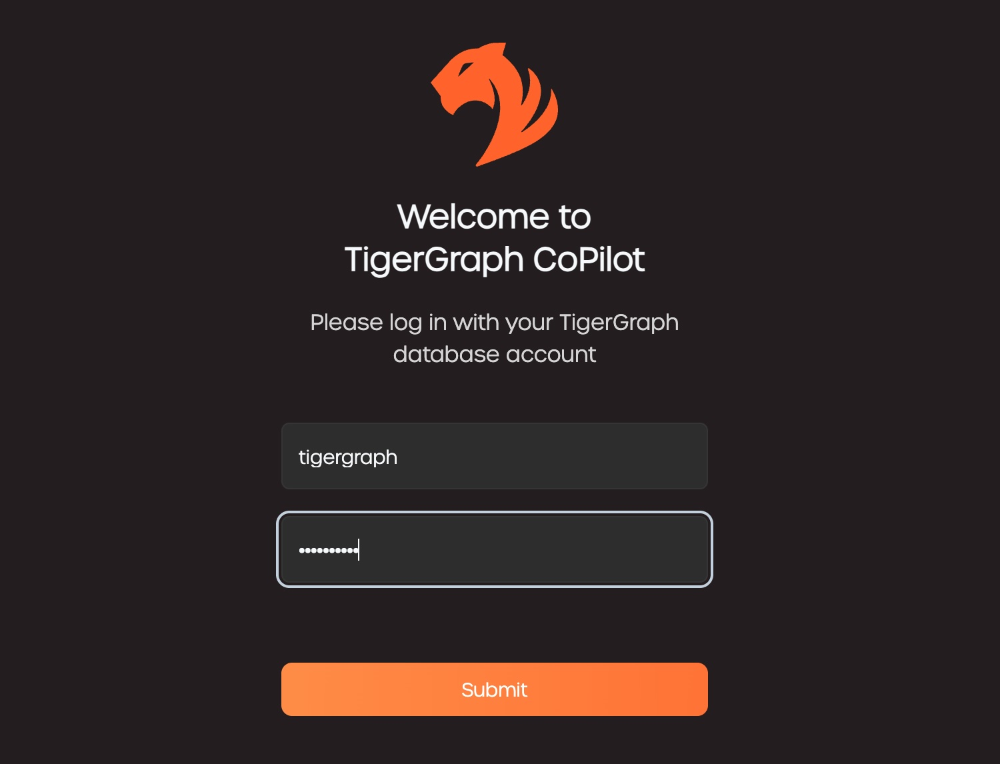
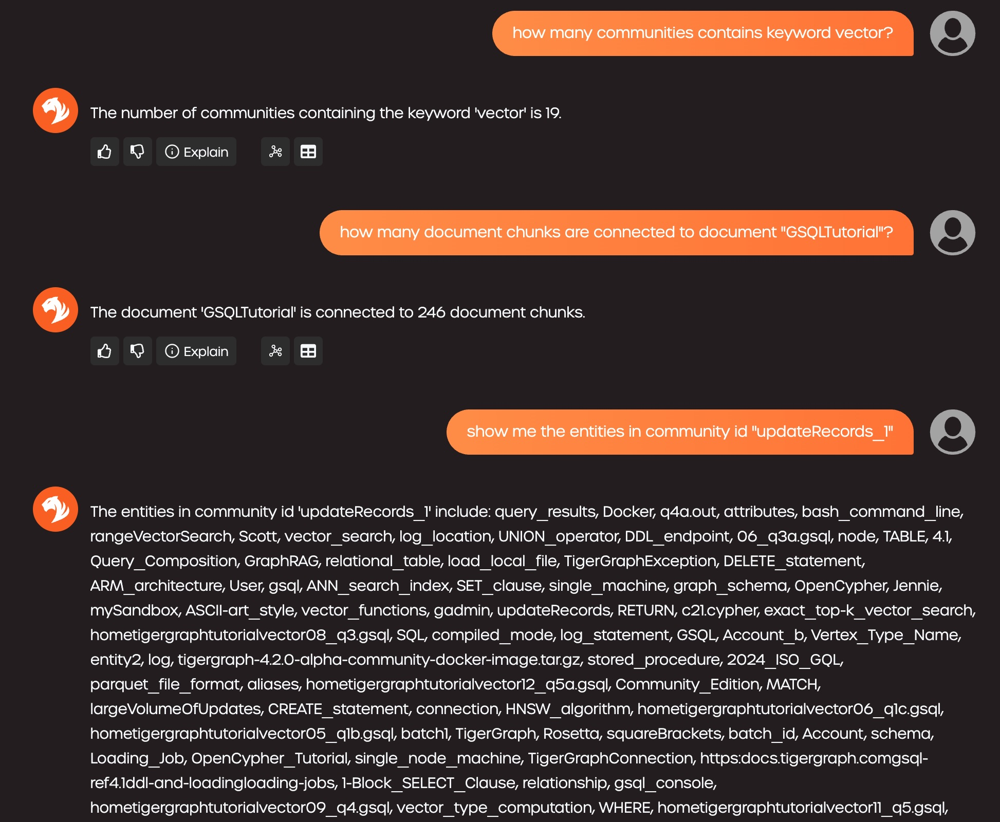

# Introduction

**TigerGraph GraphRAG** is an AI assistant meticulously designed to combine the powers of graph databases and generative AI. It draws the most value from data and enhances productivity across various business functions, including analytics, development, and administrative tasks. It is one AI assistant with three core component services:
- **InquiryAI**: A natural language assistant for graph-powered solutions.
- **SupportAI**: A knowledge Q&A assistant for documents and graphs.
- **QueryAI**: A GSQL code generator, including query and schema generation, data mapping, and more (*Not available in Beta; coming soon*).

This document provides instructions on how to use **SupportAI**.

# Content

This GraphRAG tutorial contains:
- [Setup Environment](#setup-environment)
  - [Setup Docker Environment](#setup-docker-environment)
  - [Download Docker Images](#download-docker-images)
  - [Deploy GraphRAG Services](#deploy-graphrag-with-docker-compose)
- [Run Demo](#run-demo)
  - [Use Preloaded GraphRAG](#use-preloaded-graphrag)
  - [Start From Scratch](#build-graphrag-from-scratch)
- [More Configurations](#more-detailed-configurations)
  - [DB Configuration](#db-configuration)
  - [GraphRAG Configuration](#graphrag-configuration)
  - [LLM Provider Configuration](#llm-provider-configuration)
  - [Chat Configuration](#chat-configuration)
      
# Setup Environment 

### Setup Docker Environment

* Follow [Docker setup ](https://github.com/tigergraph/ecosys/blob/master/demos/guru_scripts/docker/README.md) to set up your docker Environment.
* Please follow (Overview of installing Docker Compose)[https://docs.docker.com/compose/install/] to install Docker Compose for your platform accordingly.

### Download Docker Images

#### TigerGraph Docker Image

To use TigerGraph Community Edition without a license key, download the corresponding docker image from https://dl.tigergraph.com/ and load to Docker:
```
docker load -i ./tigergraph-4.2.0-community-docker-image.tar.gz
docker images
```

You should be able to find `tigergraph/community:4.2.0` in the image list.

#### GraphRAG Docker Images

The following images are also needed for TigerGraph GraphRAG. Docker Compose will automatically download them, but you can download them manually if preferred:

```
docker pull <image_name>

tigergraph/graphrag:latest
tigergraph/graphrag-ecc:latest
tigergraph/graphrag-ui:latest
tigergraph/chat-history:latest
nginx:latest
```

### Deploy GraphRAG with Docker Compose

#### Step 1: Get docker-compose file
Download the [docker-compose.yml](https://raw.githubusercontent.com/tigergraph/ecosys/refs/heads/master/tutorials/graphrag/docker-compose.yml) file directly

The Docker Compose file contains all dependencies for GraphRAG including a TigerGraph database. If you want to use a separate TigerGraph instance, you can comment out the `tigergraph` section from the docker compose file and restart all services. However, please follow the instructions below to make sure your standalone TigerGraph server is accessible from other GraphRAG containers.

#### Step 2: Set up configurations

Next, download the following configuration files and put them in a `configs` subdirectory of the directory contains the Docker Compose file:
* [configs/server_config.json](https://raw.githubusercontent.com/tigergraph/ecosys/refs/heads/master/tutorials/graphrag/configs/server_config.json)
* [configs/nginx.conf](https://raw.githubusercontent.com/tigergraph/ecosys/refs/heads/master/tutorials/graphrag/configs/nginx.conf)

#### Step 3: Adjust configurations

Edit `llm_config` section of `configs/server_config.json` and replace `<YOUR_OPENAI_API_KEY>` to your own OPENAI_API_KEY. 
 
> If desired, you can also change the model to be used for the embedding service and completion service to your preferred models to adjust the output from the LLM service.

#### Step 4(Optional): Configure Logging Level in Dockerfile

To configure the logging level of the service, edit the Docker Compose file.

**By default, the logging level is set to "INFO".**

```console
ENV LOGLEVEL="INFO"
```

This line can be changed to support different logging levels.

**The levels are described below:**

| Level | Description |
| --- | --- |
| `CRITICAL` | A serious error. |
| `ERROR` | Failing to perform functions. |
| `WARNING` | Indication of unexpected problems, e.g. failure to map a user’s question to the graph schema. |
| `INFO` | Confirming that the service is performing as expected. |
| `DEBUG` | Detailed information, e.g. the functions retrieved during the `GenerateFunction` step, etc. |
| `DEBUG_PII` | Finer-grained information that could potentially include `PII`, such as a user’s question, the complete function call (with parameters), and the LLM’s natural language response. |
| NOTSET | All messages are processed. |

#### Step 5: Start all services

Now, simply run `docker compose up -d` and wait for all the services to start.

> Note: `graphrag` container will be down if TigerGraph service is not ready. Log into the `tigergraph` container, bring up tigergraph services and rerun `docker compose up -d` should resolve the issue.

[Go back to top](#top)

### Standalone TigerGraph instance (Optional)

> **_Note:_** Vector feature is available in both TigerGraph Community Edition 4.2.0+ and Enterprise Edition 4.2.0+.

If you prefer to start a TigerGraph Community Edition instance without a license key, please make sure the container can be accessed from the GraphRAG containers by add `--network graphrag_default`:
```
docker run -d -p 14240:14240 --name tigergraph --ulimit nofile=1000000:1000000 --init --network graphrag_default -t tigergraph/community:4.2.0
```

> Use **tigergraph/tigergraph:4.2.0** if Enterprise Edition is preferred.
> Setting up **DNS** or `/etc/hosts` properly is an alternative solution to ensure contains can connect to each other.
> Or modify`hostname` in `db_config` section of `configs/server_config.json` and replace `http://tigergraph` to your tigergraph container IP address, e.g., `http://172.19.0.2`. 

Check the service status with the following commands:
```
docker exec -it tigergraph /bin/bash
gadmin status
gadmin start all
```

After using the database, and you want to shutdown it, use the following shell commmand
```
gadmin stop all
```

[Go back to top](#top)

# Run Demo

### Use Preloaded GraphRAG

The completed `TigerGraphRAG` is provided for an express access to the GraphRAG features.

#### Step 1: Get data package

Download the following data file and put it under `/home/tigergraph/graphrag` in your TigerGraph container:
* [data/ExportedGraph.zip](https://raw.githubusercontent.com/tigergraph/ecosys/refs/heads/master/tutorials/graphrag/data/ExportedGraph.zip)

Use the following commands if the file cannot be downloaded inside the TigerGraph container directly:
```
docker exec -it tigergraph mkdir -p /home/tigergraph/graphrag
docker cp ExportedGraph.zip tigergraph:/home/tigergraph/graphrag/
docker exec -u 0 -it tigergraph chown tigergraph:tigergraph /home/tigergraph/graphrag/ExportedGraph.zip
```

#### Step 2: Import data package
Next, log onto the TigerGraph instance and make use of the Database Import feature to recreate the GraphRAG:
```
docker exec -it tigergraph /bin/bash
gsql "import graph all from \"/home/tigergraph/graphrag\""
gsql "install query all"
```

Wait until the following output is given:
```
[======================================================================================================] 100% (26/26)
Query installation finished.
```

#### Step 3: Run the demo via chat
Open your browser to access `http://localhost:<nginx_port>` to access GraphRAG Chat. For example: http://localhost:80

Enter the username and password of the TigerGraph database to login.



On the top of the page, select `GraphRAG` as RAG pattern and `TigerGraphRAG` as Graph.


In the chat box, input the question `how to load data to tigergraph vector store, give an example in Python` and click the `send` button.


You can also ask other questions on statistics and data inside the TigerGraph database.



### Build GraphRAG From Scratch

If you want to experience the whole process of GraphRAG, you can build the GraphRAG from scratch. However, please review the LLM model and service setting carefully because it will cost some money to re-generate embedding and data structure for the raw data.

#### Step 1: Get demo script

The following scripts are needed to run the demo. Please download and put them in the same directory as the Docker Compose file:
* Demo driver: [graphrag_demo.sh](https://raw.githubusercontent.com/tigergraph/ecosys/refs/heads/master/tutorials/graphrag/graphrag_demo.sh)
* GraphRAG initializer: [init_graphrag.py](https://raw.githubusercontent.com/tigergraph/ecosys/refs/heads/master/tutorials/graphrag/init_graphrag.py)
* Example: [answer_question.py](https://raw.githubusercontent.com/tigergraph/ecosys/refs/heads/master/tutorials/graphrag/answer_question.py)

#### Step 2: Download the demo data

Next, download the following data file and put it in a `data` subdirectory of the directory contains the Docker Compose file:
* [data/tg_tutorials.jsonl](https://raw.githubusercontent.com/tigergraph/ecosys/refs/heads/master/tutorials/graphrag/data/tg_tutorials.jsonl)

#### Step 3: Run the demo driver script

> Note: Python 3.11+ is needed to run the demo

It is recommended to use a virtual env to isolate the runtime environment for the demo
```
python3.11 -m venv demo
source demo/bin/activate
```

Now, simply run the demo script to try GraphRAG.
```
  ./graphrag_demo.sh
```

The script will:
1. Check the environment
1. Init TigerGraph schema and related queries needed
1. Load the sample data
1. Init the GraphRAG based on the graph and install required queries
1. Ask a question via Python to get answer from GraphRAG

[Go back to top](#top)

# More Detailed Configurations

### DB configuration
Copy the below into `db_config` section of `configs/server_config.json` and edit the `hostname` and `getToken` fields to match your database's configuration. If token authentication is enabled in TigerGraph, set `getToken` to `true`. Set the timeout, memory threshold, and thread limit parameters as desired to control how much of the database's resources are consumed when answering a question.

```json
{
    "db_config": {
        "hostname": "http://tigergraph",
        "restppPort": "14240",
        "gsPort": "14240",
        "getToken": false,
        "default_timeout": 300,
        "default_mem_threshold": 5000,
        "default_thread_limit": 8
    }
}
```

### GraphRAG configuration
Copy the below code into `graphrag_config` section of `configs/server_config.json`. You shouldn’t need to change anything unless you change the port of the chat history service in the Docker Compose file.

`reuse_embedding` to `true` will skip re-generating the embedding if it already exists.
`ecc` and `chat_history_api` are the addresses of internal components of GraphRAG.If you use the Docker Compose file as is, you don’t need to change them.

```json
{
    "graphrag_config": {
        "reuse_embedding": false,
        "ecc": "http://eventual-consistency-service:8001",
        "chat_history_api": "http://chat-history:8002"
    }
}
```

### LLM provider configuration
In the `llm_config` section of `configs/server_config.json` file, copy JSON config template from below for your LLM provider, and fill out the appropriate fields. Only one provider is needed.

* OpenAI
In addition to the `OPENAI_API_KEY`, `llm_model` and `model_name` can be edited to match your specific configuration details.

```json
{
    "llm_config": {
        "embedding_service": {
            "embedding_model_service": "openai",
            "model_name": "text-embedding-3-small",
            "authentication_configuration": {
                "OPENAI_API_KEY": "YOUR_OPENAI_API_KEY_HERE"
            }
        },
        "completion_service": {
            "llm_service": "openai",
            "llm_model": "gpt-4.1-mini",
            "authentication_configuration": {
                "OPENAI_API_KEY": "YOUR_OPENAI_API_KEY_HERE"
            },
            "model_kwargs": {
                "temperature": 0
            },
            "prompt_path": "./app/prompts/openai_gpt4/"
        }
    }
}
```

* Google GenAI

Get your Gemini API key via https://aistudio.google.com/app/apikey.

```json
{
    "llm_config": {
        "embedding_service": {
            "embedding_model_service": "genai",
            "model_name": "models/gemini-embedding-exp-03-07",
            "dimensions": 1536,
            "authentication_configuration": {
                "GOOGLE_API_KEY": "YOUR_GOOGLE_API_KEY_HERE"
            }
        },
        "completion_service": {
            "llm_service": "genai",
            "llm_model": "gemini-2.5-flash",
            "authentication_configuration": {
                "GOOGLE_API_KEY": "YOUR_GOOGLE_API_KEY_HERE"
            },
            "model_kwargs": {
                "temperature": 0
            },
            "prompt_path": "./common/prompts/google_gemini/"
        }
    }
}
```

* GCP VertexAI

Follow the GCP authentication information found here: https://cloud.google.com/docs/authentication/application-default-credentials#GAC and create a Service Account with VertexAI credentials. Then add the following to the docker run command:

```sh
-v $(pwd)/configs/SERVICE_ACCOUNT_CREDS.json:/SERVICE_ACCOUNT_CREDS.json -e GOOGLE_APPLICATION_CREDENTIALS=/SERVICE_ACCOUNT_CREDS.json
```

And your JSON config should follow as:

```json
{
    "llm_config": {
        "embedding_service": {
            "embedding_model_service": "vertexai",
            "model_name": "GCP-text-bison",
            "authentication_configuration": {}
        },
        "completion_service": {
            "llm_service": "vertexai",
            "llm_model": "text-bison",
            "model_kwargs": {
                "temperature": 0
            },
            "prompt_path": "./app/prompts/gcp_vertexai_palm/"
        }
    }
}
```

* Azure

In addition to the `AZURE_OPENAI_ENDPOINT`, `AZURE_OPENAI_API_KEY`, and `azure_deployment`, `llm_model` and `model_name` can be edited to match your specific configuration details.

```json
{
    "llm_config": {
        "embedding_service": {
            "embedding_model_service": "azure",
            "model_name": "GPT35Turbo",
            "azure_deployment":"YOUR_EMBEDDING_DEPLOYMENT_HERE",
            "authentication_configuration": {
                "OPENAI_API_TYPE": "azure",
                "OPENAI_API_VERSION": "2022-12-01",
                "AZURE_OPENAI_ENDPOINT": "YOUR_AZURE_ENDPOINT_HERE",
                "AZURE_OPENAI_API_KEY": "YOUR_AZURE_API_KEY_HERE"
            }
        },
        "completion_service": {
            "llm_service": "azure",
            "azure_deployment": "YOUR_COMPLETION_DEPLOYMENT_HERE",
            "openai_api_version": "2023-07-01-preview",
            "llm_model": "gpt-35-turbo-instruct",
            "authentication_configuration": {
                "OPENAI_API_TYPE": "azure",
                "AZURE_OPENAI_ENDPOINT": "YOUR_AZURE_ENDPOINT_HERE",
                "AZURE_OPENAI_API_KEY": "YOUR_AZURE_API_KEY_HERE"
            },
            "model_kwargs": {
                "temperature": 0
            },
            "prompt_path": "./app/prompts/azure_open_ai_gpt35_turbo_instruct/"
        }
    }
}
```

* AWS Bedrock

```json
{
    "llm_config": {
        "embedding_service": {
            "embedding_model_service": "bedrock",
            "model_name":"amazon.titan-embed-text-v1",
            "authentication_configuration": {
                "AWS_ACCESS_KEY_ID": "ACCESS_KEY",
                "AWS_SECRET_ACCESS_KEY": "SECRET"
            }
        },
        "completion_service": {
            "llm_service": "bedrock",
            "llm_model": "anthropic.claude-3-haiku-20240307-v1:0",
            "authentication_configuration": {
                "AWS_ACCESS_KEY_ID": "ACCESS_KEY",
                "AWS_SECRET_ACCESS_KEY": "SECRET"
            },
            "model_kwargs": {
                "temperature": 0,
            },
            "prompt_path": "./app/prompts/aws_bedrock_claude3haiku/"
        }
    }
}
```

* Ollama

```json
{
    "llm_config": {
        "embedding_service": {
            "embedding_model_service": "openai",
            "model_name": "GPT-4o",
            "authentication_configuration": {
                "OPENAI_API_KEY": ""
            }
        },
        "completion_service": {
            "llm_service": "ollama",
            "llm_model": "calebfahlgren/natural-functions",
            "model_kwargs": {
                "temperature": 0.0000001
            },
            "prompt_path": "./app/prompts/openai_gpt4/"
        }
    }
}
```

* Hugging Face

Example configuration for a model on Hugging Face with a dedicated endpoint is shown below. Please specify your configuration details:\

```json
{
    "llm_config": {
        "embedding_service": {
            "embedding_model_service": "openai",
            "model_name": "llama3-8b",
            "authentication_configuration": {
                "OPENAI_API_KEY": ""
            }
        },
        "completion_service": {
            "llm_service": "huggingface",
            "llm_model": "hermes-2-pro-llama-3-8b-lpt",
            "endpoint_url": "https://endpoints.huggingface.cloud",
            "authentication_configuration": {
                "HUGGINGFACEHUB_API_TOKEN": ""
            },
            "model_kwargs": {
                "temperature": 0.1
            },
            "prompt_path": "./app/prompts/openai_gpt4/"
        }
    }
}
```

Example configuration for a model on Hugging Face with a serverless endpoint is shown below. Please specify your configuration details:

```json
{
    "llm_config": {
        "embedding_service": {
            "embedding_model_service": "openai",
            "model_name": "Llama3-70b",
            "authentication_configuration": {
                "OPENAI_API_KEY": ""
            }
        },
        "completion_service": {
            "llm_service": "huggingface",
            "llm_model": "meta-llama/Meta-Llama-3-70B-Instruct",
            "authentication_configuration": {
                "HUGGINGFACEHUB_API_TOKEN": ""
            },
            "model_kwargs": {
                "temperature": 0.1
            },
            "prompt_path": "./app/prompts/llama_70b/"
        }
    }
}
```

* Groq

```json
{
    "llm_config": {
        "embedding_service": {
            "embedding_model_service": "openai",
            "model_name": "mixtral-8x7b-32768",
            "authentication_configuration": {
                "OPENAI_API_KEY": ""
            }
        },
        "completion_service": {
            "llm_service": "groq",
            "llm_model": "mixtral-8x7b-32768",
            "authentication_configuration": {
                "GROQ_API_KEY": ""
            },
            "model_kwargs": {
                "temperature": 0.1
            },
            "prompt_path": "./app/prompts/openai_gpt4/"
        }
    }
}
```

### Chat configuration
Copy the below code into `configs/server_config.json`. You shouldn’t need to change anything unless you change the port of the chat history service in the Docker Compose file.

```json
{
    "chat_config": {
        "apiPort":"8002",
        "dbPath": "chats.db",
        "dbLogPath": "db.log",
        "logPath": "requestLogs.jsonl",
        "conversationAccessRoles": ["superuser", "globaldesigner"]
    }
}
```

[Go back to top](#top)

