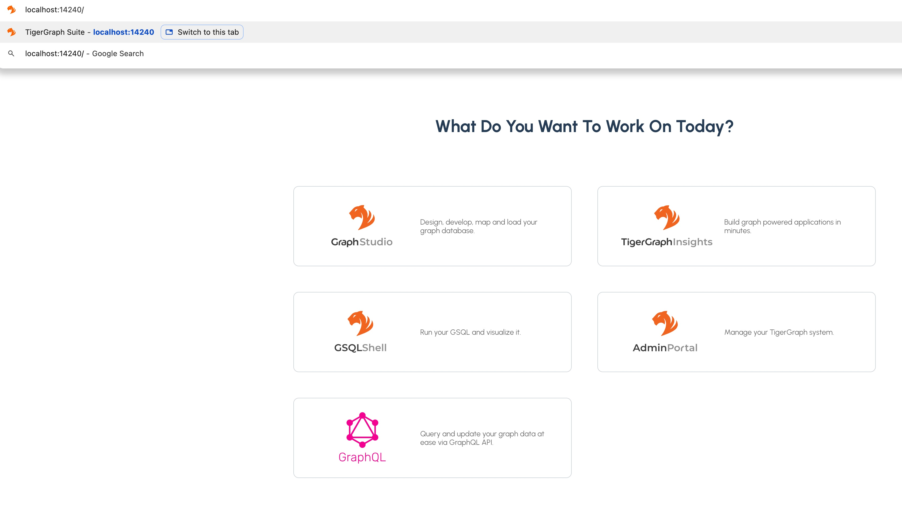
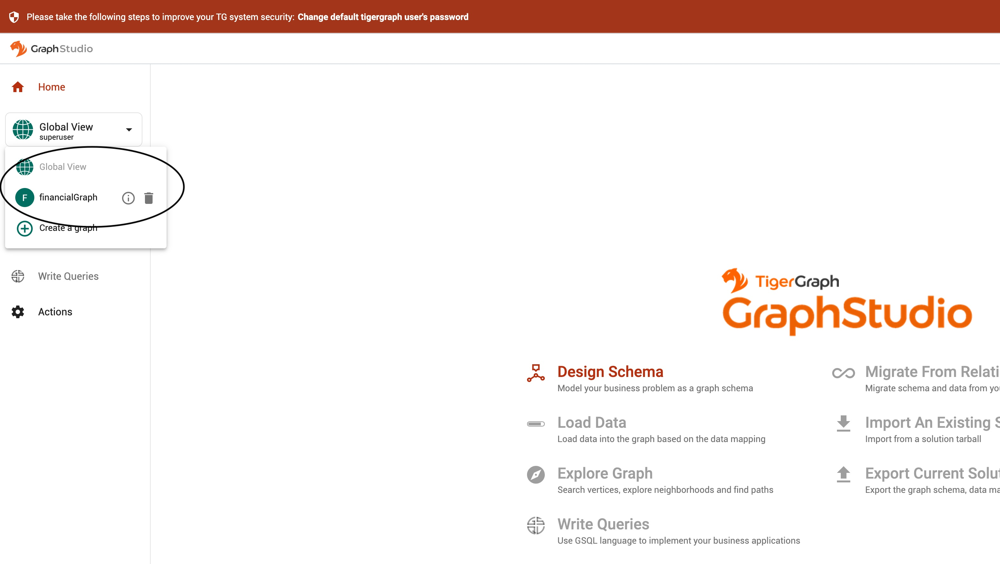
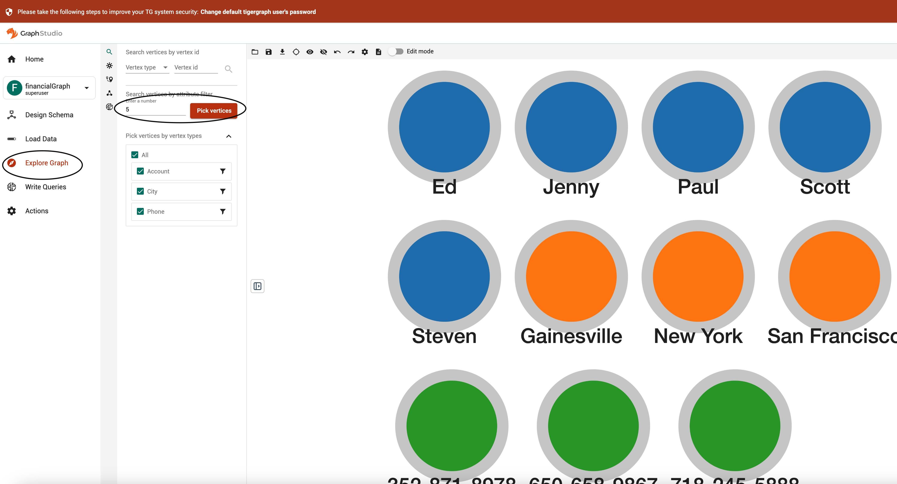
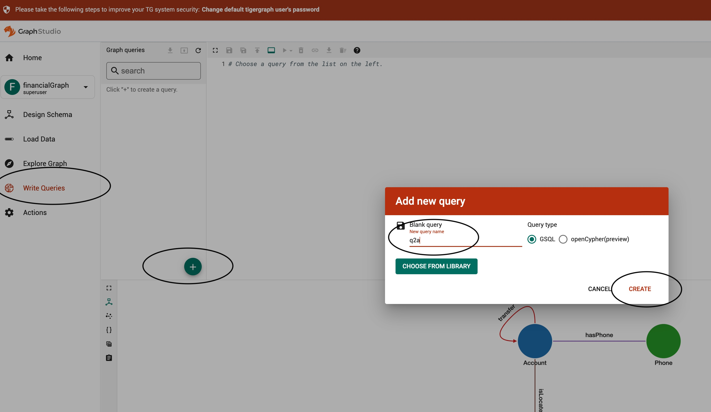

# Sample Graph For Tutorial
This graph is a simplifed version of a real-world financial transaction graph. There are 5 _Account_ vertices, with 8 _transfer_ edges between Accounts. An account may be associated with a _City_ and a _Phone_.
The use case is to analyze which other accounts are connected to 'blocked' accounts.


# How To Use GraphStudio

After installing TigerGraph, the `gadmin` command-line tool is automatically included, enabling you to easily start or stop services directly from your bash terminal.
```python
   docker load -i ./tigergraph-4.2.0-alpha-community-docker-image.tar.gz # the xxx.gz file name are what you have downloaded. Change the gz file name depending on what you have downloaded
   docker images #find image id
   docker run -d -p 14240:14240 --name mySandbox imageId #start a container, name it “mySandbox” using the image id you see from previous command
   docker exec -it mySandbox /bin/bash #start a shell on this container. 
   gadmin start all  #start all tigergraph component services
   gadmin status #should see all services are up.
```
Next, you can setup schema and data from our tutorial/gsql folder, and run your first query. 

```python
   cd tutorial/gsql/   
   gsql 00_schema.gsql  #setup sample schema in catalog
   gsql 01_load.gsql    #load sample data 
   gsql    #launch gsql shell
   GSQL> use graph financialGraph  #enter sample graph
   GSQL> ls #see the catalog content
   GSQL> select a from (a:Account)  #query Account vertex
   GSQL> select s, e, t from (s:Account)-[e:transfer]->(t:Account) limit 2 #query edge
   GSQL> select count(*) from (s:Account)  #query Account node count
   GSQL> select s, t, sum(e.amount) as transfer_amt  from (s:Account)-[e:transfer]->(t:Account)  # query s->t transfer ammount
   GSQL> exit #quit the gsql shell   
```
---
Now, you are ready to enter the GUI IDE `GraphStudio`. 

In your chrome browser, type `http://localhost:14240`. 



---

Next, click `GraphStudio` icon, and it will ask you to enter user and password. Enter `tigergraph` and `tigergraph`.
Once you are inside `GraphStudio`, first you need to select a graph. Click `Global View` on the top-left pane, and select `financialGraph` from the drop down menu. 



---
After you select a graph, you can inspect the content of the graph. Click `Explore Graph` on the left pane and click `Pick vertices` to randomly pick 5 vertices. You can double-click a node (say Jenny) to expand it. 


---
Now, let's move on to create our first query in `GraphStudio`. Click `Write Queries` in the left pane, and click the `+` sign to add a query. Enter `q2a` in the  `new query name` text line, and click the `CREATE` button.



